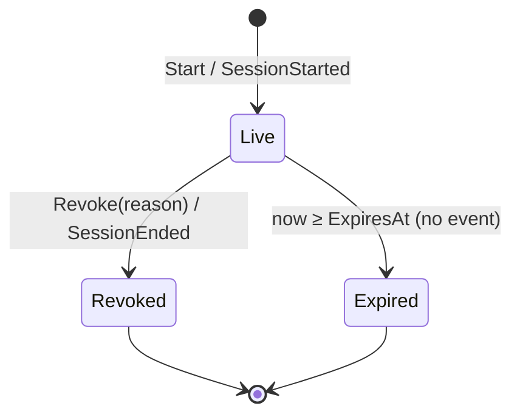

# State machine

An aggregate with more than one state is a state machine. The machine is the
aggregate's commands: each takes the aggregate from one state to another,
under a guard, and returns the fact. It performs no side effect.

## Rules

**States are a closed set, written down.** A reader can list them. A state
that only exists as a combination of fields is still a state, and it is
named in the README even when the code derives it (`Live`, `Revoked`,
`Expired` from `RevokedAt` and `ExpiresAt`).

**A transition is a command.** `Start` takes nothing to `Live`; `Revoke`
takes `Live` to `Revoked`. The command checks the guard, changes the state,
returns the event. There is no other way to change state.

**The machine has no side effects.** It does not publish, store, log, call
a port, or read a clock. It is handed `now` and returns an event. Everything
that happens because of a transition is the caller's (the use case's) or a
policy's. This is what makes every transition testable with values alone.

**A guard that fails is one of two answers.** A refused transition returns an
error (`Validate` on a revoked session says `ErrRevoked`); a transition that
has nothing to do returns "did nothing" and no event (`Revoke` on a revoked
session). The difference: the first is the caller asking for something the
state forbids; the second is the caller asking for something already true.

**A state reached by time is not a transition.** Expiry has no command, runs
no code, and publishes nothing. It is a condition read off the aggregate
with `now`. Consumers who need it know the expiry from the start event.

**A terminal state is terminal.** A revoked session never comes back;
logging in again produces a new one. A command from a terminal state is the
"nothing to do" answer or a refusal, never a resurrection.

**Every transition has an event, and only transitions have events.** The
diagram's arrows are the event list: `Start → SessionStarted`,
`Revoke → SessionEnded`. An arrow without an event, or an event without an
arrow, is a defect in one or the other.

**A single-state aggregate says so.** `User` has one state; password change
is a command that changes a value, not a state. The README says "one state"
so nobody looks for a machine that is not there.

## Document it

Each domain package has a `README.md` with the states and the diagram:

```
## States

- **Live** — issued, not revoked, not past expiry.
- **Revoked** — ended by a command, with a reason. Terminal.
- **Expired** — past expiry. Derived from time; no command, no event.


```

Arrows read `Command / Event`. Time-derived arrows say "no event".

## Checklist

- States listed by name in the domain README; diagram matches the commands.
- Every command names its source and target states in its comment.
- No port, clock, or publish inside a command.
- Refusal vs "nothing to do" chosen deliberately per command.
- Terminal states never transition out; time-derived states have no event.

Language-specific: [references/go.md](references/go.md).
