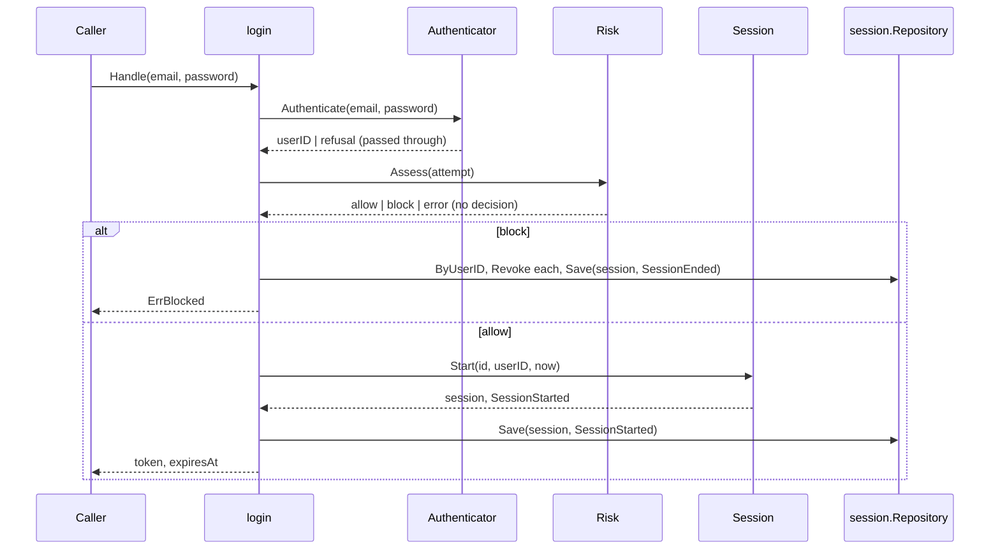

# Use case

A use case is one scenario with one entry point: input in, output or a
refusal out. It orchestrates; the rules are in the aggregate.

## Rules

**One package per use case.** The package holds the use case, its `dto`
(input and output as separate types), the ports only it needs, and a README.

**The use case holds exactly the ports it uses, and no others.** Storage for
its aggregate, and whatever else the scenario needs stated as the smallest
interface that says it. Time and id generation are injected too, so a test
can fix "now".

**A port only one use case needs is declared in that use case, not in the
domain.** Login needs somebody who can turn credentials into a user id; no
line of the session domain uses that, so `Authenticator` lives in the login
package. Same for `Risk`: an attempt in, a verdict out. The adapter over the
real thing is handed in at assembly.

**A use case never imports another domain, or another domain's use case.**
It states the need as an interface; assembly adapts the other domain's use
case to that shape. This keeps the knowledge that both domains exist in one
place.

**The order of steps is the rule.** Authenticate, then ask risk, then start a
session: a session is never issued for a user the user domain did not vouch
for, and never for an attempt risk judged hostile. Write the order down in
the comment on the handler.

**A refusal from a port is passed through untouched.** Translating it would
be the one way to accidentally make a wrong password distinguishable from an
unknown address.

**An error from an external service is not a verdict.** Risk being
unreachable means nothing is issued and nothing is ended.

**Answers a caller can act on are closed sets.** A `Verdict` is `allow` or
`block`, and a new value is a change to this package, not a string somebody
starts returning.

**The output carries what the caller can use, and nothing they could build
on by mistake.** The session id is not in login's answer: it names a row in
this service's store and putting it on the wire would invite something to be
built on it.

**A rule that spans aggregates is not written here.** Change-password does
not touch sessions. It publishes `PasswordChanged`; a policy ends the
sessions. See [ddd-policy](../ddd-policy/SKILL.md).

## The README

Every use case has one, with four sections:

1. **What it does** — the steps, numbered, and the reason for their order.
2. **What follows from it** — what happens elsewhere because of this, and
   what this package deliberately does not know. Bold the first phrase of
   each paragraph.
3. **Answers** — a two-column table: the outcome, and what the caller gets.
4. **Sequence** — the flow this use case is, derived from the code, not
   drawn. Where tooling reads the flow off the source and traces (in this
   repository, the portolan catalog: `docs/flows/<flow>.md`), the README
   links to that page and draws nothing: a hand-drawn diagram is a second
   source of truth that goes stale at the first change, and the derived
   one carries file:line and whether each hop was seen running. Only where
   no such tooling exists does the README carry a Mermaid
   `sequenceDiagram`, and then at the level of ports: participants are the
   caller, the use case, its ports by their port names, and the aggregate.
   Never an adapter, a table or a queue, because the use case does not know
   those exist.

See `examples/auth/internal/application/session/usecases/login/README.md`.

## Checklist

- Package per use case; `dto/input` and `dto/output` separate.
- Constructor takes ports and clocks; struct has nothing else.
- Cross-domain need is an interface declared here, satisfied at assembly.
- Refusals pass through; external failures are not decisions.
- README with the four sections; the sequence is a link to the derived flow, or, without tooling, a diagram that names ports, not adapters.

Language-specific: [references/go.md](references/go.md).
