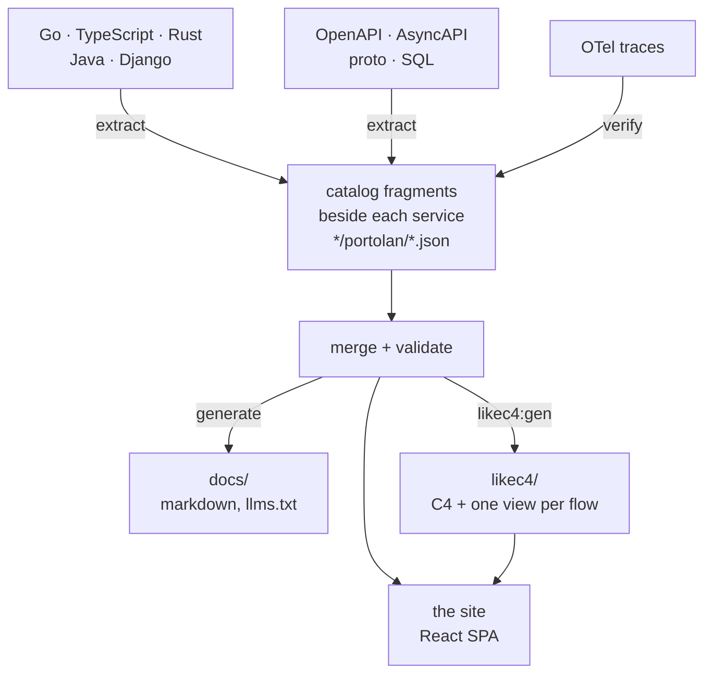

# portolan

A browser for an event-driven system's architecture catalog: bounded contexts,
services, aggregates, events, flows, stores and ADRs, read out of the code and
the specs that already describe them, and rendered as a navigable site.

Static end to end — no backend, no runtime queries. The catalog is the input,
the site is the output.

Live: <https://shortlink-org.github.io/portolan/> (the example estate in
`examples/`).

## What it does



There is no master catalog file. Every fragment the manifest's `sources` globs
find — what each service publishes beside its own code, plus the estate's
hand-written facts in `data/` (shared types, ADRs, `.flow.md` walkthroughs) —
is merged, then validated as one estate: referential integrity is a property of
the union, so a fragment naming a peer it does not own is normal. Validation
happens at startup; if it fails the shell renders the error instead of a blank
page.

Facts carry a status: `declared` (a fragment says so), `verified` (a recorded
trace showed it happening), `unresolved` (nothing in the catalog answers the
reference).

## What the site shows

- **Entity pages** — context, service, aggregate (entities, value objects,
  lifecycle, events, commands, queries), event, store, schema module, ADR.
- **Flows** — step-by-step walkthroughs with a step rail, chains that continue
  across contexts, and per-step detail.
- **Diagrams** — LikeC4 C4 views (estate landscape, one per context, two per
  service, one dynamic view per flow), an ELK-routed dependency graph, and a
  context map. The app never draws these itself; `npm run likec4:gen` writes
  the model from the catalog.
- **ER canvases** — per store: tables, views, keys and crow's feet, plus column
  lineage (`from`) drawn dashed; hovering a column lights the whole chain back
  to where the value came from.
- **API specs** — OpenAPI via Scalar, AsyncAPI via its React component.
- **Navigation** — ⌘K palette over everything the catalog names (`e:` events,
  `vo:` value objects, …), sidebar tree, breadcrumbs, "what links here", a
  trail of recent pages, pins, keyboard shortcuts, light/dark and density.

## What it checks

The **Problems** page lists every edge that leaves the chart, grouped errors
first:

- calls and consumers no service in the catalog answers, and RPC methods a
  known provider does not have;
- a foreign key or a column's lineage crossing a service boundary, a database
  with a second writer, a table that no longer holds the aggregate it claims,
  a column whose type has drifted from its field's, an outbox with no payload;
- a channel with a second publisher, an event on a channel its service does not
  declare, a declared channel no event names, a subscription nothing publishes.

## Where the facts come from

Plugins, one JSON message in and one out (`plugins/README.md`), declared in
`portolan.json` and run in three phases:

| phase | plugins |
| --- | --- |
| extract | `extract-go`, `extract-ts`, `extract-rust`, `extract-java`, `extract-django`, `extract-openapi`, `extract-asyncapi`, `extract-proto`, `extract-csr`, `extract-sql`, `extract-flows`, `extract-adr`, `extract-glossary` |
| verify | `verify-otel` — reads traces, marks the hops they show as `verified`; `verify-codeowners` — reads CODEOWNERS, says who to ask about each service |
| generate | `gen-markdown` — `docs/`, including `llms.txt` / `llms-full.txt` |

`fetch-git`, `fetch-bsr` and `fetch-csr` bring in sources from other
repositories, the Buf Schema Registry and a Confluent Schema Registry, against a
lock, so a later build can reproduce them without a socket.

Each plugin describes its own options; `npm run schema` asks all of them and
composes `schema/portolan.schema.json`, which editors complete against and `gen`
checks before running anything.

## Getting started

```bash
npm install
npm run dev
```

```bash
npm run gen          # run extract → verify → generate over portolan.json
npm run gen:check    # fail if what is committed no longer follows from the catalog
npm run schema       # recompose the manifest schema from the plugins
npm test             # vitest; npm run test:go for the Go catalog mirror
npm run build        # likec4:gen + tsc --noEmit + vite build
```

Generated output is committed, so a change to it shows up in a diff; CI runs the
`--check` variants to keep it honest.
