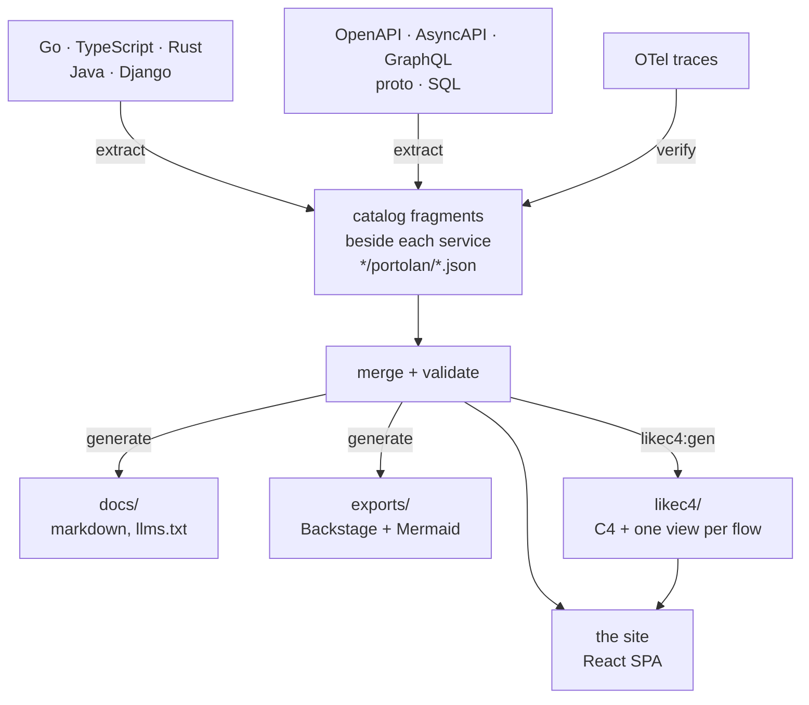

# portolan

A browser for a software estate's architecture catalog: systems or bounded
contexts, components, interfaces, events, flows, stores and ADRs, read out of
the code and specs that already describe them, and rendered as a navigable
site. DDD enriches the model when a repository really uses it; it is not a
prerequisite.

Static end to end — no backend, no runtime queries. The catalog is the input,
the site is the output.

Live: <https://shortlink-org.github.io/portolan/> (the example estate in
`examples/`).

## What it does



There is no master catalog file. Every fragment the manifest's `sources` globs
find — what each service publishes beside its own code, plus the estate's
hand-written facts in `data/` (shared types, ADRs, `.flow.md` walkthroughs) —
is merged, then validated as one estate: referential integrity is a property of
the union, so a fragment naming a peer it does not own is normal. Validation
happens at startup; if it fails the shell renders the error instead of a blank
page.

Facts carry a status: `declared` (a fragment says so), `verified` (a recorded
trace showed it happening), `unresolved` (nothing in the catalog answers the
reference).

### Projects without DDD

`extract-project` is the neutral baseline. It reads repository metadata and
deployment/build manifests without executing project code, creates a `system`,
`product`, `team` or `namespace` containing a component, and records its role
(`application`, `worker`, `job`, `cli`, `library`, and so on) and technologies.
Contract and messaging extractors then add OpenAPI, AsyncAPI, GraphQL, proto,
SQL, River, Watermill and outbound HTTP/SOAP facts to that same component.
For Go services, the HTTP client extractor also joins common router
registrations to handlers, interface calls, string-keyed factory branches and
concrete providers. Constructor maps, fixed factories, capability assertions,
composite/direct field assignment and setter injection are followed when the
source proves one concrete target. The resulting flow starts at the inbound
endpoint and fans out by the provider choices proved by source; when a
provider's transport lives in another module, the flow stops at that
implementation and says that the outbound transport could not be resolved.
Endpoints without provider selection are composed too, including handlers
passed through closures and local variables. Swagger `@Router` evidence can
root a handler factory behind a custom registry, while calls reached from a
`main → Run` assembly path become startup flows. These generated transport and
async flows carry their trigger kind and static-confidence level; `AddFunc`,
`AfterFunc`, and `Schedule` registrations become scheduled roots. A transport
fragment with no proven root is marked `unproven` instead of looking like a
complete scenario.

The older JSON keys `contexts` and `services` remain the wire format, so old
catalogs need no migration (portolan.0004). Optional `kind` fields say when those nodes should
be read as a neutral group and component. When `kind` is absent, the historical
`bounded-context` and `service` meanings apply.

The setup wizard always offers the neutral extractor. A language-specific DDD
extractor is selected only when its expected model structure is present; a
`go.mod` or a directory merely named `internal/domain` is not sufficient.

## What the site shows

- **Entity pages** — context, service, aggregate (entities, value objects,
  lifecycle, events, commands, queries), event, store, schema module, ADR.
- **Flows** — step-by-step walkthroughs with a step rail, chains that continue
  across contexts, and per-step detail.
- **Diagrams** — LikeC4 C4 views (estate landscape, one per context, two per
  service, one dynamic view per flow), an ELK-routed dependency graph, and a
  context map. The app never draws these itself; `npm run likec4:gen` writes
  the model from the catalog.
- **ER canvases** — per store: tables, views, keys and crow's feet, plus column
  lineage (`from`) drawn dashed; hovering a column lights the whole chain back
  to where the value came from.
- **API specs** — OpenAPI via Scalar, AsyncAPI via its React component, a
  GraphQL schema as the SDL it was written as.
- **Navigation** — ⌘K palette over everything the catalog names (`e:` events,
  `vo:` value objects, …), sidebar tree, breadcrumbs, "what links here", a
  trail of recent pages, pins, keyboard shortcuts, light/dark and density.
- **Ask the catalog** — a chat that answers from the generated pages: the
  model gets `llms.txt` and opens pages one at a time, names things by their
  ids (which become links), and can end an answer with a card drawn from the
  catalog — a service, a flow's sequence diagram, what runs between two
  contexts, an aggregate's state machine. The demo answers through the worker
  in `proxy/`; a reader can bring their own OpenAI-compatible endpoint and key
  from the panel's settings, kept in their browser.

## What it checks

The **Problems** page lists every edge that leaves the chart, grouped errors
first:

- calls and consumers no service in the catalog answers, and RPC methods a
  known provider does not have;
- a foreign key or a column's lineage crossing a service boundary, a database
  with a second writer, a table that no longer holds the aggregate it claims,
  a column whose type has drifted from its field's, an outbox with no payload;
- a channel with a second publisher, an event on a channel its service does not
  declare, a declared channel no event names, a subscription nothing publishes.

## Where the facts come from

Plugins, one JSON message in and one out (`plugins/README.md`), declared in
`portolan.json` and run in three phases:

| phase | plugins |
| --- | --- |
| extract | `extract-project`, `extract-go`, `extract-ts`, `extract-rust`, `extract-java`, `extract-django`, `extract-openapi`, `extract-wsdl`, `extract-http-clients`, `extract-asyncapi`, `extract-graphql`, `extract-proto`, `extract-river`, `extract-watermill`, `extract-go-nats`, `extract-csr`, `extract-sql`, `extract-flows`, `extract-adr`, `extract-glossary` |
| verify | `verify-otel` — reads traces, marks the hops they show as `verified`; `verify-codeowners` — reads CODEOWNERS, says who to ask about each service |
| generate | `gen-markdown` — `docs/`, `gen-mermaid` — standalone flow diagrams, `gen-backstage` — Backstage entities |

`fetch-git`, `fetch-bsr` and `fetch-csr` bring in sources from other
repositories, the Buf Schema Registry and a Confluent Schema Registry, against a
lock, so a later build can reproduce them without a socket.

Each plugin describes its own options; `npm run schema` asks all of them and
composes `schema/portolan.schema.json`, which editors complete against and `gen`
checks before running anything.

## Getting started

```bash
npm install
npm run dev
```

```bash
npm run gen          # run extract → verify → generate over portolan.json
npm run gen:check    # fail if what is committed no longer follows from the catalog
npm run diff         # what this branch changes about the architecture
npm run schema       # recompose the manifest schema from the plugins
npm test             # vitest; npm run test:go for the Go catalog mirror
npm run build        # likec4:gen + tsc --noEmit + vite build
```

Generated output is committed, so a change to it shows up in a diff; CI runs the
`--check` variants to keep it honest.

Three build-time variables shape the chat:

| variable | effect |
|---|---|
| `VITE_CHAT=off` | no chat at all: no button, no settings section, and its chunk is not built |
| `VITE_CHAT_PROXY_URL` | the worker that answers with a key of its own (see `proxy/README.md`); unset, the chat waits for the reader's own model |
| (a switch in Settings) | the reader turns the chat on or off in their browser; on by default when a proxy answers |
