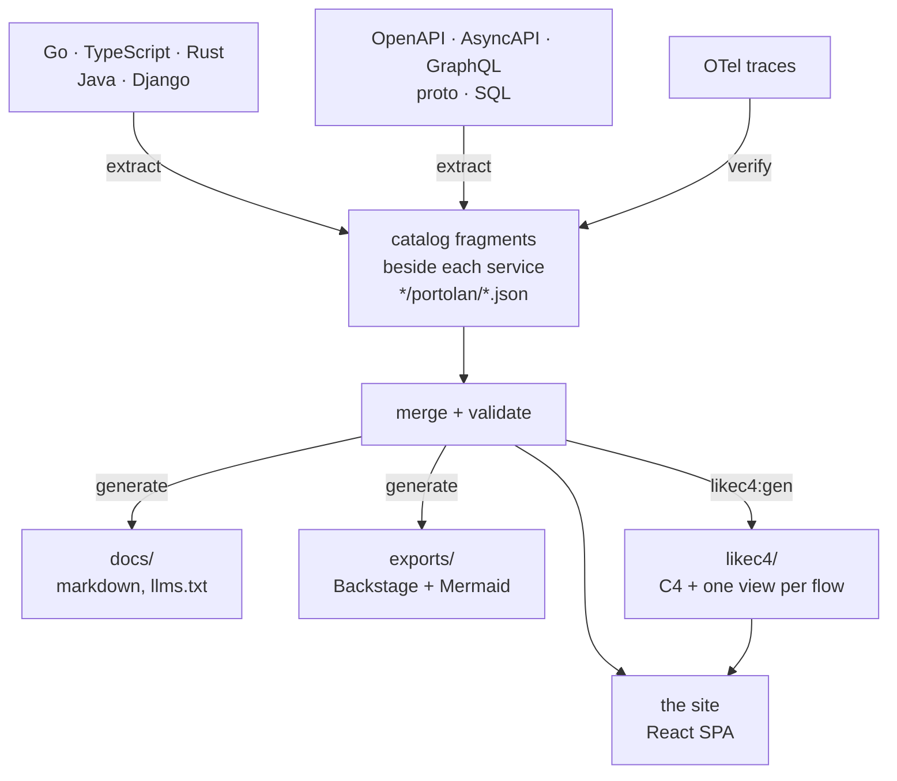

# portolan

A browser for a software estate's architecture catalog: systems or bounded
contexts, components, interfaces, events, flows, stores and ADRs, read out of
the code and specs that already describe them, and rendered as a navigable
site. DDD enriches the model when a repository really uses it; it is not a
prerequisite.

The catalog and site are static end to end and require no backend. Optional
branch comparison and source previews read immutable files from GitHub or
GitLab at runtime; local development uses a localhost-only control plane.

Live: <https://shortlink-org.github.io/portolan/> (the example estate in
`examples/`).

## What it does



There is no master catalog file. Every fragment the manifest's `sources` globs
find — what each service publishes beside its own code, plus the estate's
hand-written facts in `data/` (shared types, ADRs, `.flow.md` walkthroughs) —
is merged, then validated as one estate: referential integrity is a property of
the union, so a fragment naming a peer it does not own is normal. Validation
happens at startup; if it fails the shell renders the error instead of a blank
page.

Facts carry a status: `declared` (a fragment says so), `verified` (a recorded
trace showed it happening), `unresolved` (nothing in the catalog answers the
reference).

### Projects without DDD

`extract-project` is the neutral baseline. It reads repository metadata and
deployment/build manifests without executing project code, creates a `system`,
`product`, `team` or `namespace` containing a component, and records its role
(`application`, `worker`, `job`, `cli`, `library`, and so on) and technologies.
It also lists the commands the runner files declare - make targets, npm
scripts, just recipes, Taskfile and poe/pdm tasks, Maven and Gradle goals,
cargo aliases and xtask subcommands - which `extract-commands` does on its
own for a service a domain extractor describes.
Contract, messaging and data extractors then add OpenAPI, AsyncAPI, GraphQL,
proto, SQL, Redis, River, Watermill and outbound HTTP/SOAP facts to that same
component.
For Go services, the HTTP client extractor also joins common router
registrations to handlers, interface calls, string-keyed factory branches and
concrete providers. Constructor maps, fixed factories, capability assertions,
composite/direct field assignment and setter injection are followed when the
source proves one concrete target. The resulting flow starts at the inbound
endpoint and fans out by the provider choices proved by source; when a
provider's transport lives in another module, the flow stops at that
implementation and says that the outbound transport could not be resolved.
Endpoints without provider selection are composed too, including handlers
passed through closures and local variables. Swagger `@Router` evidence can
root a handler factory behind a custom registry, while calls reached from a
`main → Run` assembly path become startup flows. These generated transport and
async flows carry their trigger kind and static-confidence level; `AddFunc`,
`AfterFunc`, and `Schedule` registrations become scheduled roots. A transport
fragment with no proven root is marked `unproven` instead of looking like a
complete scenario.

The older JSON keys `contexts` and `services` remain the wire format, so old
catalogs need no migration (portolan.0004). Optional `kind` fields say when those nodes should
be read as a neutral group and component. When `kind` is absent, the historical
`bounded-context` and `service` meanings apply.

The setup wizard always offers the neutral extractor. A language-specific DDD
extractor is selected only when its expected model structure is present; a
`go.mod` or a directory merely named `internal/domain` is not sufficient.

## What the site shows

- **Entity pages** — context, service, aggregate (entities, value objects,
  lifecycle, events, commands, queries), event, store, schema module, ADR.
- **Flows** — step-by-step walkthroughs with a step rail, cross-protocol chains
  that continue across contexts, and per-step detail. Source locations open an
  inline code window around the exact line; private forge tokens stay in tab
  memory, and the external GitHub/GitLab link remains available.
- **Diagrams** — LikeC4 C4 views (estate landscape, every container in the
  estate with its technology and the protocol on each edge, one per context,
  two per service, one dynamic view per flow), an ELK-routed dependency graph,
  and a context map. The app never draws these itself; `npm run likec4:gen`
  writes the model from the catalog.
- **ER canvases** — per store: tables, views, keys and crow's feet, plus column
  lineage (`from`) drawn dashed; hovering a column lights the whole chain back
  to where the value came from.
- **API specs** — OpenAPI via Scalar, AsyncAPI via its React component, a
  GraphQL schema as the SDL it was written as.
- **Navigation** — ⌘K palette over everything the catalog names (`e:` events,
  `vo:` value objects, …), sidebar tree, breadcrumbs, "what links here", a
  trail of recent pages, pins, keyboard shortcuts, light/dark and density.
- **Ask the catalog** — a chat that answers from the generated pages: the
  model gets `llms.txt` and opens pages one at a time, names things by their
  ids (which become links), and can end an answer with a card drawn from the
  catalog — a service, a flow's sequence diagram, what runs between two
  contexts, an aggregate's state machine. The demo answers through the worker
  in `proxy/`; a reader can bring their own OpenAI-compatible endpoint and key
  from the panel's settings, kept in their browser.

## What it checks

The **Problems** page lists every edge that leaves the chart, grouped errors
first:

- calls and consumers no service in the catalog answers, and RPC methods a
  known provider does not have;
- a foreign key or a column's lineage crossing a service boundary, a database
  with a second writer, a table that no longer holds the aggregate it claims,
  a column whose type has drifted from its field's, an outbox with no payload;
- a channel with a second publisher, an event on a channel its service does not
  declare, a declared channel no event names, a subscription nothing publishes.

## Where the facts come from

Plugins, one JSON message in and one out (`plugins/README.md`), declared in
`portolan.json` and run in three phases:

| phase | plugins |
| --- | --- |
| extract | `extract-project`, `extract-go`, `extract-ts`, `extract-rust`, `extract-java`, `extract-django`, `extract-celery`, `extract-python-kafka`, `extract-openapi`, `extract-wsdl`, `extract-http-clients`, `extract-redis`, `extract-asyncapi`, `extract-graphql`, `extract-proto`, `extract-river`, `extract-watermill`, `extract-go-nats`, `extract-csr`, `extract-sql`, `extract-flows`, `extract-adr`, `extract-glossary`, `extract-commands` |
| verify | `verify-otel` — reads traces, marks the hops they show as `verified`; `verify-codeowners` — reads CODEOWNERS, says who to ask about each service |
| generate | `gen-markdown` — `docs/`, `gen-mermaid` — standalone flow diagrams, `gen-backstage` — Backstage entities |

`fetch-git`, `fetch-bsr` and `fetch-csr` bring in sources from other
repositories, the Buf Schema Registry and a Confluent Schema Registry, against a
lock, so a later build can reproduce them without a socket.

Each plugin describes its own options; `npm run schema` asks all of them and
composes `schema/portolan.schema.json`, which editors complete against and `gen`
checks before running anything.

## Use it in your project

Run the setup once from the root of a repository:

```bash
npx @shortlink-org/portolan init
npm install --save-dev @shortlink-org/portolan
npx portolan generate
npx portolan dev
```

`init` writes a minimal `portolan.json`, adds `.portolan/` to `.gitignore`,
and, when the repository has a `package.json`, adds these scripts without
replacing scripts that are already there:

```json
{
  "scripts": {
    "architecture": "portolan dev",
    "architecture:gen": "portolan generate",
    "architecture:check": "portolan check",
    "architecture:build": "portolan build"
  }
}
```

The generated fragments, Markdown, and exports are ordinary reviewable files
and should be committed. `.portolan/` is local build state and `dist/` is the
deployable static site.

| command | purpose |
| --- | --- |
| `portolan init` | create the first manifest without overwriting an existing one |
| `portolan dev` | run the local site and setup UI |
| `portolan generate` | update fragments, documentation, and exports |
| `portolan check` | fail when committed generated files are stale, without writing them |
| `portolan build` | build the static site into `dist/` |
| `portolan diff BASE` | describe the architecture change from a branch, tag, or commit |
| `portolan doctor` | show which optional plugin toolchains are available |

Node.js 24 is required. A process extractor also needs the toolchain of the
language it reads: Go for the Go extractors, Python 3 for Python, Java 21 for
Java, and Cargo for Rust. `portolan doctor` reports the local set. The Docker
image contains all of them.

### Check pull requests with GitHub Actions

Generated files are checked rather than silently rewritten in CI:

```yaml
name: Architecture
on: [pull_request]

permissions:
  contents: read

jobs:
  check:
    runs-on: ubuntu-latest
    steps:
      - uses: actions/checkout@v7
        with:
          fetch-depth: 0
      - uses: shortlink-org/portolan@0.1.0
        with:
          command: check
          version: 0.1.0
```

Full history is required because fragments are stamped with the last commit
that changed their input. A shallow clone would make that stamp unreliable.

### Publish the site to GitHub Pages

```yaml
name: Architecture site
on:
  push:
    branches: [main]
  workflow_dispatch:

permissions:
  contents: read
  pages: write
  id-token: write

jobs:
  build:
    runs-on: ubuntu-latest
    steps:
      - uses: actions/checkout@v7
      - uses: shortlink-org/portolan@0.1.0
        with:
          command: build
          version: 0.1.0
          output: dist
          base: /${{ github.event.repository.name }}/
      - uses: actions/configure-pages@v6
      - uses: actions/upload-pages-artifact@v5
        with:
          path: dist

  deploy:
    needs: build
    runs-on: ubuntu-latest
    environment:
      name: github-pages
      url: ${{ steps.deployment.outputs.page_url }}
    steps:
      - id: deployment
        uses: actions/deploy-pages@v5
```

The action deliberately separates building from deployment, so the Pages
permissions are held only by the deploy job.

### Run without installing Node or language toolchains

The same CLI is published at `ghcr.io/shortlink-org/portolan`. On Linux, pass
the host uid and gid so generated files remain owned by the developer:

```bash
docker run --rm \
  --user "$(id -u):$(id -g)" \
  -e HOME=/tmp \
  -v "$PWD:/workspace" \
  -w /workspace \
  ghcr.io/shortlink-org/portolan:0.1.0 generate
```

Use immutable versions in CI. `latest` is intended for trying the CLI, not for
a reproducible build.

### One repository or an estate repository

For one application or a monorepo, keep `portolan.json` at its root and write
fragments beside each component. An organization-wide catalog can instead
live in a dedicated architecture repository: `fetch-git` pins the service
repositories at immutable commits and the normal merge, check, diff, and build
commands operate on the combined estate.

## Develop Portolan itself

```bash
npm install
npm run dev
```

```bash
npm run gen          # run extract → verify → generate over portolan.json
npm run gen:check    # fail if what is committed no longer follows from the catalog
npm run diff         # what this branch changes about the architecture
npm run schema       # recompose the manifest schema from the plugins
npm test             # vitest; npm run test:go for the Go catalog mirror
npm run build        # likec4:gen + tsc --noEmit + vite build
```

Generated output is committed, so a change to it shows up in a diff. CI builds
the site (`npm run build`); the `--check` variants and the test suites are run
locally before a change lands, since they need the Go, Java, Rust and Python
toolchains the plugins are written in.

### Release Portolan

Give the repository an `NPM_TOKEN` Actions secret that can publish the
`@shortlink-org/portolan` package. Push a tag matching the version in
`package.json`, for example `0.1.0`. The release workflow verifies the package,
publishes it to npm with provenance, builds multi-platform container images at
`ghcr.io/shortlink-org/portolan`, attests the image, and creates or updates the
GitHub release notes. The tag itself is also the immutable version of the
composite action used by consumer repositories.

### In a pull request

`gen:check` says the documentation follows from the catalog; it does not say
what the change does. `.github/workflows/architecture-diff.yml` puts that on
the pull request itself, without ever failing it:

- one sticky comment with the events, endpoints, transitions and owners that
  are not what they were, breaking first, ending in a link into the published
  site's Changes page for the same pair of branches;
- the same list as SARIF in the checks tab, breaking as errors, each result
  anchored at the fragment that declares the id, so code scanning shows it;
- the report again in the job summary, for whoever reads the run.

The comment is `scripts/forge-comment.mjs` over the markdown `npm run diff`
writes. It finds its own earlier comment by a marker and updates it in place.
`GITHUB_TOKEN` with `pull-requests: write` is enough on GitHub; a pull request
from a fork has a read-only token, and the step says so and stays green.

The Changes page itself compares the built catalog with any branch or tag the
forge lists, so the link in the comment works for a release just as well.

On GitLab the job token cannot write notes, so the job wants a project access
token with the `api` scope and the Reporter role as `PORTOLAN_TOKEN`:

```yaml
architecture-diff:
  image: node:24
  rules: [{ if: $CI_PIPELINE_SOURCE == "merge_request_event" }]
  script:
    - git fetch origin "$CI_MERGE_REQUEST_TARGET_BRANCH_NAME"
    - npm ci
    - node scripts/diff.mjs "origin/$CI_MERGE_REQUEST_TARGET_BRANCH_NAME" --site "$CI_PAGES_URL" --head "$CI_COMMIT_REF_NAME" --output .portolan/diff.md
    - node scripts/forge-comment.mjs .portolan/diff.md
```

### In a release

`.github/workflows/release-notes.yml` runs the same diff when a `v*` tag is
pushed, against the tag before it, and `scripts/forge-release.mjs` writes it
into the release as one section between two markers: the rest of the notes,
hand-written or generated by the forge, stays as it was, and a rerun replaces
the section rather than repeating it. A tag with no release yet gets one,
named after the tag. The first tag of a repository has nothing to compare
against, and the job says so and stops. The same job on GitLab:

```yaml
architecture-release:
  image: node:24
  rules: [{ if: $CI_COMMIT_TAG }]
  script:
    - git fetch --tags origin
    - npm ci
    - previous=$(git describe --tags --abbrev=0 "$CI_COMMIT_TAG^")
    - node scripts/diff.mjs "$previous" --site "$CI_PAGES_URL" --head "$CI_COMMIT_TAG" --output .portolan/release.md
    - node scripts/forge-release.mjs .portolan/release.md
```

Three build-time variables shape the chat:

| variable | effect |
|---|---|
| `VITE_CHAT=off` | no chat at all: no button, no settings section, and its chunk is not built |
| `VITE_CHAT_PROXY_URL` | the worker that answers with a key of its own (see `proxy/README.md`); unset, the chat waits for the reader's own model |
| (a switch in Settings) | the reader turns the chat on or off in their browser; on by default when a proxy answers |
