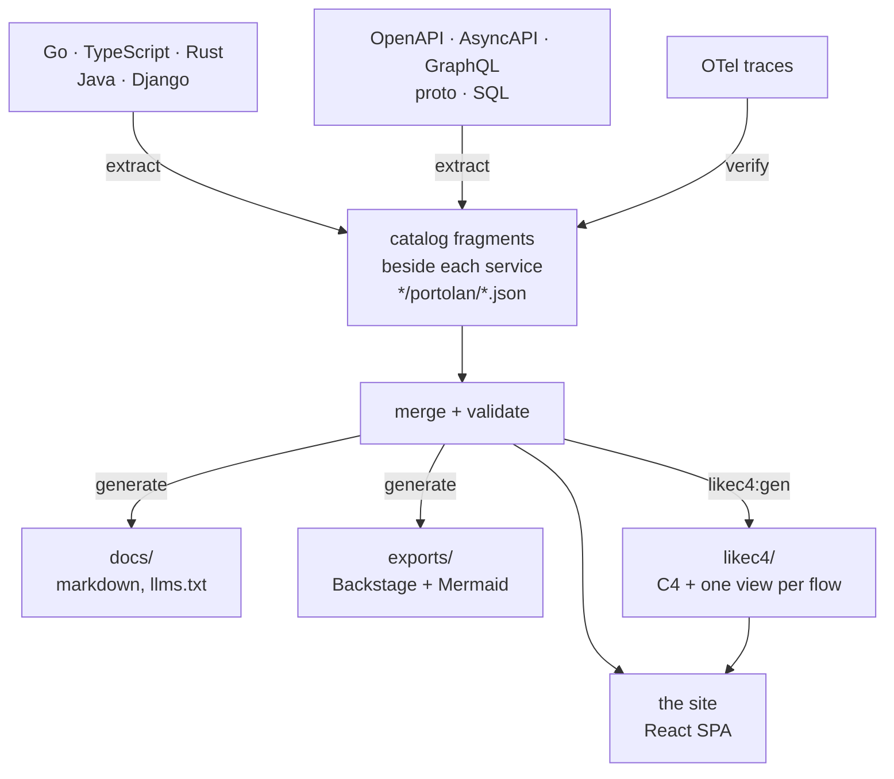

<p align="center">
  
</p>

<h1 align="center">Portolan</h1>

<p align="center"><strong>Your architecture, read from the code.</strong></p>

<p align="center">
  Turn code, contracts, schemas, traces and ADRs into a validated, navigable map of your software estate.
</p>

<p align="center">
  <a href="https://shortlink-org.github.io/portolan/landing">View the product tour</a>
  ·
  <a href="https://shortlink-org.github.io/portolan/?catalog=example">Explore the example catalog</a>
</p>

## Make architecture visible — and keep it honest

Architecture documentation loses value when it becomes another system teams
must remember to maintain. Portolan starts with the evidence your repositories
already contain and turns it into one coherent, searchable view of the system.

See how bounded contexts, services, APIs, events, data stores, flows and
decisions fit together. Follow any relationship back to its source. Surface
missing contracts, ownership conflicts and architectural drift before they
become production surprises.

- **Understand the whole estate.** Move from the landscape to a single flow,
  service, schema or decision without losing context.
- **Trust what you see.** Portolan merges and validates facts from code,
  specifications and observed traces instead of relying on a second hand-built
  inventory.
- **Publish anywhere.** The catalog and site are static end to end, require no
  hosted backend and fit naturally into pull requests and CI.

DDD enriches the model when a repository uses it; it is never a prerequisite.
Optional branch comparison and source previews read immutable files from GitHub
or GitLab at runtime, while local development uses a localhost-only control
plane.

## What it does



There is no master catalog file. Every fragment the manifest's `sources` globs
find — what each service publishes beside its own code, plus the estate's
hand-written facts in `data/` (shared types, ADRs, `.flow.md` walkthroughs) —
is merged, then validated as one estate: referential integrity is a property of
the union, so a fragment naming a peer it does not own is normal. Validation
happens at startup; if it fails the shell renders the error instead of a blank
page.

Facts carry a status: `declared` (a fragment says so), `verified` (a recorded
trace showed it happening), `unresolved` (nothing in the catalog answers the
reference).

## What the site shows

- **Entity pages** — context, service, aggregate (entities, value objects,
  lifecycle, events, commands, queries), event, store, schema module, ADR.
- **Flows** — step-by-step walkthroughs with a step rail, cross-protocol chains
  that continue across contexts, and per-step detail. Source locations open an
  inline code window around the exact line; private forge tokens stay in tab
  memory, and the external GitHub/GitLab link remains available.
- **Diagrams** — LikeC4 C4 views (estate landscape, every container in the
  estate with its technology and the protocol on each edge, one per context,
  two per service, one dynamic view per flow), an ELK-routed dependency graph,
  and a context map. The app never draws these itself; `npm run likec4:gen`
  writes the model from the catalog.
- **ER canvases** — per store: tables, views, keys and crow's feet, plus column
  lineage (`from`) drawn dashed; hovering a column lights the whole chain back
  to where the value came from.
- **API specs** — OpenAPI via Scalar, AsyncAPI via its React component, a
  GraphQL schema as the SDL it was written as.
- **Navigation** — ⌘K palette over everything the catalog names (`e:` events,
  `vo:` value objects, …), sidebar tree, breadcrumbs, "what links here", a
  trail of recent pages, pins, keyboard shortcuts, light/dark and density.
- **Ask the catalog** — a chat that answers from the generated pages: the
  model gets `llms.txt` and opens pages one at a time, names things by their
  ids (which become links), and can end an answer with a card drawn from the
  catalog — a service, a flow's sequence diagram, what runs between two
  contexts, an aggregate's state machine. The demo answers through the worker
  in `proxy/`; a reader can bring their own OpenAI-compatible endpoint and key
  from the panel's settings, kept in their browser.

## What it checks

The **Problems** page lists every edge that leaves the chart, grouped errors
first:

- calls and consumers no service in the catalog answers, and RPC methods a
  known provider does not have;
- a foreign key or a column's lineage crossing a service boundary, a database
  with a second writer, a table that no longer holds the aggregate it claims,
  a column whose type has drifted from its field's, an outbox with no payload;
- a channel with a second publisher, an event on a channel its service does not
  declare, a declared channel no event names, a subscription nothing publishes.

## Where the facts come from

Plugins, one JSON message in and one out (`plugins/README.md`), declared in
`portolan.json` and run in three phases:

| phase | plugins |
| --- | --- |
| extract | `extract-project`, `extract-go`, `extract-ts`, `extract-rust`, `extract-java`, `extract-django`, `extract-celery`, `extract-python-kafka`, `extract-openapi`, `extract-wsdl`, `extract-http-clients`, `extract-redis`, `extract-asyncapi`, `extract-graphql`, `extract-proto`, `extract-river`, `extract-watermill`, `extract-go-nats`, `extract-csr`, `extract-sql`, `extract-flows`, `extract-adr`, `extract-glossary`, `extract-commands` |
| verify | `verify-otel` — reads traces, marks the hops they show as `verified`; `verify-codeowners` — reads CODEOWNERS, says who to ask about each service |
| generate | `gen-markdown` — `docs/`, `gen-mermaid` — standalone flow diagrams, `gen-backstage` — Backstage entities |

`fetch-git`, `fetch-bsr` and `fetch-csr` bring in sources from other
repositories, the Buf Schema Registry and a Confluent Schema Registry, against a
lock, so a later build can reproduce them without a socket.

Each plugin describes its own options; `npm run schema` asks all of them and
composes `schema/portolan.schema.json`, which editors complete against and `gen`
checks before running anything.

## Use it in your project

Run the setup once from the root of a repository:

```bash
npx @shortlink-org/portolan init
npm install --save-dev @shortlink-org/portolan
npx portolan generate
npx portolan dev
```

`init` looks at the repository the way the site's Settings page does when a
project is added: it finds the directories that hold a build file, the domain
layouts, API specifications, schemas, migrations, ADRs and glossaries it can
read, and proposes a `portolan.json` with an extractor for each. In a terminal
it asks which directories are projects, what to read in each, and whether to
run `portolan generate` straight away; every question has the detected answer
as its default. With `--yes`, or without a terminal, it takes those defaults
and asks nothing. A plugin whose toolchain is not on `PATH` is pointed out
before anything is written.

`init` never overwrites an existing `portolan.json`. It adds `.portolan/` to
`.gitignore` and, when the repository has a `package.json`, adds these scripts
without replacing scripts that are already there:

```json
{
  "scripts": {
    "architecture": "portolan dev",
    "architecture:gen": "portolan generate",
    "architecture:check": "portolan check",
    "architecture:build": "portolan build"
  }
}
```

The generated fragments, Markdown, and exports are ordinary reviewable files
and should be committed. `.portolan/` is local build state and `dist/` is the
deployable static site.

| command | purpose |
| --- | --- |
| `portolan init` | inspect the repository and write the first manifest; `--yes` takes every detected default |
| `portolan dev` | run the local site and setup UI |
| `portolan generate` | update fragments, documentation, and exports |
| `portolan check` | fail when committed generated files are stale, without writing them |
| `portolan build` | build the static site into `dist/` |
| `portolan diff BASE` | describe the architecture change from a branch, tag, or commit |
| `portolan doctor` | show which toolchains the manifest's plugins need and which are on `PATH` |

Node.js 24 is required, and for a repository the built-in extractors can
read on their own it is the only requirement: every Go plugin runs as one
wasm module over the workspace (`adr/0006`), the fetchers run inside the
host (`adr/0008`), and the package ships no Go at all. A Go, TypeScript,
OpenAPI, proto, SQL or GraphQL tree is read, and another repository or a
schema registry is vendored, with Node and git alone. An extractor that runs
in its own runtime still needs it: Python 3 for Django and Celery, Java 21
for Java, Cargo for Rust. `portolan doctor` reports what the manifest asks
for against what is on `PATH`. The Docker image contains all of them.

### Add delivery automation

While `portolan dev` is running, open **Settings → Delivery presets**. Portolan
detects GitHub or GitLab from the repository's `origin`, previews the exact CI
changes, and installs architecture checks and static catalog publishing in one
step. Existing unmanaged workflow files are never overwritten.

### Run without installing Node or language toolchains

The same CLI is published at `ghcr.io/shortlink-org/portolan`. On Linux, pass
the host uid and gid so generated files remain owned by the developer:

```bash
docker run --rm \
  --user "$(id -u):$(id -g)" \
  -e HOME=/tmp \
  -v "$PWD:/workspace" \
  -w /workspace \
  ghcr.io/shortlink-org/portolan:0.2.0 generate
```

Use immutable versions in CI. `latest` is intended for trying the CLI, not for
a reproducible build.

### One repository or an estate repository

For one application or a monorepo, keep `portolan.json` at its root and write
fragments beside each component. An organization-wide catalog can instead
live in a dedicated architecture repository: `fetch-git` pins the service
repositories at immutable commits and the normal merge, check, diff, and build
commands operate on the combined estate.

## Develop Portolan itself

```bash
npm install
npm run dev
```

```bash
npm run gen          # run extract → verify → generate over portolan.json
npm run gen:check    # fail if what is committed no longer follows from the catalog
npm run diff         # what this branch changes about the architecture
npm run schema       # recompose the manifest schema from the plugins
npm test             # vitest; npm run test:go for the Go catalog mirror
npm run build        # likec4:gen + tsc --noEmit + vite build
```

Generated output is committed, so a change to it shows up in a diff. CI builds
the site (`npm run build`); the `--check` variants and the test suites are run
locally before a change lands, since they need the Go, Java, Rust and Python
toolchains the plugins are written in.
