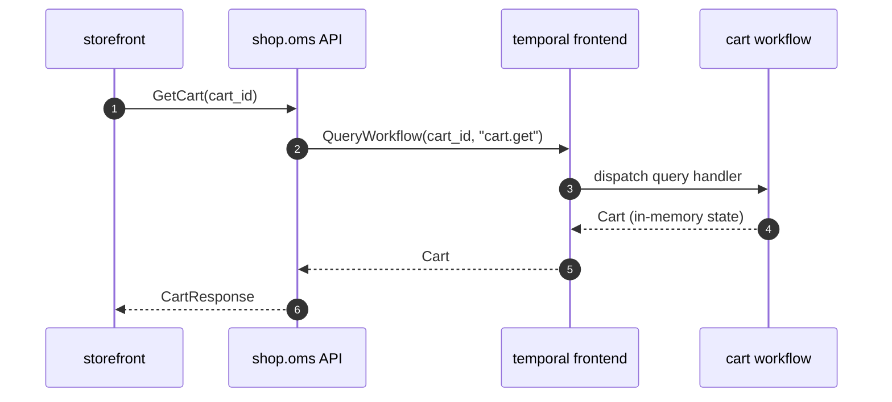

# shop.oms.0003 — Read cart state via Temporal QueryWorkflow

*Generated from the portolan catalog · commit `5 sources` · at 2026-08-29T09:14:22Z. Do not edit by hand.*

- **Status:** superseded
- **Date:** 2025-06-18
- **Scope:** [shop.oms](../shop/oms/README.md)
- **Source:** `docs/adr/0003-cart-state-via-temporal-query.md`
- **Superseded by:** [shop.oms.0007](shop.oms.0007.md)

## Context and Problem Statement

The cart is being moved out of the session store and into a Temporal workflow,
so that an abandoned checkout can be resumed and so that the cart has one
owner. The workflow holds the authoritative cart in memory. The storefront
still needs to render the cart on every page load.

Where should that read come from?

## Decision Drivers

- The workflow already holds the exact state; anything else is a copy.
- We do not want to build and operate a projection for a value that exists in
  memory a few milliseconds away.
- Temporal queries are strongly consistent against the workflow's own history.

## Considered Options

1. **`QueryWorkflow` against the cart workflow.**
2. A read-model projection in Postgres, fed by cart events.
3. Keep the session copy and accept the drift.

## Decision Outcome

Chosen option: **`QueryWorkflow`**. It gives a strongly consistent read with no
new storage, no projector to run and no lag to alert on. Option 2 is a lot of
machinery for a value we already have; option 3 is the status quo we are trying
to leave.

### Consequences

- Good: no projection, no projector, no lag.
- Good: the read is as fresh as the workflow's own state.
- Bad: a read fails once the workflow completes or is archived. Support tooling
  will need a different path for historical carts.
- Bad: read load lands on the workflow worker fleet.

## More Information

`EVENT_GET` is added to `proto/shop/v1/cart.proto` for the query dispatch.

## Relates to

- **Services:** [shop.oms](../shop/oms/README.md)
- **Flows:** `checkout`
