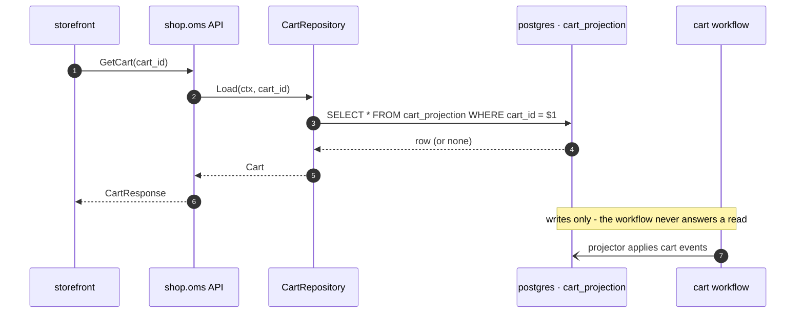

# shop.oms.0007 — Cart reads go through CartRepository, not Temporal Queries

*Generated from the portolan catalog · commit `6 sources` · at 2026-08-29T09:14:22Z. Do not edit by hand.*

- **Status:** accepted
- **Date:** 2026-04-23
- **Scope:** [shop.oms](../shop/oms/README.md)
- **Source:** `docs/adr/0007-cart-reads-via-repository.md`
- **Supersedes:** [shop.oms.0003](shop.oms.0003.md)

## Context and Problem Statement

A cart is owned by a long-running Temporal workflow for the whole of a checkout
attempt. Reads of cart state come from three places: the storefront polling the
cart page, the OMS API answering `GetCart`, and support tooling.

ADR-0003 chose to serve those reads with `QueryWorkflow` against the
running workflow. That decision was never fully implemented, and the gap only
became visible when the read path started failing in staging:

- the cart workflow **registers no query handler at all** — `SetQueryHandler`
  is absent from `cart_workflow.go`, so every `QueryWorkflow` call fails with
  `unknown queryType`;
- `EVENT_GET` is **reserved but unwired** in `proto/shop/v1/cart.proto`. The
  enum value exists so the wire numbering stays stable, and nothing dispatches
  on it;
- reads therefore fall back to whatever the caller has locally, which for the
  storefront meant a stale session copy.

We need one read path that is actually wired up, and we need it to survive a
completed or archived workflow, which a query cannot.

## Decision Drivers

- A read must work after the workflow has closed. Carts are read for days
  afterwards by support and by the returns flow.
- Read load must not be answered by the workflow worker fleet.
- The read path must be testable without a Temporal dev server.
- Whatever we choose has to be the *only* path, so there is no second answer to
  "what is in this cart".

## Considered Options

1. **`CartRepository` over the `cart_projection` table** — the workflow
   publishes events, a projector writes rows, reads hit Postgres.
2. **`QueryWorkflow` against the running workflow** — the option ADR-0003 took.
3. **Both, with the query as a fast path** — query first, fall back to the
   projection.

## Decision Outcome

Chosen option: **`CartRepository` over the projection**.

Option 2 cannot answer reads once the workflow closes, and pins read latency to
worker availability. Option 3 gives two sources for one fact, which is how the
staging drift started; a cart read that sometimes comes from the workflow and
sometimes from the projection is a cart read nobody can reason about.

The read path is now, in full:

### Consequences

- Good: reads keep working after the workflow closes, and can be served from a
  read replica.
- Good: `CartRepository` is an interface; unit tests use an in-memory
  implementation and never start a Temporal test environment.
- Bad: the projection is eventually consistent. A read issued in the same
  millisecond as a write can miss it, so the checkout path reads its own writes
  from the command result rather than re-reading the cart.
- Bad: one more thing to run — the projector is now on the critical path for
  correctness of reads, and needs its own lag alert.

## More Information

`EVENT_GET` stays reserved in `proto/shop/v1/cart.proto`. Removing it would
recycle the field number onto a different meaning for any client still holding
an old descriptor. It is dead on purpose; do not wire it.

## Relates to

- **Services:** [shop.oms](../shop/oms/README.md)
- **Flows:** `checkout`
