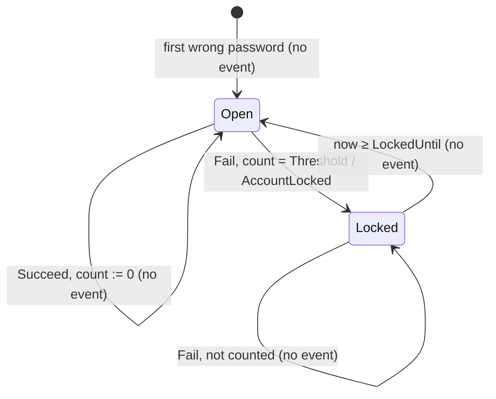
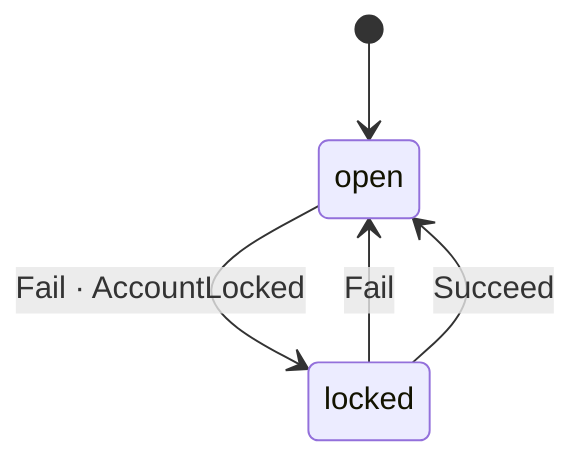

# Lockout

*Generated from the portolan catalog · commit `5 sources` · at 2026-08-29T09:14:22Z. Do not edit by hand.*

- **Id:** `auth.auth.lockout`
- **Service:** [Authentication & Sessions](../README.md)
- **Root:** `Lockout`

How many wrong passwords in a row an account has taken, and whether it is
refusing logins because of them. One per user, identified by the user id,
existing from the first wrong password on. A separate aggregate from `User`:
a failed attempt is written on every wrong password and the user does not
change when one arrives, so the two do not share a lock.

## States

- **Open** — counting. `Failures` is the number of wrong passwords in a row;
  the account accepts a password. The only state a password is checked in.
- **Locked** — until `LockedUntil`. The account refuses a password without
  checking it, with the same answer a wrong one gets. Not terminal: it ends
  by time.
- A lock that has run out is **Open** again. Derived from time when the next
  attempt arrives; no command, no event, nothing runs. The next wrong
  password starts the count at one.

The state is read off `LockedUntil` with `now`; there is no stored flag to
drift from it. The moves are one table, `Rules` in `rules.go`, run through
`go-sdk/fsm` by `trigger`: `lock` on the failure that reaches the threshold,
`lapse` on the first attempt after a lock has run out, which is when the code
notices it. The run-out itself is not a move; nothing runs when it happens.

## Commands

| Command | From | To | Event |
|---|---|---|---|
| `New` | — | Open, zero failures | none; nothing has happened yet |
| `Fail` | Open, count < Threshold − 1 | Open, count + 1 | none |
| `Fail` | Open, count = Threshold − 1 | Locked | `AccountLocked` |
| `Fail` | Locked | unchanged | none; reports "locked nothing" |
| `Succeed` | Open | Open, count 0 | none; reports whether anything changed |
| `Succeed` | Locked | unchanged | none; the lock stands |

`Allows(now)` and `Locked(now)` are the read, for the caller that asks
before checking a password.

One event for the whole aggregate. A wrong password that locked nothing is a
count, not a fact anybody consumes; a count going back to zero is
bookkeeping; the lock running out is time passing. `AccountLocked` carries
`Until`, so a consumer who wants to know when the account is usable again
does not have to be told twice.

## Entities

### Lockout — aggregate root

Lockout is the aggregate root. Its identity is the user id: there is one per account, and it exists from the first wrong password on.

| Field | Type | Doc |
| --- | --- | --- |
| `UserID` | `string` | — |
| `Failures` | `int` | Failures is the number of wrong passwords in a row. It is reset by a right one and by the count starting again after a lock has run out. |
| `LockedUntil` | `time.Time` | LockedUntil is when the lock ends; zero while the account has never been locked. A time in the past is a lock that ran out: the state is read off it with `now`, and nothing runs when it passes. |
| `Version` | `int64` | Version is what the store compares against before writing; see the note on user.User.Version. Zero means the lockout has never been stored. |

## Lifecycle

| From | To | On | Emits | Source |
| --- | --- | --- | --- | --- |
| `open` | `locked` | `Fail` | `AccountLocked` | `examples/auth/internal/domain/lockout/lockout.go:95` |
| `locked` | `open` | `Fail` | — | `examples/auth/internal/domain/lockout/lockout.go:88` |
| `locked` | `open` | `Succeed` | — | `examples/auth/internal/domain/lockout/lockout.go:121` |

## Operations

| Operation | Kind | Doc |
| --- | --- | --- |
| `Check` | query | Answers whether an account accepts a password right now. |
| `RecordFailure` | command | Counts a wrong password against an account, and locks the account when the count reaches the threshold. |
| `RecordSuccess` | command | Clears the count of wrong passwords after a right one. |

## Events

### AccountLocked

`auth.auth.lockout.AccountLocked`

On the wire as `auth.AccountLocked`, on `auth_lockout`.

#### v1 — current

AccountLocked is published when an account starts refusing logins because of too many wrong passwords in a row. Until says when it stops.

Source: `examples/auth/internal/domain/lockout/event/account_locked.go`

| Field | Type |
| --- | --- |
| `userID` | `string` |
| `until` | `time.Time` |
| `occurredAt` | `time.Time` |
