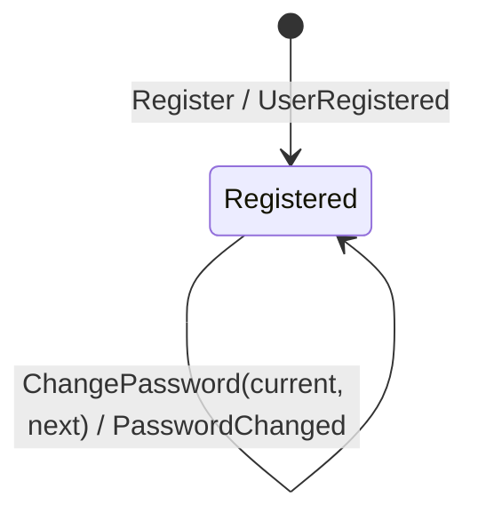

# User

*Generated from the portolan catalog · commit `6 sources` · at 2026-08-29T09:14:22Z. Do not edit by hand.*

- **Id:** `auth.auth.user`
- **Service:** [Authentication & Sessions](../README.md)
- **Root:** `User`

A person, the address they log in with, and the hash of the password they log
in by. Identity is the id, minted at registration; the address can change.

## States

One state. A user that exists is registered, and nothing here ends that:
there is no deletion, no suspension, no lockout. Each of those is a real
requirement somewhere and none of them is here.

`ChangePassword` changes a value, not a state. It is a command with a guard
(the current password) and an event, and the user is the same user afterwards.

## Commands

| Command | Guard | Event |
|---|---|---|
| `Register` | address and password pass their policies | `UserRegistered` |
| `ChangePassword` | the current password matches; the new one passes the policy | `PasswordChanged` |
| `Authenticate` | — | none; a read that answers one refusal for every failure |

No command here touches a session. That a password change ends sessions is a
rule about sessions, applied by the policy in `internal/application/policy`.

## Entities

### User — aggregate root

User is the aggregate root. Identity is ID, minted once at registration and never reused - not the email, because people change addresses.

| Field | Type | Doc |
| --- | --- | --- |
| `ID` | `string` | — |
| `Email` | `email.Address` | — |
| `Password` | `password.Hash` | — |
| `CreatedAt` | `time.Time` | — |
| `Version` | `int64` | Version is what the store compares against before writing. It is carried on the aggregate rather than known only to the repository so that a copy which has gone stale can say so - without it, two changes made from two reads both succeed and the first one silently disappears. |

## Value objects

### email.Address

Address is a normalised email address.

| Field | Type |
| --- | --- |
| `value` | `string` |

### password.Hash

Hash is what the user domain stores in place of a password. The plaintext never lives on an aggregate and never leaves the function that hashed it.

| Field | Type |
| --- | --- |
| `algorithm` | `string` |
| `iterations` | `int` |
| `salt` | `[]byte` |
| `digest` | `[]byte` |

## Operations

| Operation | Kind | Exposed by | Doc |
| --- | --- | --- | --- |
| `Authenticate` | query | *internal* | Checks an address and a password, and says which user they belong to. |
| `ChangePassword` | command | `changePassword` | Replaces the password of a user, given the current one. |
| `Get` | query | `getUser` | Reads a user by id. |
| `Register` | command | `registerUser` | Creates a user from an email address and a password. |

## Events

### PasswordChanged

`auth.auth.user.PasswordChanged`

On the wire as `auth.PasswordChanged`, on `auth_user`.

| Consumer | Status | Note |
| --- | --- | --- |
| [auth.auth](../README.md) | verified | Seen consuming it in telemetry/traces.jsonl. |

#### v1 — current

PasswordChanged is published when a user's password is replaced. It says the password is different now; it does not carry the password, old or new, in any form.

Source: `examples/auth/internal/domain/user/event/password_changed.go`

| Field | Type |
| --- | --- |
| `userID` | `string` |
| `by` | `string` |
| `occurredAt` | `time.Time` |

### UserRegistered

`auth.auth.user.UserRegistered`

On the wire as `auth.UserRegistered`, on `auth_user`.

#### v1 — current

UserRegistered is published once per user, at registration. It carries the address because consumers routinely need to reach the person, and asking auth for it on every event would make the bus useless.

Source: `examples/auth/internal/domain/user/event/user_registered.go`

| Field | Type |
| --- | --- |
| `userID` | `string` |
| `email` | `string` |
| `occurredAt` | `time.Time` |
