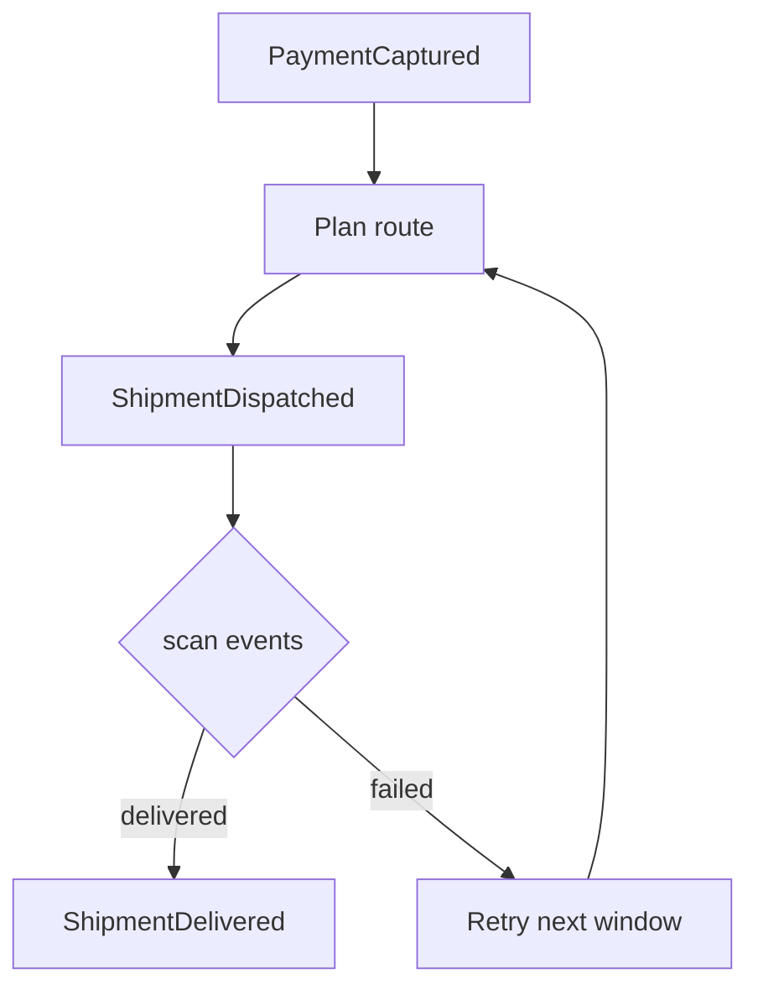

# Delivery Core

*Generated from the portolan catalog · commit `6 sources` · at 2026-08-29T09:14:22Z. Do not edit by hand.*

- **Id:** `delivery.core`
- **Context:** [Delivery](../README.md)
- **Repo:** `github.com/acme/delivery`
- **Path:** `services/core`

`delivery.core` turns confirmed orders into physical movement: routes, parcels
and proof of delivery. It is the only service in the `delivery` context and it
owns every carrier integration.

## Boundaries

Delivery reacts to `PaymentCaptured` rather than to `OrderPlaced`. An order
that is placed but never paid must never reach a van. This is the single most
important rule in the context.

## Carriers

| Carrier   | Coverage      | Tracking      | Cutoff  |
| --------- | ------------- | ------------- | ------- |
| `inhouse` | Metro only    | Live GPS      | 18:00   |
| `natpost` | National      | Scan events   | 15:30   |
| `express` | International | Scan events   | 12:00   |

Carrier choice is decided at route planning time and is not part of the order.

## Aggregates

- `shipment` — one parcel from dispatch to proof of delivery.
- `route` — a planned sequence of stops for one vehicle and one window.

## Retries

A failed delivery attempt does not fail the shipment. The shipment stays open
and is re-routed into the next available window, up to three attempts, after
which it is returned to the depot and the order is flagged for support.

## Observability

Every scan event carries the trace id of the originating `PaymentCaptured`
message, which is how the shipment tracking flow was derived from traces.

## Aggregates

| Aggregate | Root | Commands | Queries | Events |
| --- | --- | --- | --- | --- |
| [Shipment](aggregates/shipment.md) | `Shipment` | 3 commands | 2 queries | 2 events |
| [Route](aggregates/route.md) | `Route` | 2 commands | 1 query | 1 event |

## Provides

**`delivery.v1.Delivery`** — `proto/delivery/v1/delivery.proto:11`

- `PlanRoute`
- `TrackShipment`
- `GetShipment`

## Consumes

| Call | Peer | Status | Source |
| --- | --- | --- | --- |
| `shop.v1.OrderService/GetOrder` | [shop.oms](../../shop/oms/README.md) | verified | `internal/delivery/client/orders.go:31` |
| `payments.v1.Payments/GetPayment` | [payments.ledger](../../payments/ledger/README.md) | declared | `internal/delivery/client/payments.go:18` |

## Publishes

| Event | Latest | Consumers |
| --- | --- | --- |
| [ShipmentDispatched](aggregates/shipment.md) | v1 | `analytics-sink (declared)` |
| [ShipmentDelivered](aggregates/shipment.md) | v1 | `analytics-sink (unresolved)`, [shop.oms (declared)](../../shop/oms/README.md) |
| [RoutePlanned](aggregates/route.md) | v1 | — |

## Stores

| Store | Kind | Access | Tables |
| --- | --- | --- | --- |
| [Delivery database](stores/pg.md) | postgres | owns | 3 tables |
