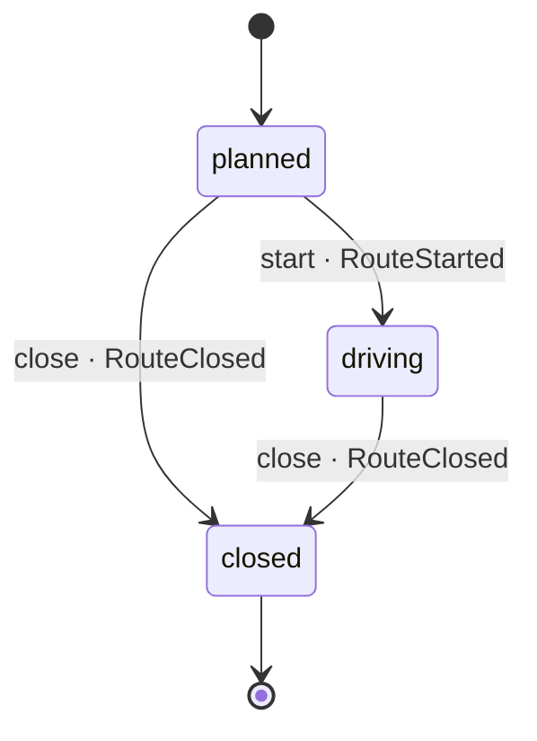

# Route

*Generated from the portolan catalog · commit `7 sources` · at 2026-09-05T03:58:04Z. Do not edit by hand.*

- **Id:** `delivery.core.route`
- **Service:** [Delivery Core](../README.md)
- **Root:** `Route`

One van, one day, in the order the stops are driven.

The order is the route: changing it is planning another one rather than editing
this. A stop knows which shipment it is dropping, and carries the address it
was planned against - a copy of the shipment's, which is itself a copy of the
order's.

### States

- **planned** - the day exists; where every route starts.
- **driving** - the van is out.
- **closed** - the day is over, whatever was left undone. Terminal. A
  planned day can be closed without ever being driven: that is a cancelled
  day, and the same event says so with every stop undone.

### Transitions

A stop being done is not a state of the route: it is a fact about the stop,
and the route reads it when it closes.

## Entities

### Route — aggregate root

One van, one day, in the order the stops are driven.

The order of the stops is the route: changing it is planning a new one, not
editing this. A closed route is history.

| Field | Type |
| --- | --- |
| `id` | `string` |
| `vehicle` | `string` |
| `plannedFor` | `Date` |
| `stops` | `Stop[]` |
| `status` | `RouteStatus` |

### Stop

One place a van stops, and what it drops there.

An entity: the stop is followed through the day - planned, then arrived at,
then done - which is what makes it more than a pair of values.

| Field | Type |
| --- | --- |
| `seq` | `number` |
| `shipmentId` | `string` |
| `address` | `Address` |
| `window` | `Window` |
| `done` | `boolean` |

## Value objects

### Window

When a van is expected somewhere, as the two ends of a promise to a person.

| Field | Type |
| --- | --- |
| `from` | `Date` |
| `to` | `Date` |

## Lifecycle

| From | To | On | Emits | Source |
| --- | --- | --- | --- | --- |
| `planned` | `driving` | `start` | `RouteStarted` | `examples/shop/delivery/core/src/domain/route/route.ts:52` |
| `planned` | `closed` | `close` | `RouteClosed` | `examples/shop/delivery/core/src/domain/route/route.ts:59` |
| `driving` | `closed` | `close` | `RouteClosed` | `examples/shop/delivery/core/src/domain/route/route.ts:59` |

## Operations

| Operation | Kind | Exposed by | Doc |
| --- | --- | --- | --- |
| `CloseRoute` | command | `CloseRoute` | Ends the day, whatever is left undone. |
| `GetRoute` | query | `GetRoute` | One route, as the depot reads it. |
| `PlanRoute` | command | `PlanRoute` | Builds a van's day out of the shipments waiting to go out. |
| `StartRoute` | command | `StartRoute` | The van is out. |

## Events

### RouteClosed

`delivery.core.route.RouteClosed`

On the wire as `delivery.RouteClosed`, on `delivery.core.route`.

#### v1 — current

The day is over. How many stops were left undone is on the event, because
that is the one number whoever plans tomorrow needs and should not have to
come back for.

Source: `examples/shop/delivery/core/src/domain/route/events/route-closed.ts`

| Field | Type |
| --- | --- |
| `channel` | `string` |
| `routeId` | `string` |
| `vehicle` | `string` |
| `undone` | `number` |
| `occurredAt` | `Date` |

### RoutePlanned

`delivery.core.route.RoutePlanned`

On the wire as `delivery.RoutePlanned`, on `delivery.core.route`.

#### v1 — current

A van has a day's work. The stops are not on the event: whoever cares reads
the route, and a list that long on the bus would go stale in flight.

Source: `examples/shop/delivery/core/src/domain/route/events/route-planned.ts`

| Field | Type |
| --- | --- |
| `channel` | `string` |
| `routeId` | `string` |
| `vehicle` | `string` |
| `stops` | `number` |
| `occurredAt` | `Date` |

### RouteStarted

`delivery.core.route.RouteStarted`

On the wire as `delivery.RouteStarted`, on `delivery.core.route`.

#### v1 — current

The van is out. The depot board stops showing the route as tomorrow's.

Source: `examples/shop/delivery/core/src/domain/route/events/route-started.ts`

| Field | Type |
| --- | --- |
| `channel` | `string` |
| `routeId` | `string` |
| `vehicle` | `string` |
| `occurredAt` | `Date` |
