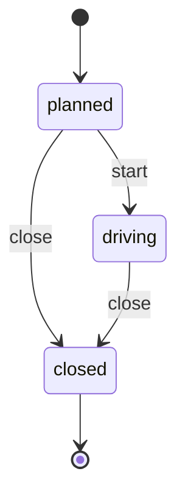

# Route

*Generated from the portolan catalog · commit `7 sources` · at 2026-08-29T09:14:22Z. Do not edit by hand.*

- **Id:** `delivery.core.route`
- **Service:** [Delivery Core](../README.md)
- **Root:** `Route`

One van, one day, in the order the stops are driven.

The order is the route: changing it is planning another one rather than editing
this. A stop knows which shipment it is dropping, and carries the address it
was planned against - a copy of the shipment's, which is itself a copy of the
order's.

## Entities

### Route — aggregate root

One van, one day, in the order the stops are driven.

The order of the stops is the route: changing it is planning a new one, not
editing this. A closed route is history.

| Field | Type |
| --- | --- |
| `id` | `string` |
| `vehicle` | `string` |
| `plannedFor` | `Date` |
| `stops` | `Stop[]` |
| `status` | `RouteStatus` |

### Stop

One place a van stops, and what it drops there.

An entity: the stop is followed through the day - planned, then arrived at,
then done - which is what makes it more than a pair of values.

| Field | Type |
| --- | --- |
| `seq` | `number` |
| `shipmentId` | `string` |
| `address` | `Address` |
| `window` | `Window` |
| `done` | `boolean` |

## Value objects

### Window

When a van is expected somewhere, as the two ends of a promise to a person.

| Field | Type |
| --- | --- |
| `from` | `Date` |
| `to` | `Date` |

## Lifecycle

| From | To | On | Source |
| --- | --- | --- | --- |
| `planned` | `driving` | `start` | `examples/shop/delivery/core/src/domain/route/route.ts:50` |
| `planned` | `closed` | `close` | `examples/shop/delivery/core/src/domain/route/route.ts:55` |
| `driving` | `closed` | `close` | `examples/shop/delivery/core/src/domain/route/route.ts:55` |

## Operations

| Operation | Kind | Exposed by | Doc |
| --- | --- | --- | --- |
| `CloseRoute` | command | `CloseRoute` | Ends the day, whatever is left undone. |
| `GetRoute` | query | `GetRoute` | One route, as the depot reads it. |
| `PlanRoute` | command | `PlanRoute` | Builds a van's day out of the shipments waiting to go out. |

## Events

### RoutePlanned

`delivery.core.route.RoutePlanned`

On the wire as `delivery.RoutePlanned`, on `delivery.core.route`.

#### v1 — current

A van has a day's work. The stops are not on the event: whoever cares reads
the route, and a list that long on the bus would go stale in flight.

Source: `examples/shop/delivery/core/src/domain/route/events/route-planned.ts`

| Field | Type |
| --- | --- |
| `channel` | `string` |
| `routeId` | `string` |
| `vehicle` | `string` |
| `stops` | `number` |
| `occurredAt` | `Date` |
