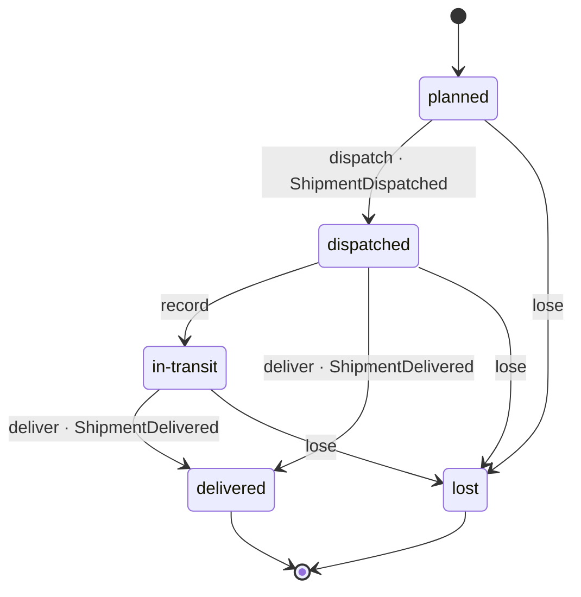

# Shipment

*Generated from the portolan catalog · commit `7 sources` · at 2026-08-29T09:14:22Z. Do not edit by hand.*

- **Id:** `delivery.core.shipment`
- **Service:** [Delivery Core](../README.md)
- **Root:** `Shipment`

What is being carried to one address for one order.

A shipment is planned, dispatched with a tracking code, seen a few times on the
way, and then either delivered or written off. The address is a copy taken from
the order at dispatch, not a reference: a parcel already on a van does not move
because somebody edited their profile - and that copy is the one thing here
that another service's schema can be seen in.

## Entities

### Shipment — aggregate root

What is being carried to one address for one order.

The address is copied from the order at dispatch and never refreshed: a
parcel on a van does not move because somebody edited their profile. The
status only ever moves the way `TRANSITIONS` allows, and `moveTo` is the one
way through it.

| Field | Type |
| --- | --- |
| `id` | `string` |
| `orderId` | `string` |
| `shipTo` | `Address` |
| `parcels` | `Parcel[]` |
| `scans` | `Scan[]` |
| `status` | `ShipmentStatus` |
| `tracking` | `TrackingCode \| undefined` |
| `routeId` | `string \| undefined` |

### Parcel

One box. A shipment is one or more of them, and each is scanned on its own -
which is why a parcel is an entity: it is followed over time, not compared.

| Field | Type |
| --- | --- |
| `id` | `string` |
| `weightG` | `number` |
| `contents` | `string` |

### Scan

One sighting of one parcel: where it was and when.

Append-only. A scan is never corrected - a wrong one is followed by a right
one, and the pair is the history.

| Field | Type |
| --- | --- |
| `parcelId` | `string` |
| `location` | `string` |
| `scannedAt` | `Date` |

## Value objects

### Address

Where a parcel is going, as the warehouse needs it.

A value: two addresses with the same lines are the same address. It is a copy
of what the order said at dispatch and is never refreshed - a parcel already
on a van does not move because somebody edited their profile.

| Field | Type |
| --- | --- |
| `line1` | `string` |
| `line2` | `string` |
| `city` | `string` |
| `postcode` | `string` |
| `country` | `string` |

### TrackingCode

What the customer types into a carrier's site.

The carrier owns the format; this only refuses what obviously cannot be one,
so that a typo is caught here rather than by a scan that never arrives.

| Field | Type |
| --- | --- |
| `value` | `string` |

## Lifecycle

| From | To | On | Emits | Source |
| --- | --- | --- | --- | --- |
| `planned` | `dispatched` | `dispatch` | `ShipmentDispatched` | `examples/shop/delivery/core/src/domain/shipment/shipment.ts:46` |
| `planned` | `lost` | `lose` | — | `examples/shop/delivery/core/src/domain/shipment/shipment.ts:71` |
| `dispatched` | `in-transit` | `record` | — | `examples/shop/delivery/core/src/domain/shipment/shipment.ts:58` |
| `dispatched` | `delivered` | `deliver` | `ShipmentDelivered` | `examples/shop/delivery/core/src/domain/shipment/shipment.ts:64` |
| `dispatched` | `lost` | `lose` | — | `examples/shop/delivery/core/src/domain/shipment/shipment.ts:71` |
| `in-transit` | `delivered` | `deliver` | `ShipmentDelivered` | `examples/shop/delivery/core/src/domain/shipment/shipment.ts:64` |
| `in-transit` | `lost` | `lose` | — | `examples/shop/delivery/core/src/domain/shipment/shipment.ts:71` |

## Operations

| Operation | Kind | Exposed by | Doc |
| --- | --- | --- | --- |
| `Dispatch` | command | `Dispatch` | Hands a planned shipment to the carrier and says so. |
| `GetShipment` | query | `Dispatch`, `GetShipment` | One shipment, for whoever is asking about an order. |
| `RecordDelivery` | command | `RecordDelivery` | Ends a shipment at the door. |
| `RecordScan` | command | `RecordScan` | Writes down that a parcel was seen somewhere. |
| `TrackShipment` | query | `TrackShipment` | What the customer sees when they paste a tracking code. |

## Events

### ShipmentDelivered

`delivery.core.shipment.ShipmentDelivered`

On the wire as `delivery.ShipmentDelivered`, on `delivery.core.shipment`.

| Consumer | Status |
| --- | --- |
| [shop.oms](../../../shop/oms/README.md) | declared |
| `analytics-sink` | unresolved |

#### v1 — current

It arrived, and who signed. The order is finished from this service's side;
whether the money is settled is somebody else's question.

Source: `examples/shop/delivery/core/src/domain/shipment/events/shipment-delivered.ts`

| Field | Type |
| --- | --- |
| `channel` | `string` |
| `shipmentId` | `string` |
| `orderId` | `string` |
| `signedBy` | `string` |
| `occurredAt` | `Date` |

### ShipmentDispatched

`delivery.core.shipment.ShipmentDispatched`

On the wire as `delivery.ShipmentDispatched`, on `delivery.core.shipment`.

#### v1 — current

The parcels are with the carrier. Whoever is waiting on the order hears this
and stops asking; the tracking code is on the event because the customer is
shown it and nobody should have to come back for it.

Source: `examples/shop/delivery/core/src/domain/shipment/events/shipment-dispatched.ts`

| Field | Type |
| --- | --- |
| `channel` | `string` |
| `shipmentId` | `string` |
| `orderId` | `string` |
| `tracking` | `TrackingCode` |
| `parcels` | `number` |
| `occurredAt` | `Date` |
