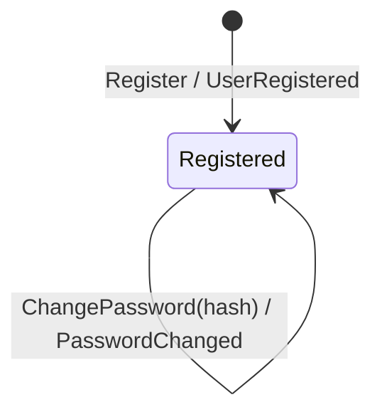

# User

*Generated from the portolan catalog. Do not edit by hand.*

- **Id:** `auth.auth.user`
- **Service:** [Authentication & Sessions](../README.md)
- **Root:** `User`

A person, the address they log in with, and the opaque hash of the password
they log in by. Identity is the id, minted at registration.

## States

One state. A user that exists is registered, and nothing here ends that:
there is no deletion, no suspension, no lockout. Each of those is a real
requirement somewhere and none of them is here.

`ChangePassword` changes a value, not a state. Credential verification and
hashing happen in application services through consumer-owned password ports;
the aggregate accepts only an already-produced hash and never sees plaintext.

## Commands

| Command | Guard | Event |
|---|---|---|
| `Register` | valid address and a non-empty password hash | `UserRegistered` |
| `ChangePassword` | non-empty password hash | `PasswordChanged` |

`check_credentials` is an application use case because it coordinates repository
lookup, lockout and password verification. It is intentionally not an
aggregate method and never issues a session; `session/application/login`
depends on it through its own `Authenticator` port.

No command here touches a session. That a password change ends sessions is a
rule about sessions, applied by the policy in `internal/session/infrastructure/messaging/policy`.

## Entities

### User — aggregate root

User is the aggregate root. Identity is ID, minted once at registration and never reused - not the email, because people change addresses.

| Field | Type | Doc |
| --- | --- | --- |
| `ID` | `string` | — |
| `Email` | `email.Address` | — |
| `Password` | `password.Hash` | — |
| `CreatedAt` | `time.Time` | — |
| `Version` | `int64` | Version is what the store compares against before writing. It is carried on the aggregate rather than known only to the repository so that a copy which has gone stale can say so - without it, two changes made from two reads both succeed and the first one silently disappears. |

## Value objects

### email.Address

Address is a normalised email address.

| Field | Type |
| --- | --- |
| `value` | `string` |

### password.Hash

Hash is an opaque, immutable stored password hash. Hashing and verification are deliberately implemented behind the application port, outside domain.

| Field | Type |
| --- | --- |
| `encoded` | `string` |

## Operations

| Operation | Kind | Exposed by | Doc |
| --- | --- | --- | --- |
| `ChangePassword` | command | `changePassword` | Replaces the password of a user, given the current one. |
| `CheckCredentials` | query | *internal* | Checks an address and a password, and says which user they belong to. |
| `Get` | query | `getUser` | Reads a user by id. |
| `Register` | command | `registerUser` | Creates a user from an email address and a password. |

## Events

### PasswordChanged

`auth.auth.user.PasswordChanged`

On the wire as `auth.PasswordChanged`, on `auth_user`.

| Consumer | Status | Note |
| --- | --- | --- |
| [auth.auth](../README.md) | verified | Seen consuming it in telemetry/traces.jsonl. |

#### v1 — current

PasswordChanged is published when a user's password is replaced. It says the password is different now; it does not carry the password, old or new, in any form.

Source: [`examples/auth/internal/user/domain/event/password_changed.go`](https://github.com/shortlink-org/portolan/blob/main/examples/auth/internal/user/domain/event/password_changed.go)

| Field | Type |
| --- | --- |
| `userID` | `string` |
| `by` | `string` |
| `occurredAt` | `time.Time` |

### UserRegistered

`auth.auth.user.UserRegistered`

On the wire as `auth.UserRegistered`, on `auth_user`.

#### v1 — current

UserRegistered is published once per user, at registration. It carries the address because consumers routinely need to reach the person, and asking auth for it on every event would make the bus useless.

Source: [`examples/auth/internal/user/domain/event/user_registered.go`](https://github.com/shortlink-org/portolan/blob/main/examples/auth/internal/user/domain/event/user_registered.go)

| Field | Type |
| --- | --- |
| `userID` | `string` |
| `email` | `string` |
| `occurredAt` | `time.Time` |
