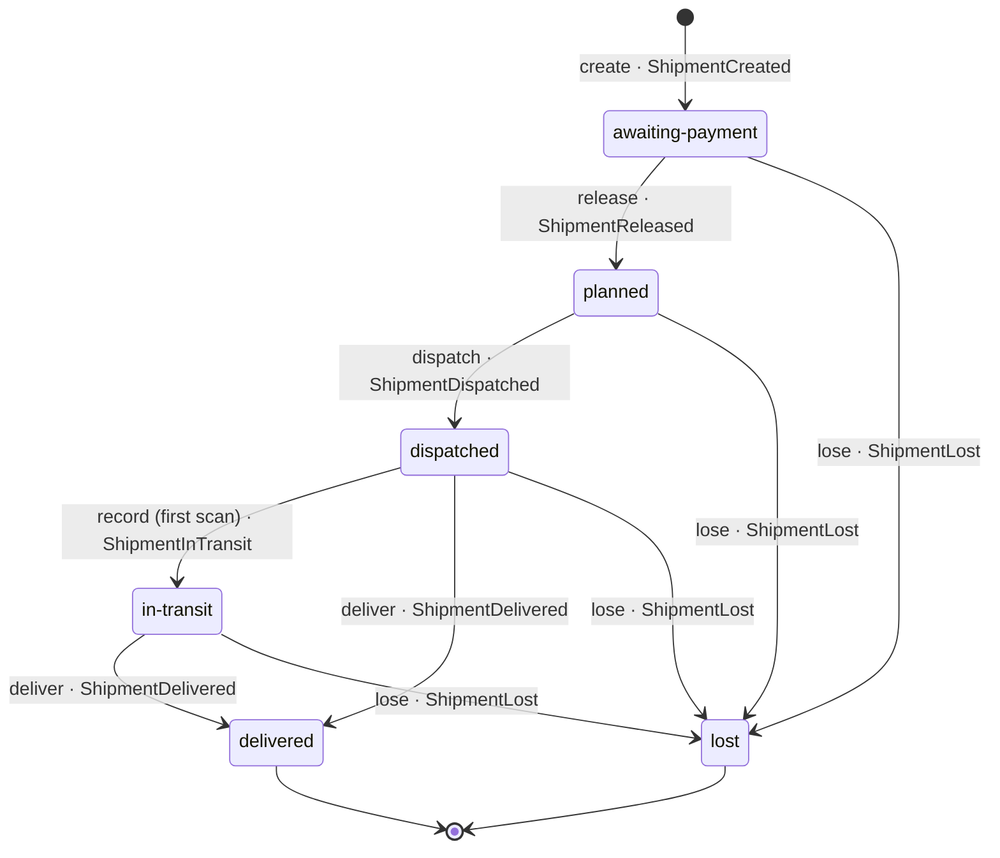
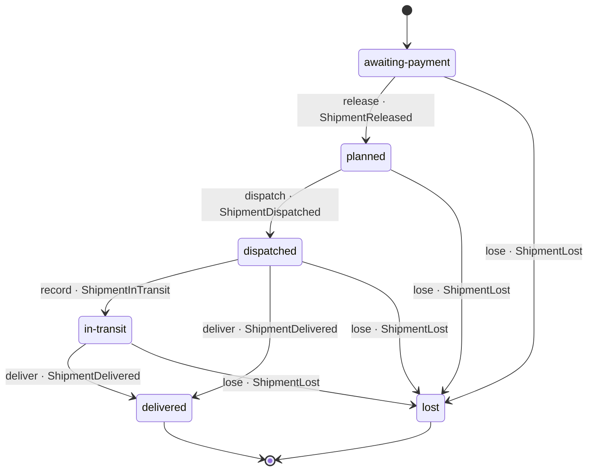

# Shipment

*Generated from the portolan catalog. Do not edit by hand.*

- **Id:** `delivery.core.shipment`
- **Service:** [Delivery Core](../README.md)
- **Root:** `Shipment`

What is being carried to one address for one order.

A shipment is created when the order is confirmed, waits for the money, is
released when the ledger says it moved,
is planned onto a route, dispatched with a tracking code, seen a few times on
the way, and then either delivered or written off. The address is a copy taken
from the order at dispatch, not a reference: a parcel already on a van does not
move because somebody edited their profile - and that copy is the one thing
here that another service's schema can be seen in.

Created from a confirmed order, a shipment has no parcels and no address:
nobody in the estate hands those over at confirmation. It may wait for the
money like that, but it is not planned onto a route without an address, and
it is not dispatched with no parcels (ADR core.0003).

### States

- **awaiting-payment** - where every shipment starts, created when the order
  is confirmed. Nothing leaves the warehouse before the money has moved (ADR
  core.0002).
- **planned** - released; may be put on a route and handed to the carrier.
- **dispatched** - with the carrier, under a tracking code.
- **in-transit** - seen at least once since dispatch. Later scans add to the
  history and change nothing.
- **delivered** - signed for at the door. Terminal.
- **lost** - written off, with a reason. Terminal; a parcel that turns up
  afterwards is a new shipment.

### Transitions

Every arrow is a command on the root and hands back the event that says so.
`moveTo` is the one way through the table; a move it does not list is refused.
The way in is `create`, which says `ShipmentCreated`.

The catalog draws the same diagram off the code: see the aggregate page.

## Entities

### Parcel

One box. A shipment is one or more of them, and each is scanned on its own -
which is why a parcel is an entity: it is followed over time, not compared.

| Field | Type |
| --- | --- |
| `id` | `string` |
| `weightG` | `number` |
| `contents` | `string` |

### Scan

One sighting of one parcel: where it was and when.

Append-only. A scan is never corrected - a wrong one is followed by a right
one, and the pair is the history.

| Field | Type |
| --- | --- |
| `parcelId` | `string` |
| `location` | `string` |
| `scannedAt` | `Date` |

### Shipment — aggregate root

What is being carried to one address for one order.

The address is copied from the order at dispatch and never refreshed: a
parcel on a van does not move because somebody edited their profile. The
status only ever moves the way `TRANSITIONS` allows, and `moveTo` is the one
way through it; every move that is a fact hands back the event that says so.

A shipment created from a confirmed order has no parcels and no address
yet: nobody in the estate hands those over at confirmation. It may wait for
the money like that, but it is not planned onto a route without somewhere
to go, and it is not handed to the carrier empty.

| Field | Type |
| --- | --- |
| `id` | `string` |
| `orderId` | `string` |
| `shipTo` | `Address \| undefined` |
| `parcels` | `Parcel[]` |
| `scans` | `Scan[]` |
| `status` | `ShipmentStatus` |
| `tracking` | `TrackingCode \| undefined` |
| `routeId` | `string \| undefined` |

## Value objects

### Address

Where a parcel is going, as the warehouse needs it.

A value: two addresses with the same lines are the same address. It is a copy
of what the order said at dispatch and is never refreshed - a parcel already
on a van does not move because somebody edited their profile.

| Field | Type |
| --- | --- |
| `line1` | `string` |
| `line2` | `string` |
| `city` | `string` |
| `postcode` | `string` |
| `country` | `string` |

### TrackingCode

What the customer types into a carrier's site.

The carrier owns the format; this only refuses what obviously cannot be one,
so that a typo is caught here rather than by a scan that never arrives.

| Field | Type |
| --- | --- |
| `value` | `string` |

## Lifecycle

| From | To | On | Emits | Source |
| --- | --- | --- | --- | --- |
| `awaiting-payment` | `planned` | `release` | `ShipmentReleased` | [`examples/shop/delivery/core/src/domain/shipment/shipment.ts:70`](https://github.com/shortlink-org/portolan/blob/main/examples/shop/delivery/core/src/domain/shipment/shipment.ts#L70) |
| `awaiting-payment` | `lost` | `lose` | `ShipmentLost` | [`examples/shop/delivery/core/src/domain/shipment/shipment.ts:106`](https://github.com/shortlink-org/portolan/blob/main/examples/shop/delivery/core/src/domain/shipment/shipment.ts#L106) |
| `planned` | `dispatched` | `dispatch` | `ShipmentDispatched` | [`examples/shop/delivery/core/src/domain/shipment/shipment.ts:79`](https://github.com/shortlink-org/portolan/blob/main/examples/shop/delivery/core/src/domain/shipment/shipment.ts#L79) |
| `planned` | `lost` | `lose` | `ShipmentLost` | [`examples/shop/delivery/core/src/domain/shipment/shipment.ts:106`](https://github.com/shortlink-org/portolan/blob/main/examples/shop/delivery/core/src/domain/shipment/shipment.ts#L106) |
| `dispatched` | `in-transit` | `record` | `ShipmentInTransit` | [`examples/shop/delivery/core/src/domain/shipment/shipment.ts:92`](https://github.com/shortlink-org/portolan/blob/main/examples/shop/delivery/core/src/domain/shipment/shipment.ts#L92) |
| `dispatched` | `delivered` | `deliver` | `ShipmentDelivered` | [`examples/shop/delivery/core/src/domain/shipment/shipment.ts:99`](https://github.com/shortlink-org/portolan/blob/main/examples/shop/delivery/core/src/domain/shipment/shipment.ts#L99) |
| `dispatched` | `lost` | `lose` | `ShipmentLost` | [`examples/shop/delivery/core/src/domain/shipment/shipment.ts:106`](https://github.com/shortlink-org/portolan/blob/main/examples/shop/delivery/core/src/domain/shipment/shipment.ts#L106) |
| `in-transit` | `delivered` | `deliver` | `ShipmentDelivered` | [`examples/shop/delivery/core/src/domain/shipment/shipment.ts:99`](https://github.com/shortlink-org/portolan/blob/main/examples/shop/delivery/core/src/domain/shipment/shipment.ts#L99) |
| `in-transit` | `lost` | `lose` | `ShipmentLost` | [`examples/shop/delivery/core/src/domain/shipment/shipment.ts:106`](https://github.com/shortlink-org/portolan/blob/main/examples/shop/delivery/core/src/domain/shipment/shipment.ts#L106) |

## Operations

| Operation | Kind | Exposed by | Doc |
| --- | --- | --- | --- |
| `CreateShipment` | command | *internal* | Turns a confirmed order into a shipment waiting for the money, and asks the ledger to move the money (ADR core.0003). |
| `Dispatch` | command | `Dispatch` | Hands a planned shipment to the carrier and says so. |
| `GetShipment` | query | `Dispatch`, `GetShipment` | One shipment, for whoever is asking about an order. |
| `RecordDelivery` | command | `RecordDelivery` | Ends a shipment at the door. |
| `RecordScan` | command | `RecordScan` | Writes down that a parcel was seen somewhere. |
| `ReleaseShipment` | command | *internal* | Lets a shipment out of the waiting room once the money for its order moved. |
| `TrackShipment` | query | `TrackShipment` | What the customer sees when they paste a tracking code. |

## Events

### ShipmentCreated

`delivery.core.shipment.ShipmentCreated`

On the wire as `delivery.ShipmentCreated`, on `delivery.core.shipment`.

#### v1 — current

A confirmed order became something to carry. Nothing is packed yet and the
shipment has nowhere to go: it waits for the money, and the ledger has just
been asked to move it (ADR core.0003).

Source: [`examples/shop/delivery/core/src/domain/shipment/events/shipment-created.ts`](https://github.com/shortlink-org/portolan/blob/main/examples/shop/delivery/core/src/domain/shipment/events/shipment-created.ts)

| Field | Type |
| --- | --- |
| `channel` | `string` |
| `shipmentId` | `string` |
| `orderId` | `string` |
| `occurredAt` | `Date` |

### ShipmentDelivered

`delivery.core.shipment.ShipmentDelivered`

On the wire as `delivery.ShipmentDelivered`, on `delivery.core.shipment`.

#### v1 — current

It arrived, and who signed. The order is finished from this service's side;
whether the money is settled is somebody else's question.

Source: [`examples/shop/delivery/core/src/domain/shipment/events/shipment-delivered.ts`](https://github.com/shortlink-org/portolan/blob/main/examples/shop/delivery/core/src/domain/shipment/events/shipment-delivered.ts)

| Field | Type |
| --- | --- |
| `channel` | `string` |
| `shipmentId` | `string` |
| `orderId` | `string` |
| `signedBy` | `string` |
| `occurredAt` | `Date` |

### ShipmentDispatched

`delivery.core.shipment.ShipmentDispatched`

On the wire as `delivery.ShipmentDispatched`, on `delivery.core.shipment`.

#### v1 — current

The parcels are with the carrier. Whoever is waiting on the order hears this
and stops asking; the tracking code is on the event because the customer is
shown it and nobody should have to come back for it.

Source: [`examples/shop/delivery/core/src/domain/shipment/events/shipment-dispatched.ts`](https://github.com/shortlink-org/portolan/blob/main/examples/shop/delivery/core/src/domain/shipment/events/shipment-dispatched.ts)

| Field | Type |
| --- | --- |
| `channel` | `string` |
| `shipmentId` | `string` |
| `orderId` | `string` |
| `tracking` | `TrackingCode` |
| `parcels` | `number` |
| `occurredAt` | `Date` |

### ShipmentInTransit

`delivery.core.shipment.ShipmentInTransit`

On the wire as `delivery.ShipmentInTransit`, on `delivery.core.shipment`.

#### v1 — current

The first sighting after dispatch: the parcels are moving. Later scans add
to the history and say nothing, because "seen again" is not a change.

Source: [`examples/shop/delivery/core/src/domain/shipment/events/shipment-in-transit.ts`](https://github.com/shortlink-org/portolan/blob/main/examples/shop/delivery/core/src/domain/shipment/events/shipment-in-transit.ts)

| Field | Type |
| --- | --- |
| `channel` | `string` |
| `shipmentId` | `string` |
| `orderId` | `string` |
| `location` | `string` |
| `occurredAt` | `Date` |

### ShipmentLost

`delivery.core.shipment.ShipmentLost`

On the wire as `delivery.ShipmentLost`, on `delivery.core.shipment`.

#### v1 — current

Source: [`examples/shop/delivery/core/src/domain/shipment/events/shipment-lost.ts`](https://github.com/shortlink-org/portolan/blob/main/examples/shop/delivery/core/src/domain/shipment/events/shipment-lost.ts)

| Field | Type |
| --- | --- |
| `channel` | `string` |
| `shipmentId` | `string` |
| `orderId` | `string` |
| `reason` | `LostReason` |
| `occurredAt` | `Date` |

### ShipmentReleased

`delivery.core.shipment.ShipmentReleased`

On the wire as `delivery.ShipmentReleased`, on `delivery.core.shipment`.

#### v1 — current

The money moved, and the shipment may now be planned onto a route and
dispatched. Said by this service, not by the ledger: the ledger says a
payment was captured, and what that means for a parcel is decided here.

Source: [`examples/shop/delivery/core/src/domain/shipment/events/shipment-released.ts`](https://github.com/shortlink-org/portolan/blob/main/examples/shop/delivery/core/src/domain/shipment/events/shipment-released.ts)

| Field | Type |
| --- | --- |
| `channel` | `string` |
| `shipmentId` | `string` |
| `orderId` | `string` |
| `occurredAt` | `Date` |
