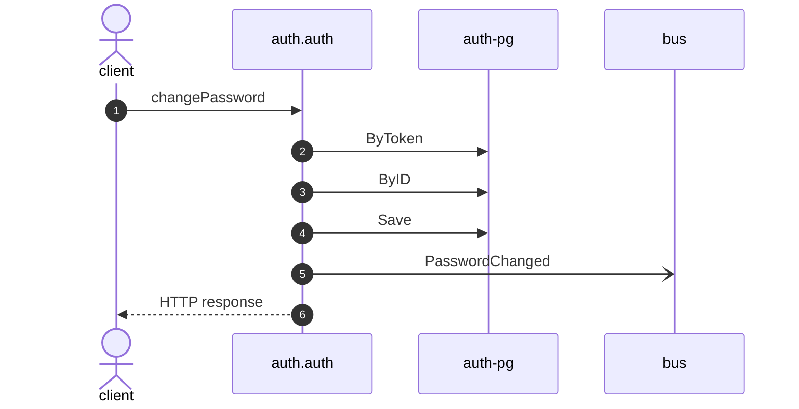

# Change password

*Generated from the portolan catalog. Do not edit by hand.*

- **Id:** `flow.auth-change-password`
- **Owner:** [auth](../auth/README.md)
- **Trigger:** `http` · changePassword
- **Root confidence:** high
- **Source:** [`examples/auth/internal/user/infrastructure/http/change_password.go`](https://github.com/shortlink-org/portolan/blob/main/examples/auth/internal/user/infrastructure/http/change_password.go)

Replaces the password of a user, given the current one. Source-backed cross-protocol continuations are included.

## Participants

| Participant | Kind | Context | Entity |
| --- | --- | --- | --- |
| `client` | actor | — | — |
| `auth.auth` | service | [auth](../auth/README.md) | — |
| `auth-pg` | store | [auth](../auth/README.md) | [auth.auth.pg](../auth/auth/stores/pg.md) |
| `bus` | broker | — | — |

## Sequence

## Steps

1. **client** → **auth.auth** — changePassword
   status: declared · [`examples/auth/internal/user/infrastructure/http/change_password.go:20`](https://github.com/shortlink-org/portolan/blob/main/examples/auth/internal/user/infrastructure/http/change_password.go#L20) · evidence: call-site · source-expression · `changePassword` · [`examples/auth/internal/user/infrastructure/http/change_password.go:20`](https://github.com/shortlink-org/portolan/blob/main/examples/auth/internal/user/infrastructure/http/change_password.go#L20)

2. **auth.auth** → **auth-pg** — ByToken
   status: declared · [`examples/auth/internal/session/application/validate/usecase.go:33`](https://github.com/shortlink-org/portolan/blob/main/examples/auth/internal/session/application/validate/usecase.go#L33) · store: [auth.auth.pg](../auth/auth/stores/pg.md) · `ByToken` · evidence: function · source-function · `examples/auth/internal/session/application/validate:UseCase.Handle` · [`examples/auth/internal/session/application/validate/usecase.go:28`](https://github.com/shortlink-org/portolan/blob/main/examples/auth/internal/session/application/validate/usecase.go#L28) · evidence: binding · domain-port-convention · `session.Repository` · [`examples/auth/internal/session/application/validate/usecase.go:33`](https://github.com/shortlink-org/portolan/blob/main/examples/auth/internal/session/application/validate/usecase.go#L33) · evidence: call-site · source-expression · `ByToken` · [`examples/auth/internal/session/application/validate/usecase.go:33`](https://github.com/shortlink-org/portolan/blob/main/examples/auth/internal/session/application/validate/usecase.go#L33)

3. **auth.auth** → **auth-pg** — ByID
   status: declared · [`examples/auth/internal/user/application/change_password/usecase.go:32`](https://github.com/shortlink-org/portolan/blob/main/examples/auth/internal/user/application/change_password/usecase.go#L32) · store: [auth.auth.pg](../auth/auth/stores/pg.md) · `ByID` · evidence: function · source-function · `examples/auth/internal/user/application/change_password:UseCase.Handle` · [`examples/auth/internal/user/application/change_password/usecase.go:31`](https://github.com/shortlink-org/portolan/blob/main/examples/auth/internal/user/application/change_password/usecase.go#L31) · evidence: binding · domain-port-convention · `user.Repository` · [`examples/auth/internal/user/application/change_password/usecase.go:32`](https://github.com/shortlink-org/portolan/blob/main/examples/auth/internal/user/application/change_password/usecase.go#L32) · evidence: call-site · source-expression · `ByID` · [`examples/auth/internal/user/application/change_password/usecase.go:32`](https://github.com/shortlink-org/portolan/blob/main/examples/auth/internal/user/application/change_password/usecase.go#L32)

4. **auth.auth** → **auth-pg** — Save
   status: declared · [`examples/auth/internal/user/application/change_password/usecase.go:48`](https://github.com/shortlink-org/portolan/blob/main/examples/auth/internal/user/application/change_password/usecase.go#L48) · store: [auth.auth.pg](../auth/auth/stores/pg.md) · `Save` · evidence: function · source-function · `examples/auth/internal/user/application/change_password:UseCase.Handle` · [`examples/auth/internal/user/application/change_password/usecase.go:31`](https://github.com/shortlink-org/portolan/blob/main/examples/auth/internal/user/application/change_password/usecase.go#L31) · evidence: binding · domain-port-convention · `user.Repository` · [`examples/auth/internal/user/application/change_password/usecase.go:48`](https://github.com/shortlink-org/portolan/blob/main/examples/auth/internal/user/application/change_password/usecase.go#L48) · evidence: call-site · source-expression · `Save` · [`examples/auth/internal/user/application/change_password/usecase.go:48`](https://github.com/shortlink-org/portolan/blob/main/examples/auth/internal/user/application/change_password/usecase.go#L48)

5. **auth.auth** → **bus** — PasswordChanged
   [`auth.auth.user.PasswordChanged`](../auth/auth/aggregates/user.md#event-auth-auth-user-passwordchanged) · status: declared · [`examples/auth/internal/user/application/change_password/usecase.go:48`](https://github.com/shortlink-org/portolan/blob/main/examples/auth/internal/user/application/change_password/usecase.go#L48) · evidence: function · source-function · `examples/auth/internal/user/application/change_password:UseCase.Handle` · [`examples/auth/internal/user/application/change_password/usecase.go:31`](https://github.com/shortlink-org/portolan/blob/main/examples/auth/internal/user/application/change_password/usecase.go#L31) · evidence: call-site · source-expression · `PasswordChanged` · [`examples/auth/internal/user/application/change_password/usecase.go:48`](https://github.com/shortlink-org/portolan/blob/main/examples/auth/internal/user/application/change_password/usecase.go#L48)

6. **auth.auth** → **client** — HTTP response
   status: declared · Synthesized from the proven synchronous HTTP handler return.
