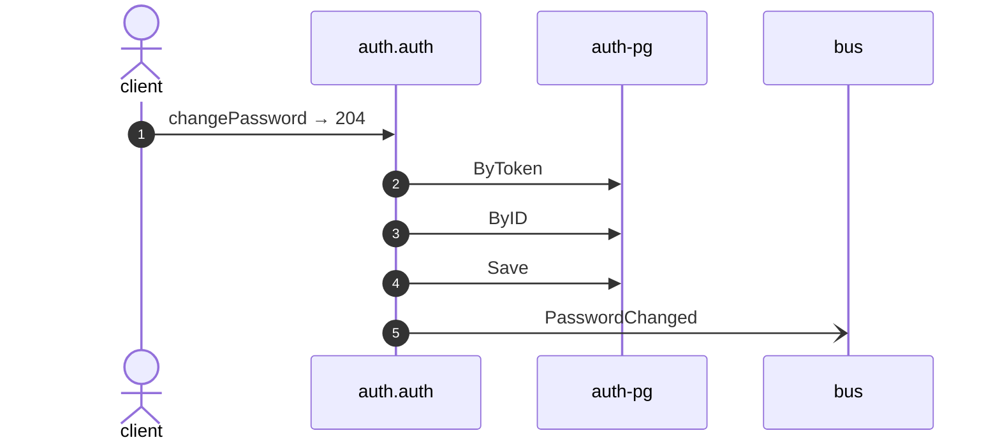

# Change password

*Generated from the portolan catalog. Do not edit by hand.*

- **Id:** `flow.auth-change-password`
- **Owner:** [auth](../auth/README.md)
- **Source:** [`examples/auth/internal/user/infrastructure/http/change_password.go`](https://github.com/shortlink-org/portolan/blob/main/examples/auth/internal/user/infrastructure/http/change_password.go)

Replaces the password of a user, given the current one.

## Participants

| Participant | Kind | Context |
| --- | --- | --- |
| `client` | actor | — |
| `auth.auth` | service | [auth](../auth/README.md) |
| `auth-pg` | store | [auth](../auth/README.md) |
| `bus` | broker | — |

## Sequence

## Steps

1. **client** → **auth.auth** — changePassword → 204
   [`examples/auth/internal/user/infrastructure/http/change_password.go:20`](https://github.com/shortlink-org/portolan/blob/main/examples/auth/internal/user/infrastructure/http/change_password.go#L20) · Seen running in telemetry/traces.jsonl (1 trace).

2. **auth.auth** → **auth-pg** — ByToken
   status: declared · [`examples/auth/internal/session/application/validate/usecase.go:33`](https://github.com/shortlink-org/portolan/blob/main/examples/auth/internal/session/application/validate/usecase.go#L33)

3. **auth.auth** → **auth-pg** — ByID
   status: declared · [`examples/auth/internal/user/application/change_password/usecase.go:32`](https://github.com/shortlink-org/portolan/blob/main/examples/auth/internal/user/application/change_password/usecase.go#L32)

4. **auth.auth** → **auth-pg** — Save
   status: declared · [`examples/auth/internal/user/application/change_password/usecase.go:48`](https://github.com/shortlink-org/portolan/blob/main/examples/auth/internal/user/application/change_password/usecase.go#L48)

5. **auth.auth** → **bus** — PasswordChanged
   [`auth.auth.user.PasswordChanged`](../auth/auth/aggregates/user.md#event-auth-auth-user-passwordchanged) · [`examples/auth/internal/user/application/change_password/usecase.go:48`](https://github.com/shortlink-org/portolan/blob/main/examples/auth/internal/user/application/change_password/usecase.go#L48) · Seen running in telemetry/traces.jsonl (1 trace).
