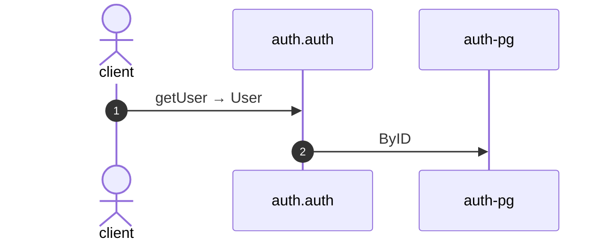

# Get user

*Generated from the portolan catalog. Do not edit by hand.*

- **Id:** `flow.auth-get-user`
- **Owner:** [auth](../auth/README.md)
- **Source:** [`examples/auth/internal/user/infrastructure/http/get.go`](https://github.com/shortlink-org/portolan/blob/main/examples/auth/internal/user/infrastructure/http/get.go)

Reads a user by id.

## Participants

| Participant | Kind | Context |
| --- | --- | --- |
| `client` | actor | — |
| `auth.auth` | service | [auth](../auth/README.md) |
| `auth-pg` | store | [auth](../auth/README.md) |

## Sequence

## Steps

1. **client** → **auth.auth** — getUser → User
   [`examples/auth/internal/user/infrastructure/http/get.go:11`](https://github.com/shortlink-org/portolan/blob/main/examples/auth/internal/user/infrastructure/http/get.go#L11) · Seen running in telemetry/traces.jsonl (3 traces).

2. **auth.auth** → **auth-pg** — ByID
   status: declared · [`examples/auth/internal/user/application/get/usecase.go:22`](https://github.com/shortlink-org/portolan/blob/main/examples/auth/internal/user/application/get/usecase.go#L22)

## Recordings

Traces this flow was seen running in, kept as examples: which steps ran, how long each took, and the names the spans carried.

- **Recording:** [`examples/auth/telemetry/traces.jsonl`](https://github.com/shortlink-org/portolan/blob/main/examples/auth/telemetry/traces.jsonl)
- **Trace:** `4477bdad7f7f3e31d841dbc63e7749e5`
- **Recorded:** 2026-09-12T10:21:50.267679Z
- **Duration:** 1.591 ms

| Step | Span | Duration | Attributes |
| --- | --- | --- | --- |
| [s1](auth-get-user.md#step-s1) | `GET /v1/users/{userId}` | 1.591 ms | `http.request.method=GET` `http.response.status_code=404` `http.route=/v1/users/{userId}` `server.address=localhost` `server.port=8080` |

- **Recording:** [`examples/auth/telemetry/traces.jsonl`](https://github.com/shortlink-org/portolan/blob/main/examples/auth/telemetry/traces.jsonl)
- **Trace:** `0ee6ade54fd1f9a3dc2a787ebacca326`
- **Recorded:** 2026-09-12T10:21:50.280286Z
- **Duration:** 0.732 ms

| Step | Span | Duration | Attributes |
| --- | --- | --- | --- |
| [s1](auth-get-user.md#step-s1) | `GET /v1/users/{userId}` | 0.732 ms | `http.request.method=GET` `http.response.status_code=404` `http.route=/v1/users/{userId}` `server.address=localhost` `server.port=8080` |

- **Recording:** [`examples/auth/telemetry/traces.jsonl`](https://github.com/shortlink-org/portolan/blob/main/examples/auth/telemetry/traces.jsonl)
- **Trace:** `96e6f014ae5ac6d5edcb50dddb9b20e6`
- **Recorded:** 2026-09-12T10:21:56.538913Z
- **Duration:** 1.109 ms

| Step | Span | Duration | Attributes |
| --- | --- | --- | --- |
| [s1](auth-get-user.md#step-s1) | `GET /v1/users/{userId}` | 1.109 ms | `http.request.method=GET` `http.response.status_code=200` `http.route=/v1/users/{userId}` `server.address=localhost` `server.port=8080` |
