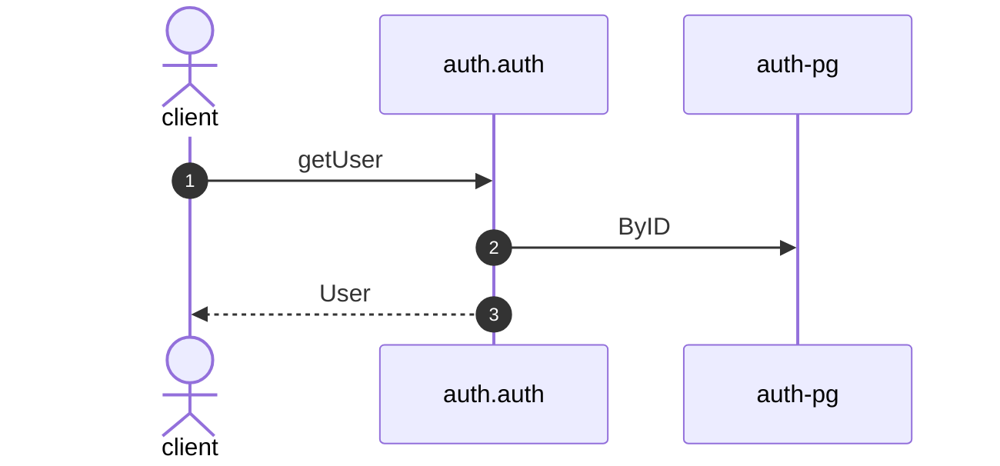

# Get user

*Generated from the portolan catalog. Do not edit by hand.*

- **Id:** `flow.auth-get-user`
- **Owner:** [auth](../auth/README.md)
- **Trigger:** `http` · getUser
- **Root confidence:** high
- **Source:** [`examples/auth/internal/user/infrastructure/http/get.go`](https://github.com/shortlink-org/portolan/blob/main/examples/auth/internal/user/infrastructure/http/get.go)

Reads a user by id. Source-backed cross-protocol continuations are included.

## Participants

| Participant | Kind | Context | Entity |
| --- | --- | --- | --- |
| `client` | actor | — | — |
| `auth.auth` | service | [auth](../auth/README.md) | — |
| `auth-pg` | store | [auth](../auth/README.md) | [auth.auth.pg](../auth/auth/stores/pg.md) |

## Sequence

## Steps

1. **client** → **auth.auth** — getUser
   `auth.v1/getUser` · status: declared · [`examples/auth/internal/user/infrastructure/http/get.go:11`](https://github.com/shortlink-org/portolan/blob/main/examples/auth/internal/user/infrastructure/http/get.go#L11) · evidence: call-site · source-expression · `getUser` · [`examples/auth/internal/user/infrastructure/http/get.go:11`](https://github.com/shortlink-org/portolan/blob/main/examples/auth/internal/user/infrastructure/http/get.go#L11)

2. **auth.auth** → **auth-pg** — ByID
   status: declared · [`examples/auth/internal/user/application/get/usecase.go:22`](https://github.com/shortlink-org/portolan/blob/main/examples/auth/internal/user/application/get/usecase.go#L22) · store: [auth.auth.pg](../auth/auth/stores/pg.md) · `ByID` · evidence: function · source-function · `examples/auth/internal/user/application/get:UseCase.Handle` · [`examples/auth/internal/user/application/get/usecase.go:21`](https://github.com/shortlink-org/portolan/blob/main/examples/auth/internal/user/application/get/usecase.go#L21) · evidence: binding · domain-port-convention · `user.Repository` · [`examples/auth/internal/user/application/get/usecase.go:22`](https://github.com/shortlink-org/portolan/blob/main/examples/auth/internal/user/application/get/usecase.go#L22) · evidence: call-site · source-expression · `ByID` · [`examples/auth/internal/user/application/get/usecase.go:22`](https://github.com/shortlink-org/portolan/blob/main/examples/auth/internal/user/application/get/usecase.go#L22)

3. **auth.auth** → **client** — User
   status: declared · Synthesized from the proven synchronous HTTP handler return.
