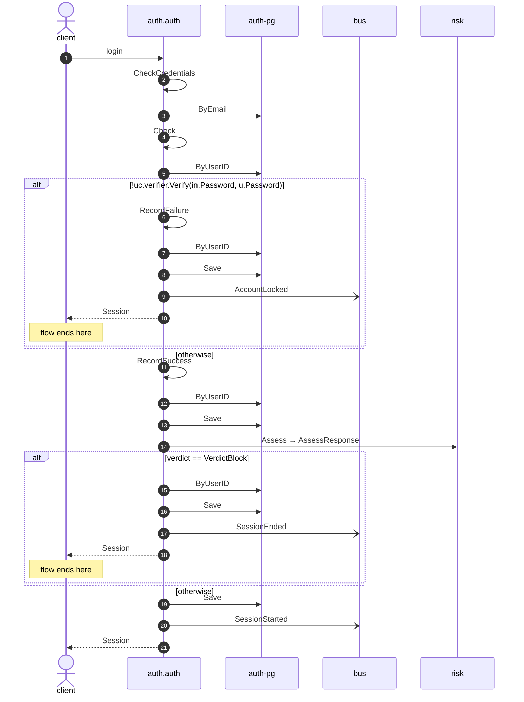

# Login

*Generated from the portolan catalog. Do not edit by hand.*

- **Id:** `flow.auth-login`
- **Owner:** [auth](../auth/README.md)
- **Trigger:** `http` · login
- **Root confidence:** high
- **Source:** [`examples/auth/internal/session/infrastructure/http/login.go`](https://github.com/shortlink-org/portolan/blob/main/examples/auth/internal/session/infrastructure/http/login.go)

Turns credentials into a session. Source-backed cross-protocol continuations are included.

## Participants

| Participant | Kind | Context | Entity |
| --- | --- | --- | --- |
| `client` | actor | — | — |
| `auth.auth` | service | [auth](../auth/README.md) | — |
| `auth-pg` | store | [auth](../auth/README.md) | [auth.auth.pg](../auth/auth/stores/pg.md) |
| `bus` | broker | — | — |
| `risk` | external | — | — |

## Sequence

## Steps

1. **client** → **auth.auth** — login
   `auth.v1/login` · [`examples/auth/internal/session/infrastructure/http/login.go:11`](https://github.com/shortlink-org/portolan/blob/main/examples/auth/internal/session/infrastructure/http/login.go#L11) · Seen running in examples/auth/telemetry/traces.jsonl (10 traces). · evidence: call-site · source-expression · `login` · [`examples/auth/internal/session/infrastructure/http/login.go:11`](https://github.com/shortlink-org/portolan/blob/main/examples/auth/internal/session/infrastructure/http/login.go#L11)

2. **auth.auth** ↺ **auth.auth** — CheckCredentials
   status: declared · [`examples/auth/internal/session/application/login/usecase.go:57`](https://github.com/shortlink-org/portolan/blob/main/examples/auth/internal/session/application/login/usecase.go#L57) · Port `Authenticator`, bound at assembly to the CheckCredentials use case. · evidence: function · source-function · `examples/auth/internal/session/application/login:UseCase.Handle` · [`examples/auth/internal/session/application/login/usecase.go:56`](https://github.com/shortlink-org/portolan/blob/main/examples/auth/internal/session/application/login/usecase.go#L56) · evidence: binding · provider-signature · `NewAuthenticator` · [`examples/auth/internal/session/infrastructure/identity/adapter.go:19`](https://github.com/shortlink-org/portolan/blob/main/examples/auth/internal/session/infrastructure/identity/adapter.go#L19) · evidence: call-site · source-expression · `CheckCredentials` · [`examples/auth/internal/session/application/login/usecase.go:57`](https://github.com/shortlink-org/portolan/blob/main/examples/auth/internal/session/application/login/usecase.go#L57)

3. **auth.auth** → **auth-pg** — ByEmail
   status: declared · [`examples/auth/internal/user/application/check_credentials/usecase.go:42`](https://github.com/shortlink-org/portolan/blob/main/examples/auth/internal/user/application/check_credentials/usecase.go#L42) · store: [auth.auth.pg](../auth/auth/stores/pg.md) · `ByEmail` · evidence: function · source-function · `examples/auth/internal/session/application/login:UseCase.Handle` · [`examples/auth/internal/session/application/login/usecase.go:56`](https://github.com/shortlink-org/portolan/blob/main/examples/auth/internal/session/application/login/usecase.go#L56) · evidence: function · source-function · `examples/auth/internal/user/application/check_credentials:UseCase.Handle` · [`examples/auth/internal/user/application/check_credentials/usecase.go:37`](https://github.com/shortlink-org/portolan/blob/main/examples/auth/internal/user/application/check_credentials/usecase.go#L37) · evidence: binding · domain-port-convention · `user.Repository` · [`examples/auth/internal/user/application/check_credentials/usecase.go:42`](https://github.com/shortlink-org/portolan/blob/main/examples/auth/internal/user/application/check_credentials/usecase.go#L42) · evidence: call-site · source-expression · `ByEmail` · [`examples/auth/internal/user/application/check_credentials/usecase.go:42`](https://github.com/shortlink-org/portolan/blob/main/examples/auth/internal/user/application/check_credentials/usecase.go#L42)

4. **auth.auth** ↺ **auth.auth** — Check
   status: declared · [`examples/auth/internal/user/application/check_credentials/usecase.go:50`](https://github.com/shortlink-org/portolan/blob/main/examples/auth/internal/user/application/check_credentials/usecase.go#L50) · Port `Lockout`, bound at assembly to the Check use case. · evidence: function · source-function · `examples/auth/internal/session/application/login:UseCase.Handle` · [`examples/auth/internal/session/application/login/usecase.go:56`](https://github.com/shortlink-org/portolan/blob/main/examples/auth/internal/session/application/login/usecase.go#L56) · evidence: function · source-function · `examples/auth/internal/user/application/check_credentials:UseCase.Handle` · [`examples/auth/internal/user/application/check_credentials/usecase.go:37`](https://github.com/shortlink-org/portolan/blob/main/examples/auth/internal/user/application/check_credentials/usecase.go#L37) · evidence: binding · provider-signature · `New` · [`examples/auth/internal/user/infrastructure/lockout/adapter.go:21`](https://github.com/shortlink-org/portolan/blob/main/examples/auth/internal/user/infrastructure/lockout/adapter.go#L21) · evidence: call-site · source-expression · `Check` · [`examples/auth/internal/user/application/check_credentials/usecase.go:50`](https://github.com/shortlink-org/portolan/blob/main/examples/auth/internal/user/application/check_credentials/usecase.go#L50)

5. **auth.auth** → **auth-pg** — ByUserID
   status: declared · [`examples/auth/internal/lockout/application/check/usecase.go:26`](https://github.com/shortlink-org/portolan/blob/main/examples/auth/internal/lockout/application/check/usecase.go#L26) · store: [auth.auth.pg](../auth/auth/stores/pg.md) · `ByUserID` · evidence: function · source-function · `examples/auth/internal/session/application/login:UseCase.Handle` · [`examples/auth/internal/session/application/login/usecase.go:56`](https://github.com/shortlink-org/portolan/blob/main/examples/auth/internal/session/application/login/usecase.go#L56) · evidence: function · source-function · `examples/auth/internal/user/application/check_credentials:UseCase.Handle` · [`examples/auth/internal/user/application/check_credentials/usecase.go:37`](https://github.com/shortlink-org/portolan/blob/main/examples/auth/internal/user/application/check_credentials/usecase.go#L37) · evidence: function · source-function · `examples/auth/internal/lockout/application/check:UseCase.Handle` · [`examples/auth/internal/lockout/application/check/usecase.go:25`](https://github.com/shortlink-org/portolan/blob/main/examples/auth/internal/lockout/application/check/usecase.go#L25) · evidence: binding · domain-port-convention · `lockout.Repository` · [`examples/auth/internal/lockout/application/check/usecase.go:26`](https://github.com/shortlink-org/portolan/blob/main/examples/auth/internal/lockout/application/check/usecase.go#L26) · evidence: call-site · source-expression · `ByUserID` · [`examples/auth/internal/lockout/application/check/usecase.go:26`](https://github.com/shortlink-org/portolan/blob/main/examples/auth/internal/lockout/application/check/usecase.go#L26)

> **One of**
>
> *!uc.verifier.Verify(in.Password, u.Password) — *ends the flow**
>
> 
> 6. **auth.auth** ↺ **auth.auth** — RecordFailure
>    status: declared · [`examples/auth/internal/user/application/check_credentials/usecase.go:59`](https://github.com/shortlink-org/portolan/blob/main/examples/auth/internal/user/application/check_credentials/usecase.go#L59) · Port `Lockout`, bound at assembly to the RecordFailure use case. · evidence: function · source-function · `examples/auth/internal/session/application/login:UseCase.Handle` · [`examples/auth/internal/session/application/login/usecase.go:56`](https://github.com/shortlink-org/portolan/blob/main/examples/auth/internal/session/application/login/usecase.go#L56) · evidence: function · source-function · `examples/auth/internal/user/application/check_credentials:UseCase.Handle` · [`examples/auth/internal/user/application/check_credentials/usecase.go:37`](https://github.com/shortlink-org/portolan/blob/main/examples/auth/internal/user/application/check_credentials/usecase.go#L37) · evidence: binding · provider-signature · `New` · [`examples/auth/internal/user/infrastructure/lockout/adapter.go:21`](https://github.com/shortlink-org/portolan/blob/main/examples/auth/internal/user/infrastructure/lockout/adapter.go#L21) · evidence: call-site · source-expression · `RecordFailure` · [`examples/auth/internal/user/application/check_credentials/usecase.go:59`](https://github.com/shortlink-org/portolan/blob/main/examples/auth/internal/user/application/check_credentials/usecase.go#L59)
> 
> 7. **auth.auth** → **auth-pg** — ByUserID
>    status: declared · [`examples/auth/internal/lockout/application/record_failure/usecase.go:36`](https://github.com/shortlink-org/portolan/blob/main/examples/auth/internal/lockout/application/record_failure/usecase.go#L36) · inside a loop over `retries`. · store: [auth.auth.pg](../auth/auth/stores/pg.md) · `ByUserID` · evidence: function · source-function · `examples/auth/internal/session/application/login:UseCase.Handle` · [`examples/auth/internal/session/application/login/usecase.go:56`](https://github.com/shortlink-org/portolan/blob/main/examples/auth/internal/session/application/login/usecase.go#L56) · evidence: function · source-function · `examples/auth/internal/user/application/check_credentials:UseCase.Handle` · [`examples/auth/internal/user/application/check_credentials/usecase.go:37`](https://github.com/shortlink-org/portolan/blob/main/examples/auth/internal/user/application/check_credentials/usecase.go#L37) · evidence: function · source-function · `examples/auth/internal/lockout/application/record_failure:UseCase.Handle` · [`examples/auth/internal/lockout/application/record_failure/usecase.go:34`](https://github.com/shortlink-org/portolan/blob/main/examples/auth/internal/lockout/application/record_failure/usecase.go#L34) · evidence: binding · domain-port-convention · `lockout.Repository` · [`examples/auth/internal/lockout/application/record_failure/usecase.go:36`](https://github.com/shortlink-org/portolan/blob/main/examples/auth/internal/lockout/application/record_failure/usecase.go#L36) · evidence: call-site · source-expression · `ByUserID` · [`examples/auth/internal/lockout/application/record_failure/usecase.go:36`](https://github.com/shortlink-org/portolan/blob/main/examples/auth/internal/lockout/application/record_failure/usecase.go#L36)
> 
> 8. **auth.auth** → **auth-pg** — Save
>    status: declared · [`examples/auth/internal/lockout/application/record_failure/usecase.go:53`](https://github.com/shortlink-org/portolan/blob/main/examples/auth/internal/lockout/application/record_failure/usecase.go#L53) · inside a loop over `retries`. · store: [auth.auth.pg](../auth/auth/stores/pg.md) · `Save` · evidence: function · source-function · `examples/auth/internal/session/application/login:UseCase.Handle` · [`examples/auth/internal/session/application/login/usecase.go:56`](https://github.com/shortlink-org/portolan/blob/main/examples/auth/internal/session/application/login/usecase.go#L56) · evidence: function · source-function · `examples/auth/internal/user/application/check_credentials:UseCase.Handle` · [`examples/auth/internal/user/application/check_credentials/usecase.go:37`](https://github.com/shortlink-org/portolan/blob/main/examples/auth/internal/user/application/check_credentials/usecase.go#L37) · evidence: function · source-function · `examples/auth/internal/lockout/application/record_failure:UseCase.Handle` · [`examples/auth/internal/lockout/application/record_failure/usecase.go:34`](https://github.com/shortlink-org/portolan/blob/main/examples/auth/internal/lockout/application/record_failure/usecase.go#L34) · evidence: binding · domain-port-convention · `lockout.Repository` · [`examples/auth/internal/lockout/application/record_failure/usecase.go:53`](https://github.com/shortlink-org/portolan/blob/main/examples/auth/internal/lockout/application/record_failure/usecase.go#L53) · evidence: call-site · source-expression · `Save` · [`examples/auth/internal/lockout/application/record_failure/usecase.go:53`](https://github.com/shortlink-org/portolan/blob/main/examples/auth/internal/lockout/application/record_failure/usecase.go#L53)
> 
> 9. **auth.auth** → **bus** — AccountLocked
>    [`auth.auth.lockout.AccountLocked`](../auth/auth/aggregates/lockout.md#event-auth-auth-lockout-accountlocked) · [`examples/auth/internal/lockout/application/record_failure/usecase.go:53`](https://github.com/shortlink-org/portolan/blob/main/examples/auth/internal/lockout/application/record_failure/usecase.go#L53) · inside a loop over `retries`. · evidence: function · source-function · `examples/auth/internal/session/application/login:UseCase.Handle` · [`examples/auth/internal/session/application/login/usecase.go:56`](https://github.com/shortlink-org/portolan/blob/main/examples/auth/internal/session/application/login/usecase.go#L56) · evidence: function · source-function · `examples/auth/internal/user/application/check_credentials:UseCase.Handle` · [`examples/auth/internal/user/application/check_credentials/usecase.go:37`](https://github.com/shortlink-org/portolan/blob/main/examples/auth/internal/user/application/check_credentials/usecase.go#L37) · evidence: function · source-function · `examples/auth/internal/lockout/application/record_failure:UseCase.Handle` · [`examples/auth/internal/lockout/application/record_failure/usecase.go:34`](https://github.com/shortlink-org/portolan/blob/main/examples/auth/internal/lockout/application/record_failure/usecase.go#L34) · evidence: call-site · source-expression · `AccountLocked` · [`examples/auth/internal/lockout/application/record_failure/usecase.go:53`](https://github.com/shortlink-org/portolan/blob/main/examples/auth/internal/lockout/application/record_failure/usecase.go#L53)
> 
> 10. **auth.auth** → **client** — Session
>    Synthesized from the proven synchronous HTTP handler return.
>
> *otherwise*

11. **auth.auth** ↺ **auth.auth** — RecordSuccess
   status: declared · [`examples/auth/internal/user/application/check_credentials/usecase.go:68`](https://github.com/shortlink-org/portolan/blob/main/examples/auth/internal/user/application/check_credentials/usecase.go#L68) · Port `Lockout`, bound at assembly to the RecordSuccess use case. · evidence: function · source-function · `examples/auth/internal/session/application/login:UseCase.Handle` · [`examples/auth/internal/session/application/login/usecase.go:56`](https://github.com/shortlink-org/portolan/blob/main/examples/auth/internal/session/application/login/usecase.go#L56) · evidence: function · source-function · `examples/auth/internal/user/application/check_credentials:UseCase.Handle` · [`examples/auth/internal/user/application/check_credentials/usecase.go:37`](https://github.com/shortlink-org/portolan/blob/main/examples/auth/internal/user/application/check_credentials/usecase.go#L37) · evidence: binding · provider-signature · `New` · [`examples/auth/internal/user/infrastructure/lockout/adapter.go:21`](https://github.com/shortlink-org/portolan/blob/main/examples/auth/internal/user/infrastructure/lockout/adapter.go#L21) · evidence: call-site · source-expression · `RecordSuccess` · [`examples/auth/internal/user/application/check_credentials/usecase.go:68`](https://github.com/shortlink-org/portolan/blob/main/examples/auth/internal/user/application/check_credentials/usecase.go#L68)

12. **auth.auth** → **auth-pg** — ByUserID
   status: declared · [`examples/auth/internal/lockout/application/record_success/usecase.go:31`](https://github.com/shortlink-org/portolan/blob/main/examples/auth/internal/lockout/application/record_success/usecase.go#L31) · inside a loop over `retries`. · store: [auth.auth.pg](../auth/auth/stores/pg.md) · `ByUserID` · evidence: function · source-function · `examples/auth/internal/session/application/login:UseCase.Handle` · [`examples/auth/internal/session/application/login/usecase.go:56`](https://github.com/shortlink-org/portolan/blob/main/examples/auth/internal/session/application/login/usecase.go#L56) · evidence: function · source-function · `examples/auth/internal/user/application/check_credentials:UseCase.Handle` · [`examples/auth/internal/user/application/check_credentials/usecase.go:37`](https://github.com/shortlink-org/portolan/blob/main/examples/auth/internal/user/application/check_credentials/usecase.go#L37) · evidence: function · source-function · `examples/auth/internal/lockout/application/record_success:UseCase.Handle` · [`examples/auth/internal/lockout/application/record_success/usecase.go:29`](https://github.com/shortlink-org/portolan/blob/main/examples/auth/internal/lockout/application/record_success/usecase.go#L29) · evidence: binding · domain-port-convention · `lockout.Repository` · [`examples/auth/internal/lockout/application/record_success/usecase.go:31`](https://github.com/shortlink-org/portolan/blob/main/examples/auth/internal/lockout/application/record_success/usecase.go#L31) · evidence: call-site · source-expression · `ByUserID` · [`examples/auth/internal/lockout/application/record_success/usecase.go:31`](https://github.com/shortlink-org/portolan/blob/main/examples/auth/internal/lockout/application/record_success/usecase.go#L31)

13. **auth.auth** → **auth-pg** — Save
   status: declared · [`examples/auth/internal/lockout/application/record_success/usecase.go:43`](https://github.com/shortlink-org/portolan/blob/main/examples/auth/internal/lockout/application/record_success/usecase.go#L43) · inside a loop over `retries`. · store: [auth.auth.pg](../auth/auth/stores/pg.md) · `Save` · evidence: function · source-function · `examples/auth/internal/session/application/login:UseCase.Handle` · [`examples/auth/internal/session/application/login/usecase.go:56`](https://github.com/shortlink-org/portolan/blob/main/examples/auth/internal/session/application/login/usecase.go#L56) · evidence: function · source-function · `examples/auth/internal/user/application/check_credentials:UseCase.Handle` · [`examples/auth/internal/user/application/check_credentials/usecase.go:37`](https://github.com/shortlink-org/portolan/blob/main/examples/auth/internal/user/application/check_credentials/usecase.go#L37) · evidence: function · source-function · `examples/auth/internal/lockout/application/record_success:UseCase.Handle` · [`examples/auth/internal/lockout/application/record_success/usecase.go:29`](https://github.com/shortlink-org/portolan/blob/main/examples/auth/internal/lockout/application/record_success/usecase.go#L29) · evidence: binding · domain-port-convention · `lockout.Repository` · [`examples/auth/internal/lockout/application/record_success/usecase.go:43`](https://github.com/shortlink-org/portolan/blob/main/examples/auth/internal/lockout/application/record_success/usecase.go#L43) · evidence: call-site · source-expression · `Save` · [`examples/auth/internal/lockout/application/record_success/usecase.go:43`](https://github.com/shortlink-org/portolan/blob/main/examples/auth/internal/lockout/application/record_success/usecase.go#L43)

14. **auth.auth** → **risk** — Assess → AssessResponse
   `risk.v1.RiskService/Assess` · status: declared · [`examples/auth/internal/session/application/login/usecase.go:62`](https://github.com/shortlink-org/portolan/blob/main/examples/auth/internal/session/application/login/usecase.go#L62) · evidence: function · source-function · `examples/auth/internal/session/application/login:UseCase.Handle` · [`examples/auth/internal/session/application/login/usecase.go:56`](https://github.com/shortlink-org/portolan/blob/main/examples/auth/internal/session/application/login/usecase.go#L56) · evidence: contract · generated-client-method · `risk.v1.RiskService/Assess` · [`examples/auth/internal/session/infrastructure/risk/gen/riskpb/risk_grpc.pb.go`](https://github.com/shortlink-org/portolan/blob/main/examples/auth/internal/session/infrastructure/risk/gen/riskpb/risk_grpc.pb.go) · evidence: call-site · source-expression · `Assess` · [`examples/auth/internal/session/application/login/usecase.go:62`](https://github.com/shortlink-org/portolan/blob/main/examples/auth/internal/session/application/login/usecase.go#L62)

> **One of**
>
> *verdict == VerdictBlock — *ends the flow**
>
> 
> 15. **auth.auth** → **auth-pg** — ByUserID
>    status: declared · [`examples/auth/internal/session/application/login/usecase.go:91`](https://github.com/shortlink-org/portolan/blob/main/examples/auth/internal/session/application/login/usecase.go#L91) · store: [auth.auth.pg](../auth/auth/stores/pg.md) · `ByUserID` · evidence: function · source-function · `examples/auth/internal/session/application/login:UseCase.Handle` · [`examples/auth/internal/session/application/login/usecase.go:56`](https://github.com/shortlink-org/portolan/blob/main/examples/auth/internal/session/application/login/usecase.go#L56) · evidence: function · source-function · `examples/auth/internal/session/application/login:UseCase.endAll` · [`examples/auth/internal/session/application/login/usecase.go:90`](https://github.com/shortlink-org/portolan/blob/main/examples/auth/internal/session/application/login/usecase.go#L90) · evidence: binding · domain-port-convention · `session.Repository` · [`examples/auth/internal/session/application/login/usecase.go:91`](https://github.com/shortlink-org/portolan/blob/main/examples/auth/internal/session/application/login/usecase.go#L91) · evidence: call-site · source-expression · `ByUserID` · [`examples/auth/internal/session/application/login/usecase.go:91`](https://github.com/shortlink-org/portolan/blob/main/examples/auth/internal/session/application/login/usecase.go#L91)
> 
> 16. **auth.auth** → **auth-pg** — Save
>    status: declared · [`examples/auth/internal/session/application/login/usecase.go:101`](https://github.com/shortlink-org/portolan/blob/main/examples/auth/internal/session/application/login/usecase.go#L101) · inside a loop over `sessions`. · store: [auth.auth.pg](../auth/auth/stores/pg.md) · `Save` · evidence: function · source-function · `examples/auth/internal/session/application/login:UseCase.Handle` · [`examples/auth/internal/session/application/login/usecase.go:56`](https://github.com/shortlink-org/portolan/blob/main/examples/auth/internal/session/application/login/usecase.go#L56) · evidence: function · source-function · `examples/auth/internal/session/application/login:UseCase.endAll` · [`examples/auth/internal/session/application/login/usecase.go:90`](https://github.com/shortlink-org/portolan/blob/main/examples/auth/internal/session/application/login/usecase.go#L90) · evidence: binding · domain-port-convention · `session.Repository` · [`examples/auth/internal/session/application/login/usecase.go:101`](https://github.com/shortlink-org/portolan/blob/main/examples/auth/internal/session/application/login/usecase.go#L101) · evidence: call-site · source-expression · `Save` · [`examples/auth/internal/session/application/login/usecase.go:101`](https://github.com/shortlink-org/portolan/blob/main/examples/auth/internal/session/application/login/usecase.go#L101)
> 
> 17. **auth.auth** → **bus** — SessionEnded
>    [`auth.auth.session.SessionEnded`](../auth/auth/aggregates/session.md#event-auth-auth-session-sessionended) · status: declared · [`examples/auth/internal/session/application/login/usecase.go:101`](https://github.com/shortlink-org/portolan/blob/main/examples/auth/internal/session/application/login/usecase.go#L101) · inside a loop over `sessions`. · evidence: function · source-function · `examples/auth/internal/session/application/login:UseCase.Handle` · [`examples/auth/internal/session/application/login/usecase.go:56`](https://github.com/shortlink-org/portolan/blob/main/examples/auth/internal/session/application/login/usecase.go#L56) · evidence: function · source-function · `examples/auth/internal/session/application/login:UseCase.endAll` · [`examples/auth/internal/session/application/login/usecase.go:90`](https://github.com/shortlink-org/portolan/blob/main/examples/auth/internal/session/application/login/usecase.go#L90) · evidence: call-site · source-expression · `SessionEnded` · [`examples/auth/internal/session/application/login/usecase.go:101`](https://github.com/shortlink-org/portolan/blob/main/examples/auth/internal/session/application/login/usecase.go#L101)
> 
> 18. **auth.auth** → **client** — Session
>    Synthesized from the proven synchronous HTTP handler return.
>
> *otherwise*

19. **auth.auth** → **auth-pg** — Save
   status: declared · [`examples/auth/internal/session/application/login/usecase.go:77`](https://github.com/shortlink-org/portolan/blob/main/examples/auth/internal/session/application/login/usecase.go#L77) · store: [auth.auth.pg](../auth/auth/stores/pg.md) · `Save` · evidence: function · source-function · `examples/auth/internal/session/application/login:UseCase.Handle` · [`examples/auth/internal/session/application/login/usecase.go:56`](https://github.com/shortlink-org/portolan/blob/main/examples/auth/internal/session/application/login/usecase.go#L56) · evidence: binding · domain-port-convention · `session.Repository` · [`examples/auth/internal/session/application/login/usecase.go:77`](https://github.com/shortlink-org/portolan/blob/main/examples/auth/internal/session/application/login/usecase.go#L77) · evidence: call-site · source-expression · `Save` · [`examples/auth/internal/session/application/login/usecase.go:77`](https://github.com/shortlink-org/portolan/blob/main/examples/auth/internal/session/application/login/usecase.go#L77)

20. **auth.auth** → **bus** — SessionStarted
   [`auth.auth.session.SessionStarted`](../auth/auth/aggregates/session.md#event-auth-auth-session-sessionstarted) · [`examples/auth/internal/session/application/login/usecase.go:77`](https://github.com/shortlink-org/portolan/blob/main/examples/auth/internal/session/application/login/usecase.go#L77) · Seen running in examples/auth/telemetry/traces.jsonl (10 traces). · evidence: function · source-function · `examples/auth/internal/session/application/login:UseCase.Handle` · [`examples/auth/internal/session/application/login/usecase.go:56`](https://github.com/shortlink-org/portolan/blob/main/examples/auth/internal/session/application/login/usecase.go#L56) · evidence: call-site · source-expression · `SessionStarted` · [`examples/auth/internal/session/application/login/usecase.go:77`](https://github.com/shortlink-org/portolan/blob/main/examples/auth/internal/session/application/login/usecase.go#L77)

21. **auth.auth** → **client** — Session
   Synthesized from the proven synchronous HTTP handler return.

## Recordings

Traces this flow was seen running in, kept as examples: which steps ran, how long each took, and the names the spans carried.

- **Recording:** [`examples/auth/telemetry/traces.jsonl`](https://github.com/shortlink-org/portolan/blob/main/examples/auth/telemetry/traces.jsonl)
- **Trace:** `02e8453ebeca90ad2136d3a8592d6f52`
- **Recorded:** 2026-09-12T10:21:50.334643Z
- **Duration:** 23.495 ms

| Step | Span | Duration | Attributes |
| --- | --- | --- | --- |
| [s1](auth-login.md#step-s1) | `POST /v1/sessions` | 23.495 ms | `http.request.method=POST` `http.response.status_code=201` `http.route=/v1/sessions` `server.address=localhost` `server.port=8080` |
| [s20](auth-login.md#step-s20) | `publish auth.SessionStarted` | 0.001 ms | `event.name=auth.SessionStarted` `messaging.destination.name=auth_session` `messaging.operation.type=publish` `messaging.system=outbox` |

- **Recording:** [`examples/auth/telemetry/traces.jsonl`](https://github.com/shortlink-org/portolan/blob/main/examples/auth/telemetry/traces.jsonl)
- **Trace:** `b6aff747917df310640719e5289f396e`
- **Recorded:** 2026-09-12T10:21:50.366269Z
- **Duration:** 22.089 ms

| Step | Span | Duration | Attributes |
| --- | --- | --- | --- |
| [s1](auth-login.md#step-s1) | `POST /v1/sessions` | 22.089 ms | `http.request.method=POST` `http.response.status_code=201` `http.route=/v1/sessions` `server.address=localhost` `server.port=8080` |
| [s20](auth-login.md#step-s20) | `publish auth.SessionStarted` | 0.001 ms | `event.name=auth.SessionStarted` `messaging.destination.name=auth_session` `messaging.operation.type=publish` `messaging.system=outbox` |

- **Recording:** [`examples/auth/telemetry/traces.jsonl`](https://github.com/shortlink-org/portolan/blob/main/examples/auth/telemetry/traces.jsonl)
- **Trace:** `8d0b412eb458897f7d3ff6b39ac9138a`
- **Recorded:** 2026-09-12T10:21:56.548049Z
- **Duration:** 25.225 ms

| Step | Span | Duration | Attributes |
| --- | --- | --- | --- |
| [s1](auth-login.md#step-s1) | `POST /v1/sessions` | 25.225 ms | `http.request.method=POST` `http.response.status_code=201` `http.route=/v1/sessions` `server.address=localhost` `server.port=8080` |
| [s20](auth-login.md#step-s20) | `publish auth.SessionStarted` | 0.002 ms | `event.name=auth.SessionStarted` `messaging.destination.name=auth_session` `messaging.operation.type=publish` `messaging.system=outbox` |

- **Recording:** [`examples/auth/telemetry/traces.jsonl`](https://github.com/shortlink-org/portolan/blob/main/examples/auth/telemetry/traces.jsonl)
- **Trace:** `636904aecb41829a8bc232b5003dd918`
- **Recorded:** 2026-09-12T10:21:56.722975Z
- **Duration:** 21.457 ms

| Step | Span | Duration | Attributes |
| --- | --- | --- | --- |
| [s1](auth-login.md#step-s1) | `POST /v1/sessions` | 21.457 ms | `http.request.method=POST` `http.response.status_code=401` `http.route=/v1/sessions` `server.address=localhost` `server.port=8080` |
| [s9](auth-login.md#step-s9) | `publish auth.AccountLocked` | 0.001 ms | `event.name=auth.AccountLocked` `messaging.destination.name=auth_lockout` `messaging.operation.type=publish` `messaging.system=outbox` |

- **Recording:** [`examples/auth/telemetry/traces.jsonl`](https://github.com/shortlink-org/portolan/blob/main/examples/auth/telemetry/traces.jsonl)
- **Trace:** `e49d5adf2fb5ecc3ed0fa041fb66b7b1`
- **Recorded:** 2026-09-12T10:21:56.607654Z
- **Duration:** 22.53 ms

| Step | Span | Duration | Attributes |
| --- | --- | --- | --- |
| [s1](auth-login.md#step-s1) | `POST /v1/sessions` | 22.53 ms | `http.request.method=POST` `http.response.status_code=401` `http.route=/v1/sessions` `server.address=localhost` `server.port=8080` |
