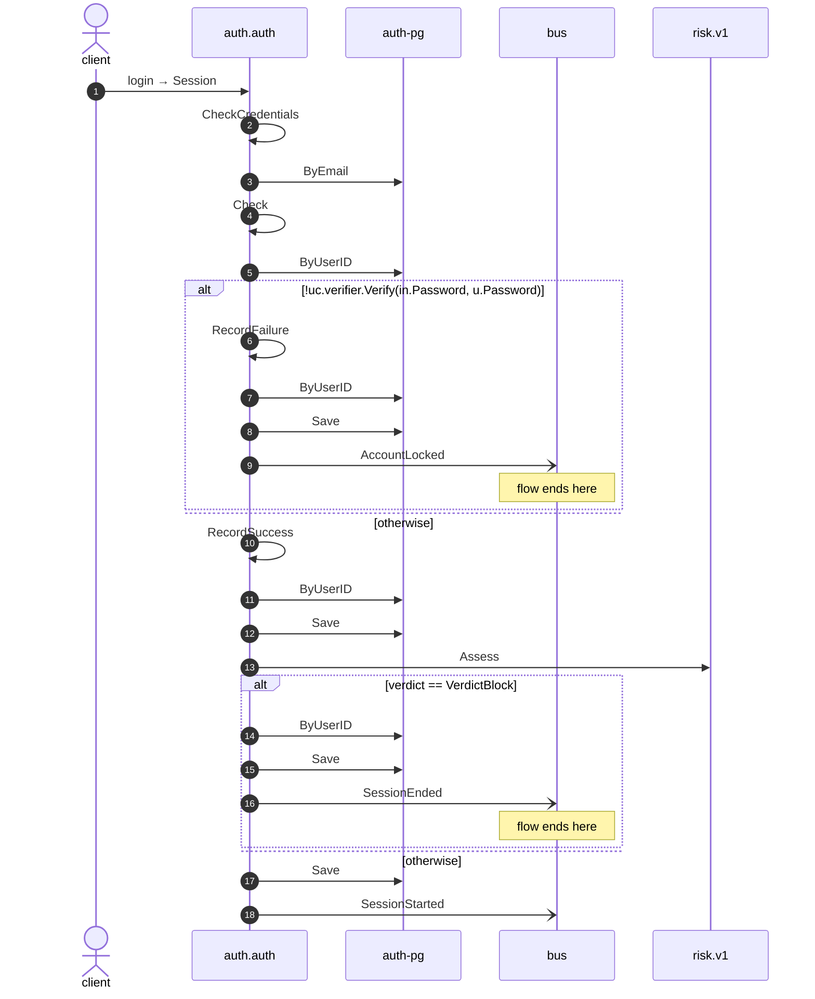

# Login

*Generated from the portolan catalog. Do not edit by hand.*

- **Id:** `flow.auth-login`
- **Owner:** [auth](../auth/README.md)
- **Source:** [`examples/auth/internal/session/infrastructure/http/login.go`](https://github.com/shortlink-org/portolan/blob/main/examples/auth/internal/session/infrastructure/http/login.go)

Turns credentials into a session.

## Participants

| Participant | Kind | Context | Label |
| --- | --- | --- | --- |
| `client` | actor | — | — |
| `auth.auth` | service | [auth](../auth/README.md) | — |
| `auth-pg` | store | [auth](../auth/README.md) | — |
| `bus` | broker | — | — |
| `risk-v1` | unknown | — | risk.v1 |

## Sequence

## Steps

1. **client** → **auth.auth** — login → Session
   [`examples/auth/internal/session/infrastructure/http/login.go:11`](https://github.com/shortlink-org/portolan/blob/main/examples/auth/internal/session/infrastructure/http/login.go#L11) · Seen running in telemetry/traces.jsonl (2 traces).

2. **auth.auth** ↺ **auth.auth** — CheckCredentials
   status: declared · [`examples/auth/internal/session/application/login/usecase.go:57`](https://github.com/shortlink-org/portolan/blob/main/examples/auth/internal/session/application/login/usecase.go#L57) · Port `Authenticator`, bound at assembly to the CheckCredentials use case.

3. **auth.auth** → **auth-pg** — ByEmail
   status: declared · [`examples/auth/internal/user/application/check_credentials/usecase.go:42`](https://github.com/shortlink-org/portolan/blob/main/examples/auth/internal/user/application/check_credentials/usecase.go#L42)

4. **auth.auth** ↺ **auth.auth** — Check
   status: declared · [`examples/auth/internal/user/application/check_credentials/usecase.go:50`](https://github.com/shortlink-org/portolan/blob/main/examples/auth/internal/user/application/check_credentials/usecase.go#L50) · Port `Lockout`, bound at assembly to the Check use case.

5. **auth.auth** → **auth-pg** — ByUserID
   status: declared · [`examples/auth/internal/lockout/application/check/usecase.go:26`](https://github.com/shortlink-org/portolan/blob/main/examples/auth/internal/lockout/application/check/usecase.go#L26)

> **One of**
>
> *!uc.verifier.Verify(in.Password, u.Password) — *ends the flow**
>
> 
> 6. **auth.auth** ↺ **auth.auth** — RecordFailure
>    status: declared · [`examples/auth/internal/user/application/check_credentials/usecase.go:59`](https://github.com/shortlink-org/portolan/blob/main/examples/auth/internal/user/application/check_credentials/usecase.go#L59) · Port `Lockout`, bound at assembly to the RecordFailure use case.
> 
> 7. **auth.auth** → **auth-pg** — ByUserID
>    status: declared · [`examples/auth/internal/lockout/application/record_failure/usecase.go:36`](https://github.com/shortlink-org/portolan/blob/main/examples/auth/internal/lockout/application/record_failure/usecase.go#L36) · inside a loop over `retries`.
> 
> 8. **auth.auth** → **auth-pg** — Save
>    status: declared · [`examples/auth/internal/lockout/application/record_failure/usecase.go:53`](https://github.com/shortlink-org/portolan/blob/main/examples/auth/internal/lockout/application/record_failure/usecase.go#L53) · inside a loop over `retries`.
> 
> 9. **auth.auth** → **bus** — AccountLocked
>    [`auth.auth.lockout.AccountLocked`](../auth/auth/aggregates/lockout.md#event-auth-auth-lockout-accountlocked) · status: declared · [`examples/auth/internal/lockout/application/record_failure/usecase.go:53`](https://github.com/shortlink-org/portolan/blob/main/examples/auth/internal/lockout/application/record_failure/usecase.go#L53) · inside a loop over `retries`.
>
> *otherwise*

10. **auth.auth** ↺ **auth.auth** — RecordSuccess
   status: declared · [`examples/auth/internal/user/application/check_credentials/usecase.go:68`](https://github.com/shortlink-org/portolan/blob/main/examples/auth/internal/user/application/check_credentials/usecase.go#L68) · Port `Lockout`, bound at assembly to the RecordSuccess use case.

11. **auth.auth** → **auth-pg** — ByUserID
   status: declared · [`examples/auth/internal/lockout/application/record_success/usecase.go:31`](https://github.com/shortlink-org/portolan/blob/main/examples/auth/internal/lockout/application/record_success/usecase.go#L31) · inside a loop over `retries`.

12. **auth.auth** → **auth-pg** — Save
   status: declared · [`examples/auth/internal/lockout/application/record_success/usecase.go:43`](https://github.com/shortlink-org/portolan/blob/main/examples/auth/internal/lockout/application/record_success/usecase.go#L43) · inside a loop over `retries`.

13. **auth.auth** → **risk-v1** — Assess
   `risk.v1.RiskService/Assess` · status: unresolved · [`examples/auth/internal/session/application/login/usecase.go:62`](https://github.com/shortlink-org/portolan/blob/main/examples/auth/internal/session/application/login/usecase.go#L62)

> **One of**
>
> *verdict == VerdictBlock — *ends the flow**
>
> 
> 14. **auth.auth** → **auth-pg** — ByUserID
>    status: declared · [`examples/auth/internal/session/application/login/usecase.go:91`](https://github.com/shortlink-org/portolan/blob/main/examples/auth/internal/session/application/login/usecase.go#L91)
> 
> 15. **auth.auth** → **auth-pg** — Save
>    status: declared · [`examples/auth/internal/session/application/login/usecase.go:101`](https://github.com/shortlink-org/portolan/blob/main/examples/auth/internal/session/application/login/usecase.go#L101) · inside a loop over `sessions`.
> 
> 16. **auth.auth** → **bus** — SessionEnded
>    [`auth.auth.session.SessionEnded`](../auth/auth/aggregates/session.md#event-auth-auth-session-sessionended) · status: declared · [`examples/auth/internal/session/application/login/usecase.go:101`](https://github.com/shortlink-org/portolan/blob/main/examples/auth/internal/session/application/login/usecase.go#L101) · inside a loop over `sessions`.
>
> *otherwise*

17. **auth.auth** → **auth-pg** — Save
   status: declared · [`examples/auth/internal/session/application/login/usecase.go:77`](https://github.com/shortlink-org/portolan/blob/main/examples/auth/internal/session/application/login/usecase.go#L77)

18. **auth.auth** → **bus** — SessionStarted
   [`auth.auth.session.SessionStarted`](../auth/auth/aggregates/session.md#event-auth-auth-session-sessionstarted) · [`examples/auth/internal/session/application/login/usecase.go:77`](https://github.com/shortlink-org/portolan/blob/main/examples/auth/internal/session/application/login/usecase.go#L77) · Seen running in telemetry/traces.jsonl (2 traces).
