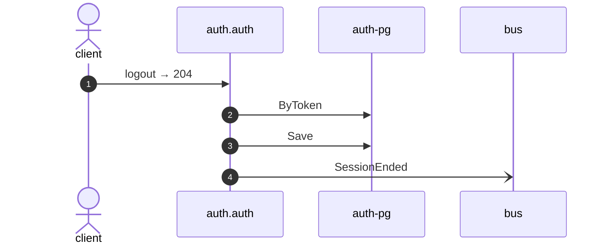

# Logout

*Generated from the portolan catalog. Do not edit by hand.*

- **Id:** `flow.auth-logout`
- **Owner:** [auth](../auth/README.md)
- **Source:** [`examples/auth/internal/session/infrastructure/http/logout.go`](https://github.com/shortlink-org/portolan/blob/main/examples/auth/internal/session/infrastructure/http/logout.go)

Ends the session behind a token.

## Participants

| Participant | Kind | Context |
| --- | --- | --- |
| `client` | actor | — |
| `auth.auth` | service | [auth](../auth/README.md) |
| `auth-pg` | store | [auth](../auth/README.md) |
| `bus` | broker | — |

## Sequence

## Steps

1. **client** → **auth.auth** — logout → 204
   [`examples/auth/internal/session/infrastructure/http/logout.go:15`](https://github.com/shortlink-org/portolan/blob/main/examples/auth/internal/session/infrastructure/http/logout.go#L15) · Seen running in telemetry/traces.jsonl (1 trace).

2. **auth.auth** → **auth-pg** — ByToken
   status: declared · [`examples/auth/internal/session/application/logout/usecase.go:34`](https://github.com/shortlink-org/portolan/blob/main/examples/auth/internal/session/application/logout/usecase.go#L34)

3. **auth.auth** → **auth-pg** — Save
   status: declared · [`examples/auth/internal/session/application/logout/usecase.go:48`](https://github.com/shortlink-org/portolan/blob/main/examples/auth/internal/session/application/logout/usecase.go#L48)

4. **auth.auth** → **bus** — SessionEnded
   [`auth.auth.session.SessionEnded`](../auth/auth/aggregates/session.md#event-auth-auth-session-sessionended) · [`examples/auth/internal/session/application/logout/usecase.go:48`](https://github.com/shortlink-org/portolan/blob/main/examples/auth/internal/session/application/logout/usecase.go#L48) · Seen running in telemetry/traces.jsonl (1 trace).

## Recordings

Traces this flow was seen running in, kept as examples: which steps ran, how long each took, and the names the spans carried.

- **Recording:** [`examples/auth/telemetry/traces.jsonl`](https://github.com/shortlink-org/portolan/blob/main/examples/auth/telemetry/traces.jsonl)
- **Trace:** `81580abd0bc8ab1c73813a0cab33f499`
- **Recorded:** 2026-09-05T20:47:06.282783Z
- **Duration:** 4.452 ms

| Step | Span | Duration | Attributes |
| --- | --- | --- | --- |
| [s1](auth-logout.md#step-s1) | `DELETE /v1/sessions/current` | 4.452 ms | `http.request.method=DELETE` `http.response.status_code=204` `http.route=/v1/sessions/current` `server.address=localhost` `server.port=8080` |
| [s4](auth-logout.md#step-s4) | `publish auth.SessionEnded` | 0.003 ms | `event.name=auth.SessionEnded` `messaging.destination.name=auth_session` `messaging.operation.type=publish` `messaging.system=outbox` |
