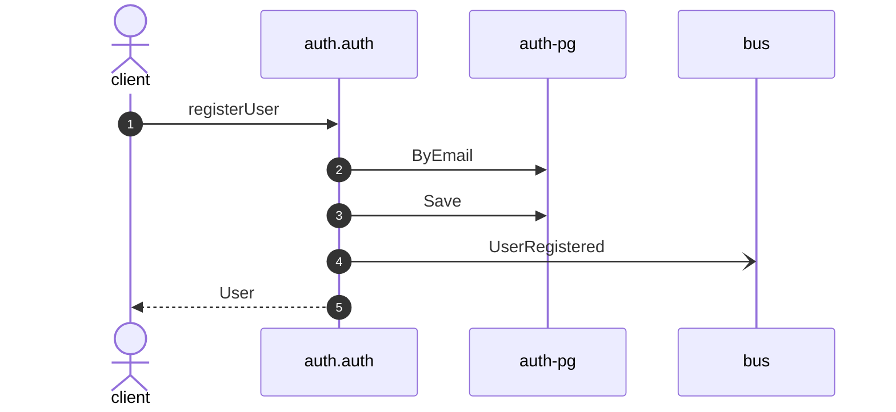

# Register user

*Generated from the portolan catalog. Do not edit by hand.*

- **Id:** `flow.auth-register-user`
- **Owner:** [auth](../auth/README.md)
- **Trigger:** `http` · registerUser
- **Root confidence:** high
- **Source:** [`examples/auth/internal/user/infrastructure/http/register.go`](https://github.com/shortlink-org/portolan/blob/main/examples/auth/internal/user/infrastructure/http/register.go)

Creates a user from an email address and a password. Source-backed cross-protocol continuations are included.

## Participants

| Participant | Kind | Context | Entity |
| --- | --- | --- | --- |
| `client` | actor | — | — |
| `auth.auth` | service | [auth](../auth/README.md) | — |
| `auth-pg` | store | [auth](../auth/README.md) | [auth.auth.pg](../auth/auth/stores/pg.md) |
| `bus` | broker | — | — |

## Sequence

## Steps

1. **client** → **auth.auth** — registerUser
   `auth.v1/registerUser` · status: declared · [`examples/auth/internal/user/infrastructure/http/register.go:16`](https://github.com/shortlink-org/portolan/blob/main/examples/auth/internal/user/infrastructure/http/register.go#L16) · evidence: call-site · source-expression · `registerUser` · [`examples/auth/internal/user/infrastructure/http/register.go:16`](https://github.com/shortlink-org/portolan/blob/main/examples/auth/internal/user/infrastructure/http/register.go#L16)

2. **auth.auth** → **auth-pg** — ByEmail
   status: declared · [`examples/auth/internal/user/application/register/usecase.go:36`](https://github.com/shortlink-org/portolan/blob/main/examples/auth/internal/user/application/register/usecase.go#L36) · store: [auth.auth.pg](../auth/auth/stores/pg.md) · `ByEmail` · evidence: function · source-function · `examples/auth/internal/user/application/register:UseCase.Handle` · [`examples/auth/internal/user/application/register/usecase.go:31`](https://github.com/shortlink-org/portolan/blob/main/examples/auth/internal/user/application/register/usecase.go#L31) · evidence: binding · domain-port-convention · `user.Repository` · [`examples/auth/internal/user/application/register/usecase.go:36`](https://github.com/shortlink-org/portolan/blob/main/examples/auth/internal/user/application/register/usecase.go#L36) · evidence: call-site · source-expression · `ByEmail` · [`examples/auth/internal/user/application/register/usecase.go:36`](https://github.com/shortlink-org/portolan/blob/main/examples/auth/internal/user/application/register/usecase.go#L36)

3. **auth.auth** → **auth-pg** — Save
   status: declared · [`examples/auth/internal/user/application/register/usecase.go:53`](https://github.com/shortlink-org/portolan/blob/main/examples/auth/internal/user/application/register/usecase.go#L53) · store: [auth.auth.pg](../auth/auth/stores/pg.md) · `Save` · evidence: function · source-function · `examples/auth/internal/user/application/register:UseCase.Handle` · [`examples/auth/internal/user/application/register/usecase.go:31`](https://github.com/shortlink-org/portolan/blob/main/examples/auth/internal/user/application/register/usecase.go#L31) · evidence: binding · domain-port-convention · `user.Repository` · [`examples/auth/internal/user/application/register/usecase.go:53`](https://github.com/shortlink-org/portolan/blob/main/examples/auth/internal/user/application/register/usecase.go#L53) · evidence: call-site · source-expression · `Save` · [`examples/auth/internal/user/application/register/usecase.go:53`](https://github.com/shortlink-org/portolan/blob/main/examples/auth/internal/user/application/register/usecase.go#L53)

4. **auth.auth** → **bus** — UserRegistered
   [`auth.auth.user.UserRegistered`](../auth/auth/aggregates/user.md#event-auth-auth-user-userregistered) · status: declared · [`examples/auth/internal/user/application/register/usecase.go:53`](https://github.com/shortlink-org/portolan/blob/main/examples/auth/internal/user/application/register/usecase.go#L53) · evidence: function · source-function · `examples/auth/internal/user/application/register:UseCase.Handle` · [`examples/auth/internal/user/application/register/usecase.go:31`](https://github.com/shortlink-org/portolan/blob/main/examples/auth/internal/user/application/register/usecase.go#L31) · evidence: call-site · source-expression · `UserRegistered` · [`examples/auth/internal/user/application/register/usecase.go:53`](https://github.com/shortlink-org/portolan/blob/main/examples/auth/internal/user/application/register/usecase.go#L53)

5. **auth.auth** → **client** — User
   status: declared · Synthesized from the proven synchronous HTTP handler return.
