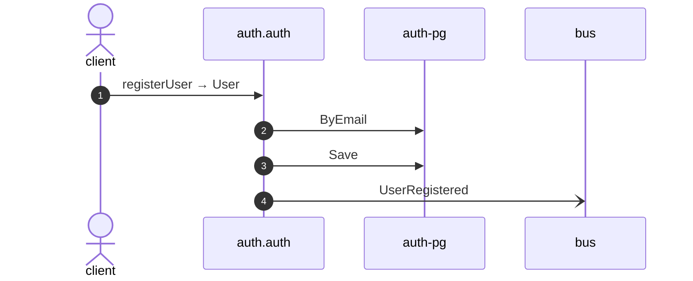

# Register user

*Generated from the portolan catalog. Do not edit by hand.*

- **Id:** `flow.auth-register-user`
- **Owner:** [auth](../auth/README.md)
- **Source:** [`examples/auth/internal/user/infrastructure/http/register.go`](https://github.com/shortlink-org/portolan/blob/main/examples/auth/internal/user/infrastructure/http/register.go)

Creates a user from an email address and a password.

## Participants

| Participant | Kind | Context |
| --- | --- | --- |
| `client` | actor | — |
| `auth.auth` | service | [auth](../auth/README.md) |
| `auth-pg` | store | [auth](../auth/README.md) |
| `bus` | broker | — |

## Sequence

## Steps

1. **client** → **auth.auth** — registerUser → User
   [`examples/auth/internal/user/infrastructure/http/register.go:16`](https://github.com/shortlink-org/portolan/blob/main/examples/auth/internal/user/infrastructure/http/register.go#L16) · Seen running in telemetry/traces.jsonl (2 traces).

2. **auth.auth** → **auth-pg** — ByEmail
   status: declared · [`examples/auth/internal/user/application/register/usecase.go:36`](https://github.com/shortlink-org/portolan/blob/main/examples/auth/internal/user/application/register/usecase.go#L36)

3. **auth.auth** → **auth-pg** — Save
   status: declared · [`examples/auth/internal/user/application/register/usecase.go:53`](https://github.com/shortlink-org/portolan/blob/main/examples/auth/internal/user/application/register/usecase.go#L53)

4. **auth.auth** → **bus** — UserRegistered
   [`auth.auth.user.UserRegistered`](../auth/auth/aggregates/user.md#event-auth-auth-user-userregistered) · [`examples/auth/internal/user/application/register/usecase.go:53`](https://github.com/shortlink-org/portolan/blob/main/examples/auth/internal/user/application/register/usecase.go#L53) · Seen running in telemetry/traces.jsonl (2 traces).

## Recordings

Traces this flow was seen running in, kept as examples: which steps ran, how long each took, and the names the spans carried.

- **Recording:** [`examples/auth/telemetry/traces.jsonl`](https://github.com/shortlink-org/portolan/blob/main/examples/auth/telemetry/traces.jsonl)
- **Trace:** `f58792258285dd6de741a740b7a36c53`
- **Recorded:** 2026-09-12T10:21:50.29868Z
- **Duration:** 27.649 ms

| Step | Span | Duration | Attributes |
| --- | --- | --- | --- |
| [s1](auth-register-user.md#step-s1) | `POST /v1/users` | 27.649 ms | `http.request.method=POST` `http.response.status_code=201` `http.route=/v1/users` `server.address=localhost` `server.port=8080` |
| [s4](auth-register-user.md#step-s4) | `publish auth.UserRegistered` | 0.002 ms | `event.name=auth.UserRegistered` `messaging.destination.name=auth_user` `messaging.operation.type=publish` `messaging.system=outbox` |

- **Recording:** [`examples/auth/telemetry/traces.jsonl`](https://github.com/shortlink-org/portolan/blob/main/examples/auth/telemetry/traces.jsonl)
- **Trace:** `c83196c29bd40d0d34caa9cbeb251255`
- **Recorded:** 2026-09-12T10:21:56.502278Z
- **Duration:** 28.106 ms

| Step | Span | Duration | Attributes |
| --- | --- | --- | --- |
| [s1](auth-register-user.md#step-s1) | `POST /v1/users` | 28.106 ms | `http.request.method=POST` `http.response.status_code=201` `http.route=/v1/users` `server.address=localhost` `server.port=8080` |
| [s4](auth-register-user.md#step-s4) | `publish auth.UserRegistered` | 0.003 ms | `event.name=auth.UserRegistered` `messaging.destination.name=auth_user` `messaging.operation.type=publish` `messaging.system=outbox` |
