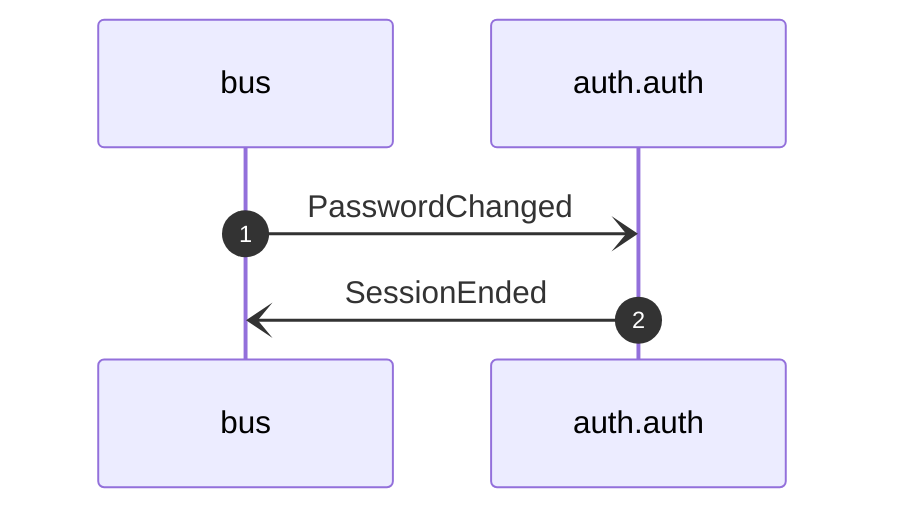

# Revoke sessions on password change

*Generated from the portolan catalog. Do not edit by hand.*

- **Id:** `flow.auth-revoke-sessions-on-password-change`
- **Owner:** [auth](../auth/README.md)
- **Source:** [`examples/auth/internal/session/infrastructure/messaging/policy/revoke_sessions_on_password_change.go`](https://github.com/shortlink-org/portolan/blob/main/examples/auth/internal/session/infrastructure/messaging/policy/revoke_sessions_on_password_change.go)

Ends the sessions issued against a password that has just been replaced.

## Participants

| Participant | Kind | Context |
| --- | --- | --- |
| `bus` | broker | — |
| `auth.auth` | service | [auth](../auth/README.md) |

## Sequence

## Steps

1. **bus** → **auth.auth** — PasswordChanged
   [`auth.auth.user.PasswordChanged`](../auth/auth/aggregates/user.md#event-auth-auth-user-passwordchanged) · [`examples/auth/internal/session/infrastructure/messaging/policy/revoke_sessions_on_password_change.go:47`](https://github.com/shortlink-org/portolan/blob/main/examples/auth/internal/session/infrastructure/messaging/policy/revoke_sessions_on_password_change.go#L47) · Seen running in telemetry/traces.jsonl (1 trace).

2. **auth.auth** → **bus** — SessionEnded
   [`auth.auth.session.SessionEnded`](../auth/auth/aggregates/session.md#event-auth-auth-session-sessionended) · Seen in 1 recording of 1 trace; the code does not declare this hop.

## Recordings

Traces this flow was seen running in, kept as examples: which steps ran, how long each took, and the names the spans carried.

- **Recording:** [`examples/auth/telemetry/traces.jsonl`](https://github.com/shortlink-org/portolan/blob/main/examples/auth/telemetry/traces.jsonl)
- **Trace:** `fc0d47a555b03d7af44a85259857c04e`
- **Recorded:** 2026-09-05T20:47:00.381452Z
- **Duration:** 5.252 ms

| Step | Span | Duration | Attributes |
| --- | --- | --- | --- |
| [s1](auth-revoke-sessions-on-password-change.md#step-s1) | `consume auth.PasswordChanged` | 5.252 ms | `event.name=auth.PasswordChanged` `messaging.destination.name=auth_user` `messaging.operation.type=process` `messaging.system=inproc` |
| [seen1](auth-revoke-sessions-on-password-change.md#step-seen1) | `publish auth.SessionEnded` | 0.009 ms | `event.name=auth.SessionEnded` `messaging.destination.name=auth_session` `messaging.operation.type=publish` `messaging.system=outbox` |
