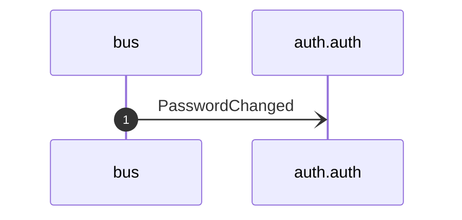

# Revoke sessions on password change

*Generated from the portolan catalog · commit `8 sources` · at 2026-09-05T13:47:23+07:00. Do not edit by hand.*

- **Id:** `flow.auth-revoke-sessions-on-password-change`
- **Owner:** [auth](../auth/README.md)
- **Source:** [`examples/auth/internal/session/infrastructure/messaging/policy/revoke_sessions_on_password_change.go`](https://github.com/shortlink-org/portolan/blob/main/examples/auth/internal/session/infrastructure/messaging/policy/revoke_sessions_on_password_change.go)

Ends the sessions issued against a password that has just been replaced.

## Participants

| Participant | Kind | Context |
| --- | --- | --- |
| `bus` | broker | — |
| `auth.auth` | service | [auth](../auth/README.md) |

## Sequence

## Steps

1. **bus** → **auth.auth** — PasswordChanged
   [`auth.auth.user.PasswordChanged`](../auth/auth/aggregates/user.md#event-auth-auth-user-passwordchanged) · [`examples/auth/internal/session/infrastructure/messaging/policy/revoke_sessions_on_password_change.go:47`](https://github.com/shortlink-org/portolan/blob/main/examples/auth/internal/session/infrastructure/messaging/policy/revoke_sessions_on_password_change.go#L47) · Seen running in telemetry/traces.jsonl (1 trace).
