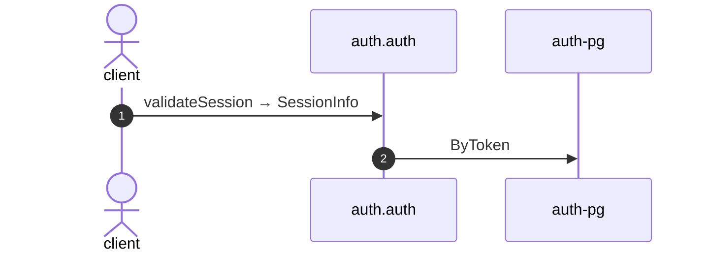

# Validate session

*Generated from the portolan catalog. Do not edit by hand.*

- **Id:** `flow.auth-validate-session`
- **Owner:** [auth](../auth/README.md)
- **Source:** [`examples/auth/internal/session/infrastructure/http/validate.go`](https://github.com/shortlink-org/portolan/blob/main/examples/auth/internal/session/infrastructure/http/validate.go)

Resolves a token to a live session: who is calling, and how long the answer stays good.

## Participants

| Participant | Kind | Context |
| --- | --- | --- |
| `client` | actor | — |
| `auth.auth` | service | [auth](../auth/README.md) |
| `auth-pg` | store | [auth](../auth/README.md) |

## Sequence

## Steps

1. **client** → **auth.auth** — validateSession → SessionInfo
   [`examples/auth/internal/session/infrastructure/http/validate.go:12`](https://github.com/shortlink-org/portolan/blob/main/examples/auth/internal/session/infrastructure/http/validate.go#L12) · Seen running in telemetry/traces.jsonl (2 traces).

2. **auth.auth** → **auth-pg** — ByToken
   status: declared · [`examples/auth/internal/session/application/validate/usecase.go:33`](https://github.com/shortlink-org/portolan/blob/main/examples/auth/internal/session/application/validate/usecase.go#L33)

## Recordings

Traces this flow was seen running in, kept as examples: which steps ran, how long each took, and the names the spans carried.

- **Recording:** [`examples/auth/telemetry/traces.jsonl`](https://github.com/shortlink-org/portolan/blob/main/examples/auth/telemetry/traces.jsonl)
- **Trace:** `37f66f3381772c818c4de1df0b16c00f`
- **Recorded:** 2026-09-05T20:47:00.198653Z
- **Duration:** 1.724 ms

| Step | Span | Duration | Attributes |
| --- | --- | --- | --- |
| [s1](auth-validate-session.md#step-s1) | `GET /v1/sessions/current` | 1.724 ms | `http.request.method=GET` `http.response.status_code=200` `http.route=/v1/sessions/current` `server.address=localhost` `server.port=8080` |

- **Recording:** [`examples/auth/telemetry/traces.jsonl`](https://github.com/shortlink-org/portolan/blob/main/examples/auth/telemetry/traces.jsonl)
- **Trace:** `9007e50cfd5638f2516100d48d14e46c`
- **Recorded:** 2026-09-05T20:47:06.269111Z
- **Duration:** 2.133 ms

| Step | Span | Duration | Attributes |
| --- | --- | --- | --- |
| [s1](auth-validate-session.md#step-s1) | `GET /v1/sessions/current` | 2.133 ms | `http.request.method=GET` `http.response.status_code=401` `http.route=/v1/sessions/current` `server.address=localhost` `server.port=8080` |
