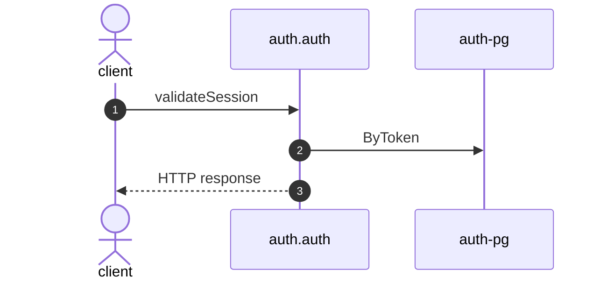

# Validate session

*Generated from the portolan catalog. Do not edit by hand.*

- **Id:** `flow.auth-validate-session`
- **Owner:** [auth](../auth/README.md)
- **Trigger:** `http` · validateSession
- **Root confidence:** high
- **Source:** [`examples/auth/internal/session/infrastructure/http/validate.go`](https://github.com/shortlink-org/portolan/blob/main/examples/auth/internal/session/infrastructure/http/validate.go)

Resolves a token to a live session: who is calling, and how long the answer stays good. Source-backed cross-protocol continuations are included.

## Participants

| Participant | Kind | Context | Entity |
| --- | --- | --- | --- |
| `client` | actor | — | — |
| `auth.auth` | service | [auth](../auth/README.md) | — |
| `auth-pg` | store | [auth](../auth/README.md) | [auth.auth.pg](../auth/auth/stores/pg.md) |

## Sequence

## Steps

1. **client** → **auth.auth** — validateSession
   status: declared · [`examples/auth/internal/session/infrastructure/http/validate.go:12`](https://github.com/shortlink-org/portolan/blob/main/examples/auth/internal/session/infrastructure/http/validate.go#L12) · evidence: call-site · source-expression · `validateSession` · [`examples/auth/internal/session/infrastructure/http/validate.go:12`](https://github.com/shortlink-org/portolan/blob/main/examples/auth/internal/session/infrastructure/http/validate.go#L12)

2. **auth.auth** → **auth-pg** — ByToken
   status: declared · [`examples/auth/internal/session/application/validate/usecase.go:33`](https://github.com/shortlink-org/portolan/blob/main/examples/auth/internal/session/application/validate/usecase.go#L33) · store: [auth.auth.pg](../auth/auth/stores/pg.md) · `ByToken` · evidence: function · source-function · `examples/auth/internal/session/application/validate:UseCase.Handle` · [`examples/auth/internal/session/application/validate/usecase.go:28`](https://github.com/shortlink-org/portolan/blob/main/examples/auth/internal/session/application/validate/usecase.go#L28) · evidence: binding · domain-port-convention · `session.Repository` · [`examples/auth/internal/session/application/validate/usecase.go:33`](https://github.com/shortlink-org/portolan/blob/main/examples/auth/internal/session/application/validate/usecase.go#L33) · evidence: call-site · source-expression · `ByToken` · [`examples/auth/internal/session/application/validate/usecase.go:33`](https://github.com/shortlink-org/portolan/blob/main/examples/auth/internal/session/application/validate/usecase.go#L33)

3. **auth.auth** → **client** — HTTP response
   status: declared · Synthesized from the proven synchronous HTTP handler return.
