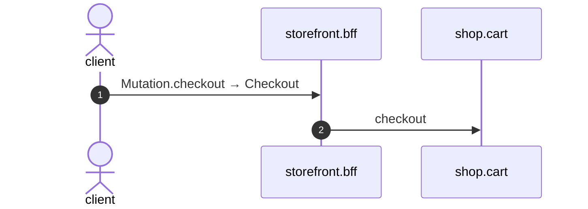

# Mutation checkout

*Generated from the portolan catalog · commit `6 sources` · at 2026-09-05T13:47:23+07:00. Do not edit by hand.*

- **Id:** `flow.bff-mutation-checkout`
- **Owner:** [storefront](../storefront/README.md)
- **Source:** [`examples/bff/src/schema/basket/resolvers/Mutation/checkout.ts`](https://github.com/shortlink-org/portolan/blob/main/examples/bff/src/schema/basket/resolvers/Mutation/checkout.ts)

Freeze the basket and hand it on.

## Participants

| Participant | Kind | Context |
| --- | --- | --- |
| `client` | actor | — |
| `storefront.bff` | service | [storefront](../storefront/README.md) |
| `shop.cart` | service | [shop](../shop/README.md) |

## Sequence

## Steps

1. **client** → **storefront.bff** — Mutation.checkout → Checkout
   status: declared · [`examples/bff/src/schema/basket/resolvers/Mutation/checkout.ts:11`](https://github.com/shortlink-org/portolan/blob/main/examples/bff/src/schema/basket/resolvers/Mutation/checkout.ts#L11)

2. **storefront.bff** → **shop.cart** — checkout
   `cart.v1.Baskets/checkout` · status: declared · [`examples/bff/src/schema/basket/resolvers/Mutation/checkout.ts:12`](https://github.com/shortlink-org/portolan/blob/main/examples/bff/src/schema/basket/resolvers/Mutation/checkout.ts#L12)
