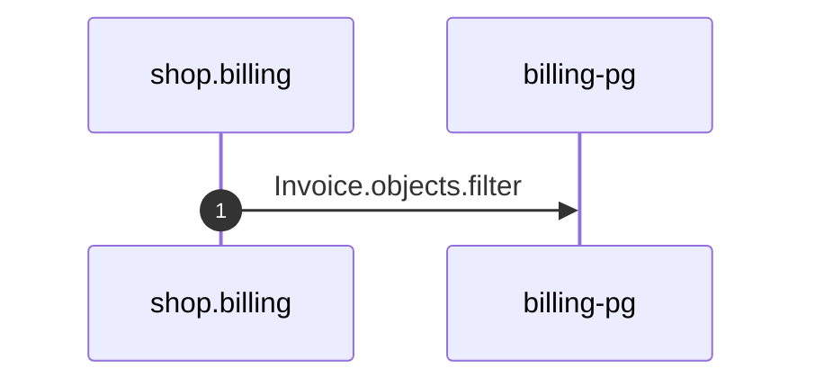

# Remind unpaid invoice work

*Generated from the portolan catalog. Do not edit by hand.*

- **Id:** `flow.billing-celery-body-invoices-tasks-remind-unpaid-invoice`
- **Owner:** [shop](../shop/README.md)
- **Trigger:** `job` · Celery · invoices.tasks.remind_unpaid_invoice
- **Root confidence:** high
- **Source:** [`examples/shop/billing/invoices/tasks.py`](https://github.com/shortlink-org/portolan/blob/main/examples/shop/billing/invoices/tasks.py)

Nudges the customer about an invoice that has stayed unpaid. Observable work performed by the Celery task.

## Participants

| Participant | Kind | Context | Entity |
| --- | --- | --- | --- |
| `shop.billing` | service | [shop](../shop/README.md) | — |
| `billing-pg` | store | [shop](../shop/README.md) | [shop.billing.pg](../shop/billing/stores/pg.md) |

## Sequence

## Steps

1. **shop.billing** → **billing-pg** — Invoice.objects.filter
   status: declared · [`examples/shop/billing/invoices/tasks.py:32`](https://github.com/shortlink-org/portolan/blob/main/examples/shop/billing/invoices/tasks.py#L32)
