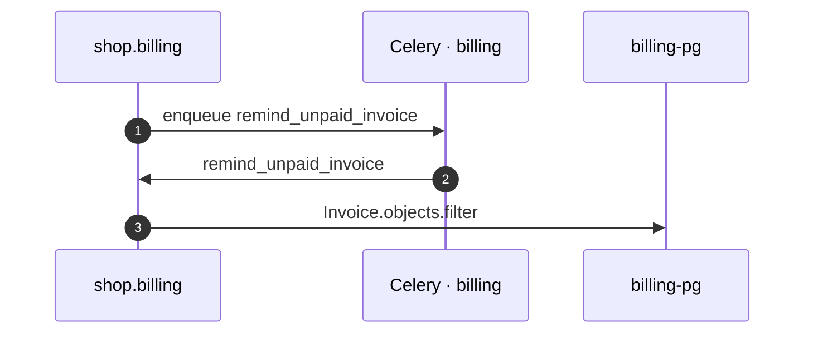

# Remind Unpaid Invoice task

*Generated from the portolan catalog · commit `5 sources` · at 2026-09-05T13:47:23+07:00. Do not edit by hand.*

- **Id:** `flow.billing-celery-remind-unpaid-invoice`
- **Owner:** [shop](../shop/README.md)
- **Trigger:** `job` · Celery · billing
- **Root confidence:** high
- **Source:** [`examples/shop/billing/invoices/services.py`](https://github.com/shortlink-org/portolan/blob/main/examples/shop/billing/invoices/services.py)

Celery task `invoices.tasks.remind_unpaid_invoice` is enqueued on `billing` and worked by `remind_unpaid_invoice`. Source-backed cross-protocol continuations are included.

## Participants

| Participant | Kind | Context | Label |
| --- | --- | --- | --- |
| `shop.billing` | service | [shop](../shop/README.md) | — |
| `celery-billing` | broker | — | Celery · billing |
| `billing-pg` | store | [shop](../shop/README.md) | — |

## Sequence

## Steps

1. **shop.billing** → **celery-billing** — enqueue remind_unpaid_invoice
   status: declared · [`examples/shop/billing/invoices/services.py:50`](https://github.com/shortlink-org/portolan/blob/main/examples/shop/billing/invoices/services.py#L50) · Enqueued after the transaction commits, for later, with a countdown or an eta. Nudges the customer about an invoice that has stayed unpaid.

2. **celery-billing** → **shop.billing** — remind_unpaid_invoice
   status: declared · [`examples/shop/billing/invoices/tasks.py:30`](https://github.com/shortlink-org/portolan/blob/main/examples/shop/billing/invoices/tasks.py#L30) · Celery hands `invoices.tasks.remind_unpaid_invoice` to the worker consuming `billing`, the default queue.

3. **shop.billing** → **billing-pg** — Invoice.objects.filter
   status: declared · [`examples/shop/billing/invoices/tasks.py:32`](https://github.com/shortlink-org/portolan/blob/main/examples/shop/billing/invoices/tasks.py#L32)
