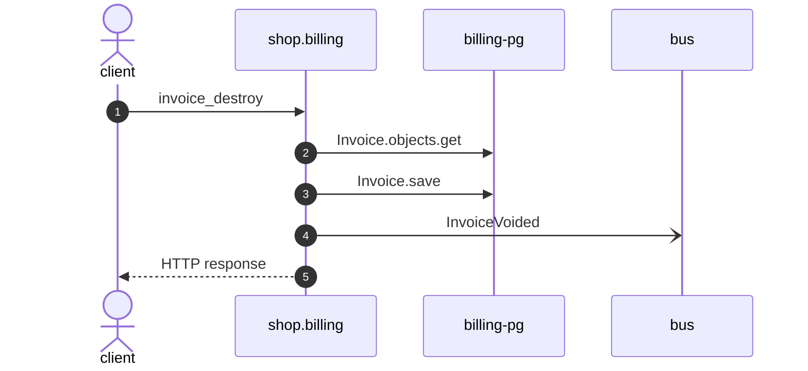

# Invoice destroy

*Generated from the portolan catalog. Do not edit by hand.*

- **Id:** `flow.billing-invoice-destroy`
- **Owner:** [shop](../shop/README.md)
- **Trigger:** `http` · DELETE /v1/invoices/{id}/
- **Root confidence:** high
- **Source:** [`examples/shop/billing/invoices/views.py`](https://github.com/shortlink-org/portolan/blob/main/examples/shop/billing/invoices/views.py)

Ends an invoice nobody is going to pay. Source-backed cross-protocol continuations are included.

## Participants

| Participant | Kind | Context | Entity |
| --- | --- | --- | --- |
| `client` | actor | — | — |
| `shop.billing` | service | [shop](../shop/README.md) | — |
| `billing-pg` | store | [shop](../shop/README.md) | [shop.billing.pg](../shop/billing/stores/pg.md) |
| `bus` | broker | — | — |

## Sequence

## Steps

1. **client** → **shop.billing** — invoice_destroy
   status: declared · [`examples/shop/billing/invoices/views.py:34`](https://github.com/shortlink-org/portolan/blob/main/examples/shop/billing/invoices/views.py#L34)

2. **shop.billing** → **billing-pg** — Invoice.objects.get
   status: declared · [`examples/shop/billing/invoices/services.py:68`](https://github.com/shortlink-org/portolan/blob/main/examples/shop/billing/invoices/services.py#L68)

3. **shop.billing** → **billing-pg** — Invoice.save
   status: declared · [`examples/shop/billing/invoices/services.py:70`](https://github.com/shortlink-org/portolan/blob/main/examples/shop/billing/invoices/services.py#L70)

4. **shop.billing** → **bus** — InvoiceVoided
   [`shop.billing.invoice.InvoiceVoided`](../shop/billing/aggregates/invoice.md#event-shop-billing-invoice-invoicevoided) · status: declared · [`examples/shop/billing/invoices/services.py:71`](https://github.com/shortlink-org/portolan/blob/main/examples/shop/billing/invoices/services.py#L71) · on shop.billing.invoice

5. **shop.billing** → **client** — HTTP response
   status: declared · Synthesized from the proven synchronous HTTP handler return.
