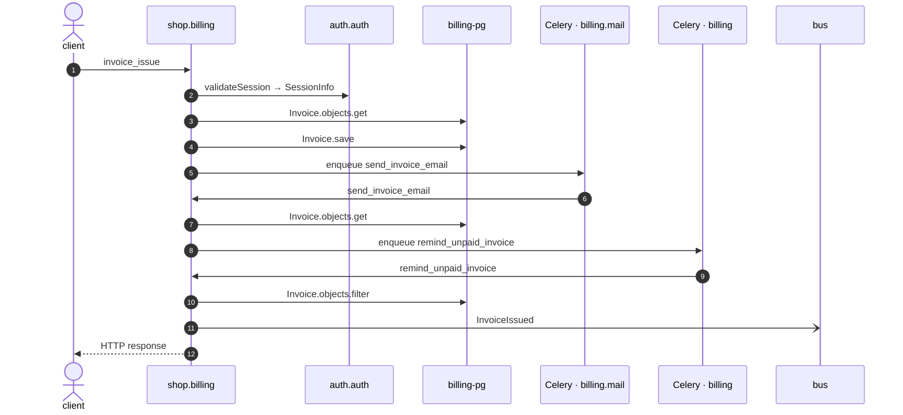

# Invoice issue

*Generated from the portolan catalog. Do not edit by hand.*

- **Id:** `flow.billing-invoice-issue`
- **Owner:** [shop](../shop/README.md)
- **Trigger:** `http` · POST /v1/invoices/{id}/issue/
- **Root confidence:** high
- **Source:** [`examples/shop/billing/invoices/views.py`](https://github.com/shortlink-org/portolan/blob/main/examples/shop/billing/invoices/views.py)

Confirms the session, freezes the invoice and asks the customer to pay. Source-backed cross-protocol continuations are included.

## Participants

| Participant | Kind | Context | Entity | Label |
| --- | --- | --- | --- | --- |
| `client` | actor | — | — | — |
| `shop.billing` | service | [shop](../shop/README.md) | — | — |
| `auth.auth` | service | [auth](../auth/README.md) | — | — |
| `billing-pg` | store | [shop](../shop/README.md) | [shop.billing.pg](../shop/billing/stores/pg.md) | — |
| `celery-billing-mail` | broker | — | — | Celery · billing.mail |
| `celery-billing` | broker | — | — | Celery · billing |
| `bus` | broker | — | — | — |

## Composition

| Fragment | After step | Seam | Target | Evidence | Source |
| --- | --- | --- | --- | --- | --- |
| [billing-celery-send-invoice-email](billing-celery-send-invoice-email.md) | [s5](billing-invoice-issue.md#step-s5) | `handoff` | `celery:billing.mail:invoices.tasks.send_invoice_email` | high · exact asynchronous handoff | [`examples/shop/billing/invoices/services.py`](https://github.com/shortlink-org/portolan/blob/main/examples/shop/billing/invoices/services.py) |
| [billing-celery-body-invoices-tasks-send-invoice-email](billing-celery-body-invoices-tasks-send-invoice-email.md) | [continuation-billing-celery-send-invoice-email-s5-work](billing-invoice-issue.md#step-continuation-billing-celery-send-invoice-email-s5-work) | `entrypoint` | `python:invoices.tasks:send_invoice_email` | high · exact source entrypoint | [`examples/shop/billing/invoices/tasks.py`](https://github.com/shortlink-org/portolan/blob/main/examples/shop/billing/invoices/tasks.py) |
| [billing-celery-remind-unpaid-invoice](billing-celery-remind-unpaid-invoice.md) | [s6](billing-invoice-issue.md#step-s6) | `handoff` | `celery:billing:invoices.tasks.remind_unpaid_invoice` | high · exact asynchronous handoff | [`examples/shop/billing/invoices/services.py`](https://github.com/shortlink-org/portolan/blob/main/examples/shop/billing/invoices/services.py) |
| [billing-celery-body-invoices-tasks-remind-unpaid-invoice](billing-celery-body-invoices-tasks-remind-unpaid-invoice.md) | [continuation-billing-celery-remind-unpaid-invoice-s6-work](billing-invoice-issue.md#step-continuation-billing-celery-remind-unpaid-invoice-s6-work) | `entrypoint` | `python:invoices.tasks:remind_unpaid_invoice` | high · exact source entrypoint | [`examples/shop/billing/invoices/tasks.py`](https://github.com/shortlink-org/portolan/blob/main/examples/shop/billing/invoices/tasks.py) |

## Sequence

## Steps

1. **client** → **shop.billing** — invoice_issue
   status: declared · [`examples/shop/billing/invoices/views.py:29`](https://github.com/shortlink-org/portolan/blob/main/examples/shop/billing/invoices/views.py#L29)

2. **shop.billing** → **auth.auth** — validateSession → SessionInfo
   `auth.v1/validateSession` · status: declared · [`examples/shop/billing/invoices/services.py:40`](https://github.com/shortlink-org/portolan/blob/main/examples/shop/billing/invoices/services.py#L40)

3. **shop.billing** → **billing-pg** — Invoice.objects.get
   status: declared · [`examples/shop/billing/invoices/services.py:41`](https://github.com/shortlink-org/portolan/blob/main/examples/shop/billing/invoices/services.py#L41)

4. **shop.billing** → **billing-pg** — Invoice.save
   status: declared · [`examples/shop/billing/invoices/services.py:46`](https://github.com/shortlink-org/portolan/blob/main/examples/shop/billing/invoices/services.py#L46) · in one transaction.

5. **shop.billing** → **celery-billing-mail** — enqueue send_invoice_email
   status: declared · [`examples/shop/billing/invoices/services.py:49`](https://github.com/shortlink-org/portolan/blob/main/examples/shop/billing/invoices/services.py#L49) · in one transaction, after the transaction commits. · handoff: send · job · celery · billing.mail · invoices.tasks.send_invoice_email

6. **celery-billing-mail** → **shop.billing** — send_invoice_email
   status: declared · [`examples/shop/billing/invoices/tasks.py:18`](https://github.com/shortlink-org/portolan/blob/main/examples/shop/billing/invoices/tasks.py#L18) · Celery hands `invoices.tasks.send_invoice_email` to the worker consuming `billing.mail`, routed by task_routes. · continues at `python:invoices.tasks:send_invoice_email` · handoff: receive · job · celery · billing.mail · invoices.tasks.send_invoice_email

7. **shop.billing** → **billing-pg** — Invoice.objects.get
   status: declared · [`examples/shop/billing/invoices/tasks.py:20`](https://github.com/shortlink-org/portolan/blob/main/examples/shop/billing/invoices/tasks.py#L20)

8. **shop.billing** → **celery-billing** — enqueue remind_unpaid_invoice
   status: declared · [`examples/shop/billing/invoices/services.py:50`](https://github.com/shortlink-org/portolan/blob/main/examples/shop/billing/invoices/services.py#L50) · in one transaction, after the transaction commits. · handoff: send · job · celery · billing · invoices.tasks.remind_unpaid_invoice

9. **celery-billing** → **shop.billing** — remind_unpaid_invoice
   status: declared · [`examples/shop/billing/invoices/tasks.py:30`](https://github.com/shortlink-org/portolan/blob/main/examples/shop/billing/invoices/tasks.py#L30) · Celery hands `invoices.tasks.remind_unpaid_invoice` to the worker consuming `billing`, the default queue. · continues at `python:invoices.tasks:remind_unpaid_invoice` · handoff: receive · job · celery · billing · invoices.tasks.remind_unpaid_invoice

10. **shop.billing** → **billing-pg** — Invoice.objects.filter
   status: declared · [`examples/shop/billing/invoices/tasks.py:32`](https://github.com/shortlink-org/portolan/blob/main/examples/shop/billing/invoices/tasks.py#L32)

11. **shop.billing** → **bus** — InvoiceIssued
   [`shop.billing.invoice.InvoiceIssued`](../shop/billing/aggregates/invoice.md#event-shop-billing-invoice-invoiceissued) · status: declared · [`examples/shop/billing/invoices/services.py:51`](https://github.com/shortlink-org/portolan/blob/main/examples/shop/billing/invoices/services.py#L51) · on shop.billing.invoice

12. **shop.billing** → **client** — HTTP response
   status: declared · Synthesized from the proven synchronous HTTP handler return.
