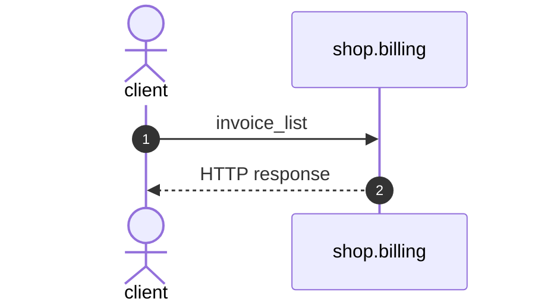

# Invoice list

*Generated from the portolan catalog. Do not edit by hand.*

- **Id:** `flow.billing-invoice-list`
- **Owner:** [shop](../shop/README.md)
- **Trigger:** `http` · GET /v1/invoices/
- **Root confidence:** high
- **Source:** [`examples/shop/billing/invoices/views.py`](https://github.com/shortlink-org/portolan/blob/main/examples/shop/billing/invoices/views.py)

Invoices over HTTP. Every action here runs one function of services.py. Source-backed cross-protocol continuations are included.

## Participants

| Participant | Kind | Context | Entity |
| --- | --- | --- | --- |
| `client` | actor | — | — |
| `shop.billing` | service | [shop](../shop/README.md) | — |

## Sequence

## Steps

1. **client** → **shop.billing** — invoice_list
   status: declared · [`examples/shop/billing/invoices/views.py:10`](https://github.com/shortlink-org/portolan/blob/main/examples/shop/billing/invoices/views.py#L10)

2. **shop.billing** → **client** — HTTP response
   status: declared · Synthesized from the proven synchronous HTTP handler return.
