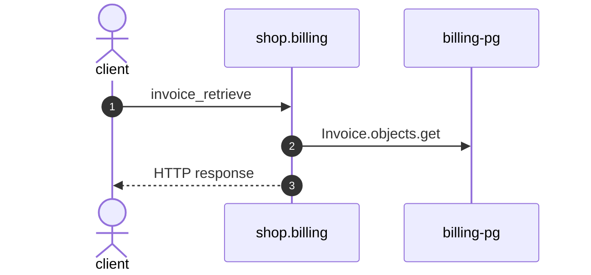

# Invoice retrieve

*Generated from the portolan catalog. Do not edit by hand.*

- **Id:** `flow.billing-invoice-retrieve`
- **Owner:** [shop](../shop/README.md)
- **Trigger:** `http` · GET /v1/invoices/{id}/
- **Root confidence:** high
- **Source:** [`examples/shop/billing/invoices/views.py`](https://github.com/shortlink-org/portolan/blob/main/examples/shop/billing/invoices/views.py)

Reads one invoice and the lines it is made of. Source-backed cross-protocol continuations are included.

## Participants

| Participant | Kind | Context | Entity |
| --- | --- | --- | --- |
| `client` | actor | — | — |
| `shop.billing` | service | [shop](../shop/README.md) | — |
| `billing-pg` | store | [shop](../shop/README.md) | [shop.billing.pg](../shop/billing/stores/pg.md) |

## Sequence

## Steps

1. **client** → **shop.billing** — invoice_retrieve
   status: declared · [`examples/shop/billing/invoices/views.py:24`](https://github.com/shortlink-org/portolan/blob/main/examples/shop/billing/invoices/views.py#L24)

2. **shop.billing** → **billing-pg** — Invoice.objects.get
   status: declared · [`examples/shop/billing/invoices/services.py:77`](https://github.com/shortlink-org/portolan/blob/main/examples/shop/billing/invoices/services.py#L77)

3. **shop.billing** → **client** — HTTP response
   status: declared · Synthesized from the proven synchronous HTTP handler return.
