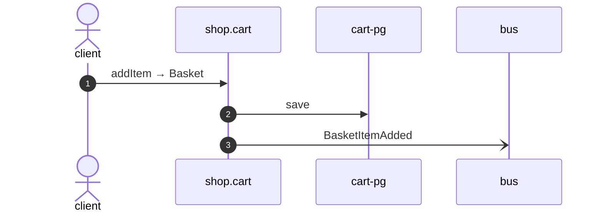

# Add item

*Generated from the portolan catalog. Do not edit by hand.*

- **Id:** `flow.cart-add-item`
- **Owner:** [shop](../shop/README.md)
- **Source:** [`examples/shop/cart/src/infrastructure/transport/http/basket/handlers.ts`](https://github.com/shortlink-org/portolan/blob/main/examples/shop/cart/src/infrastructure/transport/http/basket/handlers.ts)

## Participants

| Participant | Kind | Context |
| --- | --- | --- |
| `client` | actor | — |
| `shop.cart` | service | [shop](../shop/README.md) |
| `cart-pg` | store | [shop](../shop/README.md) |
| `bus` | broker | — |

## Sequence

## Steps

1. **client** → **shop.cart** — addItem → Basket
   [`examples/shop/cart/src/infrastructure/transport/http/basket/handlers.ts:43`](https://github.com/shortlink-org/portolan/blob/main/examples/shop/cart/src/infrastructure/transport/http/basket/handlers.ts#L43) · Seen running in telemetry/traces.jsonl (3 traces).

2. **shop.cart** → **cart-pg** — save
   status: declared · [`examples/shop/cart/src/application/basket/usecases/add_item/usecase.ts:27`](https://github.com/shortlink-org/portolan/blob/main/examples/shop/cart/src/application/basket/usecases/add_item/usecase.ts#L27)

3. **shop.cart** → **bus** — BasketItemAdded
   [`shop.cart.basket.BasketItemAdded`](../shop/cart/aggregates/basket.md#event-shop-cart-basket-basketitemadded) · [`examples/shop/cart/src/application/basket/usecases/add_item/usecase.ts:27`](https://github.com/shortlink-org/portolan/blob/main/examples/shop/cart/src/application/basket/usecases/add_item/usecase.ts#L27) · Seen running in telemetry/traces.jsonl (3 traces).

## Recordings

Traces this flow was seen running in, kept as examples: which steps ran, how long each took, and the names the spans carried.

- **Recording:** [`examples/shop/cart/telemetry/traces.jsonl`](https://github.com/shortlink-org/portolan/blob/main/examples/shop/cart/telemetry/traces.jsonl)
- **Trace:** `ab232acad1a6ecd0ba9d3568ce81942a`
- **Recorded:** 2026-09-04T18:33:36.566Z
- **Duration:** 5.486 ms

| Step | Span | Duration | Attributes |
| --- | --- | --- | --- |
| [s1](cart-add-item.md#step-s1) | `POST /v1/baskets/:basketId/items` | 5.486 ms | `http.request.method=POST` `http.response.status_code=200` `http.route=/v1/baskets/:basketId/items` `server.address=localhost` `server.port=8081` |
| [s3](cart-add-item.md#step-s3) | `publish cart.BasketItemAdded` | 0.328 ms | `event.name=cart.BasketItemAdded` `messaging.destination.name=shop.cart.basket` `messaging.operation.type=publish` `messaging.system=outbox` |

- **Recording:** [`examples/shop/cart/telemetry/traces.jsonl`](https://github.com/shortlink-org/portolan/blob/main/examples/shop/cart/telemetry/traces.jsonl)
- **Trace:** `874884def44a7a6fd5e0d32de295ddfe`
- **Recorded:** 2026-09-04T18:33:36.579Z
- **Duration:** 4.235 ms

| Step | Span | Duration | Attributes |
| --- | --- | --- | --- |
| [s1](cart-add-item.md#step-s1) | `POST /v1/baskets/:basketId/items` | 4.235 ms | `http.request.method=POST` `http.response.status_code=200` `http.route=/v1/baskets/:basketId/items` `server.address=localhost` `server.port=8081` |
| [s3](cart-add-item.md#step-s3) | `publish cart.BasketItemAdded` | 0.317 ms | `event.name=cart.BasketItemAdded` `messaging.destination.name=shop.cart.basket` `messaging.operation.type=publish` `messaging.system=outbox` |

- **Recording:** [`examples/shop/cart/telemetry/traces.jsonl`](https://github.com/shortlink-org/portolan/blob/main/examples/shop/cart/telemetry/traces.jsonl)
- **Trace:** `d045ed886eeebd471a745f089f1150a6`
- **Recorded:** 2026-09-04T18:33:36.622Z
- **Duration:** 3.558 ms

| Step | Span | Duration | Attributes |
| --- | --- | --- | --- |
| [s1](cart-add-item.md#step-s1) | `POST /v1/baskets/:basketId/items` | 3.558 ms | `http.request.method=POST` `http.response.status_code=200` `http.route=/v1/baskets/:basketId/items` `server.address=localhost` `server.port=8081` |
| [s3](cart-add-item.md#step-s3) | `publish cart.BasketItemAdded` | 0.431 ms | `event.name=cart.BasketItemAdded` `messaging.destination.name=shop.cart.basket` `messaging.operation.type=publish` `messaging.system=outbox` |
