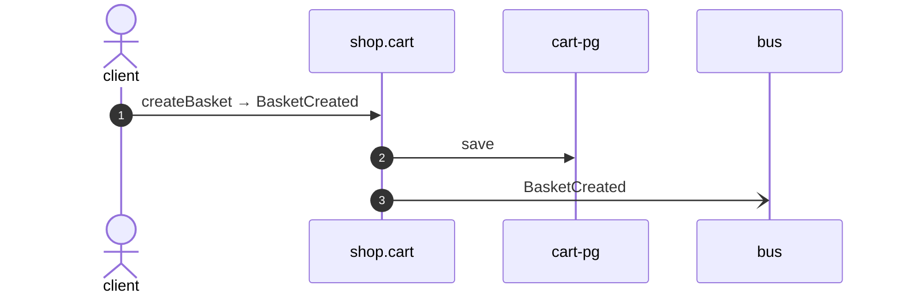

# Create basket

*Generated from the portolan catalog · commit `5 sources` · at 2026-09-05T13:47:23+07:00. Do not edit by hand.*

- **Id:** `flow.cart-create-basket`
- **Owner:** [shop](../shop/README.md)
- **Source:** [`examples/shop/cart/src/infrastructure/transport/http/basket/handlers.ts`](https://github.com/shortlink-org/portolan/blob/main/examples/shop/cart/src/infrastructure/transport/http/basket/handlers.ts)

## Participants

| Participant | Kind | Context |
| --- | --- | --- |
| `client` | actor | — |
| `shop.cart` | service | [shop](../shop/README.md) |
| `cart-pg` | store | [shop](../shop/README.md) |
| `bus` | broker | — |

## Sequence

## Steps

1. **client** → **shop.cart** — createBasket → BasketCreated
   [`examples/shop/cart/src/infrastructure/transport/http/basket/handlers.ts:33`](https://github.com/shortlink-org/portolan/blob/main/examples/shop/cart/src/infrastructure/transport/http/basket/handlers.ts#L33) · Seen running in telemetry/traces.jsonl (2 traces).

2. **shop.cart** → **cart-pg** — save
   status: declared · [`examples/shop/cart/src/application/basket/usecases/create_basket/usecase.ts:22`](https://github.com/shortlink-org/portolan/blob/main/examples/shop/cart/src/application/basket/usecases/create_basket/usecase.ts#L22)

3. **shop.cart** → **bus** — BasketCreated
   [`shop.cart.basket.BasketCreated`](../shop/cart/aggregates/basket.md#event-shop-cart-basket-basketcreated) · [`examples/shop/cart/src/application/basket/usecases/create_basket/usecase.ts:22`](https://github.com/shortlink-org/portolan/blob/main/examples/shop/cart/src/application/basket/usecases/create_basket/usecase.ts#L22) · Seen running in telemetry/traces.jsonl (2 traces).
