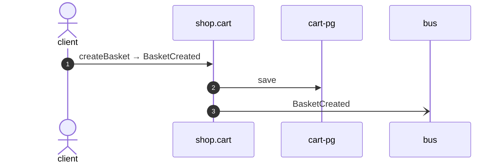

# Create basket

*Generated from the portolan catalog. Do not edit by hand.*

- **Id:** `flow.cart-create-basket`
- **Owner:** [shop](../shop/README.md)
- **Source:** [`examples/shop/cart/src/infrastructure/transport/http/basket/handlers.ts`](https://github.com/shortlink-org/portolan/blob/main/examples/shop/cart/src/infrastructure/transport/http/basket/handlers.ts)

## Participants

| Participant | Kind | Context |
| --- | --- | --- |
| `client` | actor | — |
| `shop.cart` | service | [shop](../shop/README.md) |
| `cart-pg` | store | [shop](../shop/README.md) |
| `bus` | broker | — |

## Sequence

## Steps

1. **client** → **shop.cart** — createBasket → BasketCreated
   [`examples/shop/cart/src/infrastructure/transport/http/basket/handlers.ts:33`](https://github.com/shortlink-org/portolan/blob/main/examples/shop/cart/src/infrastructure/transport/http/basket/handlers.ts#L33) · Seen running in telemetry/traces.jsonl (2 traces).

2. **shop.cart** → **cart-pg** — save
   status: declared · [`examples/shop/cart/src/application/basket/usecases/create_basket/usecase.ts:22`](https://github.com/shortlink-org/portolan/blob/main/examples/shop/cart/src/application/basket/usecases/create_basket/usecase.ts#L22)

3. **shop.cart** → **bus** — BasketCreated
   [`shop.cart.basket.BasketCreated`](../shop/cart/aggregates/basket.md#event-shop-cart-basket-basketcreated) · [`examples/shop/cart/src/application/basket/usecases/create_basket/usecase.ts:22`](https://github.com/shortlink-org/portolan/blob/main/examples/shop/cart/src/application/basket/usecases/create_basket/usecase.ts#L22) · Seen running in telemetry/traces.jsonl (2 traces).

## Recordings

Traces this flow was seen running in, kept as examples: which steps ran, how long each took, and the names the spans carried.

- **Recording:** [`examples/shop/cart/telemetry/traces.jsonl`](https://github.com/shortlink-org/portolan/blob/main/examples/shop/cart/telemetry/traces.jsonl)
- **Trace:** `80014f01019ea7c7254374b2317de1d3`
- **Recorded:** 2026-09-04T18:33:36.548Z
- **Duration:** 4.357 ms

| Step | Span | Duration | Attributes |
| --- | --- | --- | --- |
| [s1](cart-create-basket.md#step-s1) | `POST /v1/baskets` | 4.357 ms | `http.request.method=POST` `http.response.status_code=201` `http.route=/v1/baskets` `server.address=localhost` `server.port=8081` |
| [s3](cart-create-basket.md#step-s3) | `publish cart.BasketCreated` | 0.632 ms | `event.name=cart.BasketCreated` `messaging.destination.name=shop.cart.basket` `messaging.operation.type=publish` `messaging.system=outbox` |

- **Recording:** [`examples/shop/cart/telemetry/traces.jsonl`](https://github.com/shortlink-org/portolan/blob/main/examples/shop/cart/telemetry/traces.jsonl)
- **Trace:** `ec15cc6a983573be3a056364aa22acef`
- **Recorded:** 2026-09-04T18:33:36.609Z
- **Duration:** 2.524 ms

| Step | Span | Duration | Attributes |
| --- | --- | --- | --- |
| [s1](cart-create-basket.md#step-s1) | `POST /v1/baskets` | 2.524 ms | `http.request.method=POST` `http.response.status_code=201` `http.route=/v1/baskets` `server.address=localhost` `server.port=8081` |
| [s3](cart-create-basket.md#step-s3) | `publish cart.BasketCreated` | 0.395 ms | `event.name=cart.BasketCreated` `messaging.destination.name=shop.cart.basket` `messaging.operation.type=publish` `messaging.system=outbox` |
