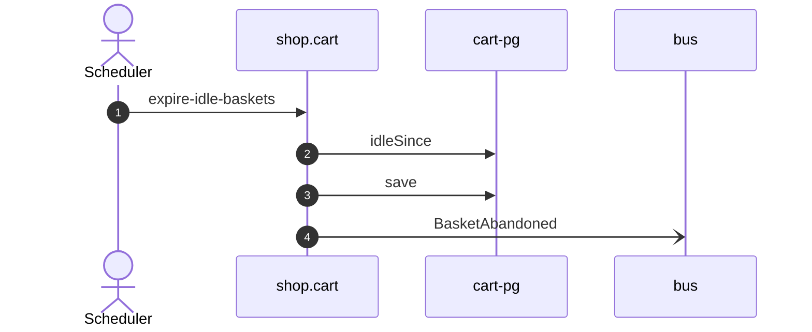

# Expire idle baskets

*Generated from the portolan catalog. Do not edit by hand.*

- **Id:** `flow.cart-expire-idle-baskets`
- **Owner:** [shop](../shop/README.md)
- **Trigger:** `scheduled` · every minute
- **Root confidence:** high
- **Source:** [`examples/shop/cart/src/infrastructure/transport/job/expire_idle_baskets.ts`](https://github.com/shortlink-org/portolan/blob/main/examples/shop/cart/src/infrastructure/transport/job/expire_idle_baskets.ts)

Abandons every open basket nobody touched for a day, and says so for each.

## Participants

| Participant | Kind | Context | Entity | Label |
| --- | --- | --- | --- | --- |
| `scheduler` | actor | — | — | Scheduler |
| `shop.cart` | service | [shop](../shop/README.md) | — | — |
| `cart-pg` | store | [shop](../shop/README.md) | [shop.cart.pg](../shop/cart/stores/pg.md) | — |
| `bus` | broker | — | — | — |

## Sequence

## Steps

1. **scheduler** → **shop.cart** — expire-idle-baskets
   status: declared · [`examples/shop/cart/src/infrastructure/transport/job/expire_idle_baskets.ts:18`](https://github.com/shortlink-org/portolan/blob/main/examples/shop/cart/src/infrastructure/transport/job/expire_idle_baskets.ts#L18) · Fires every minute.

2. **shop.cart** → **cart-pg** — idleSince
   status: declared · [`examples/shop/cart/src/application/basket/usecases/expire_idle_baskets/usecase.ts:21`](https://github.com/shortlink-org/portolan/blob/main/examples/shop/cart/src/application/basket/usecases/expire_idle_baskets/usecase.ts#L21)

3. **shop.cart** → **cart-pg** — save
   status: declared · [`examples/shop/cart/src/application/basket/usecases/expire_idle_baskets/usecase.ts:25`](https://github.com/shortlink-org/portolan/blob/main/examples/shop/cart/src/application/basket/usecases/expire_idle_baskets/usecase.ts#L25) · inside a loop over `idle`.

4. **shop.cart** → **bus** — BasketAbandoned
   [`shop.cart.basket.BasketAbandoned`](../shop/cart/aggregates/basket.md#event-shop-cart-basket-basketabandoned) · status: declared · [`examples/shop/cart/src/application/basket/usecases/expire_idle_baskets/usecase.ts:25`](https://github.com/shortlink-org/portolan/blob/main/examples/shop/cart/src/application/basket/usecases/expire_idle_baskets/usecase.ts#L25) · inside a loop over `idle`.
