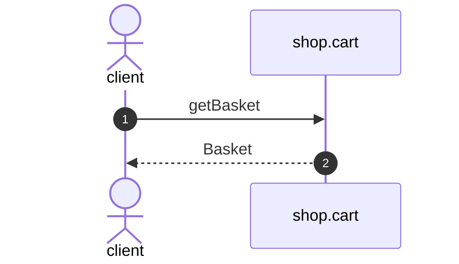

# Get basket

*Generated from the portolan catalog. Do not edit by hand.*

- **Id:** `flow.cart-get-basket`
- **Owner:** [shop](../shop/README.md)
- **Trigger:** `http` · GET /v1/baskets/{basketId}
- **Root confidence:** high
- **Source:** [`examples/shop/cart/src/infrastructure/transport/http/basket/handlers.ts`](https://github.com/shortlink-org/portolan/blob/main/examples/shop/cart/src/infrastructure/transport/http/basket/handlers.ts)

 Source-backed cross-protocol continuations are included.

## Participants

| Participant | Kind | Context | Entity |
| --- | --- | --- | --- |
| `client` | actor | — | — |
| `shop.cart` | service | [shop](../shop/README.md) | — |

## Sequence

## Steps

1. **client** → **shop.cart** — getBasket
   `cart.v1/getBasket` · [`examples/shop/cart/src/infrastructure/transport/http/basket/handlers.ts:38`](https://github.com/shortlink-org/portolan/blob/main/examples/shop/cart/src/infrastructure/transport/http/basket/handlers.ts#L38) · Seen running in examples/shop/cart/telemetry/traces.jsonl (2 traces).

2. **shop.cart** → **client** — Basket
   Synthesized from the proven synchronous HTTP handler return.

## Recordings

Traces this flow was seen running in, kept as examples: which steps ran, how long each took, and the names the spans carried.

- **Recording:** [`examples/shop/cart/telemetry/traces.jsonl`](https://github.com/shortlink-org/portolan/blob/main/examples/shop/cart/telemetry/traces.jsonl)
- **Trace:** `4997ef8e00085dbb06d43f5f7bf37ee9`
- **Recorded:** 2026-09-04T18:33:36.448Z
- **Duration:** 4.395 ms

| Step | Span | Duration | Attributes |
| --- | --- | --- | --- |
| [s1](cart-get-basket.md#step-s1) | `GET /v1/baskets/:basketId` | 4.395 ms | `http.request.method=GET` `http.response.status_code=404` `http.route=/v1/baskets/:basketId` `server.address=localhost` `server.port=8081` |

- **Recording:** [`examples/shop/cart/telemetry/traces.jsonl`](https://github.com/shortlink-org/portolan/blob/main/examples/shop/cart/telemetry/traces.jsonl)
- **Trace:** `6ec632f40403e66bf6b0cb4d6ef57508`
- **Recorded:** 2026-09-04T18:33:36.601Z
- **Duration:** 1.337 ms

| Step | Span | Duration | Attributes |
| --- | --- | --- | --- |
| [s1](cart-get-basket.md#step-s1) | `GET /v1/baskets/:basketId` | 1.337 ms | `http.request.method=GET` `http.response.status_code=200` `http.route=/v1/baskets/:basketId` `server.address=localhost` `server.port=8081` |
