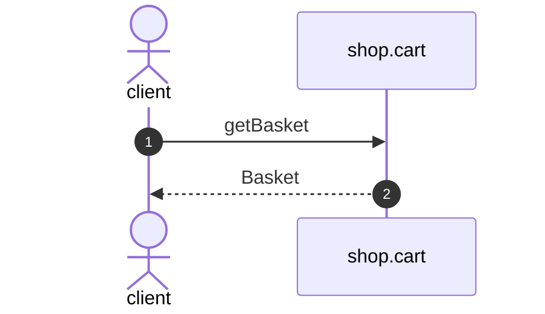

# Get basket

*Generated from the portolan catalog. Do not edit by hand.*

- **Id:** `flow.cart-get-basket`
- **Owner:** [shop](../shop/README.md)
- **Trigger:** `http` · GET /v1/baskets/{basketId}
- **Root confidence:** high
- **Source:** [`examples/shop/cart/src/infrastructure/transport/http/basket/handlers.ts`](https://github.com/shortlink-org/portolan/blob/main/examples/shop/cart/src/infrastructure/transport/http/basket/handlers.ts)

 Source-backed cross-protocol continuations are included.

## Participants

| Participant | Kind | Context | Entity |
| --- | --- | --- | --- |
| `client` | actor | — | — |
| `shop.cart` | service | [shop](../shop/README.md) | — |

## Sequence

## Steps

1. **client** → **shop.cart** — getBasket
   `cart.v1/getBasket` · status: declared · [`examples/shop/cart/src/infrastructure/transport/http/basket/handlers.ts:38`](https://github.com/shortlink-org/portolan/blob/main/examples/shop/cart/src/infrastructure/transport/http/basket/handlers.ts#L38)

2. **shop.cart** → **client** — Basket
   status: declared · Synthesized from the proven synchronous HTTP handler return.
