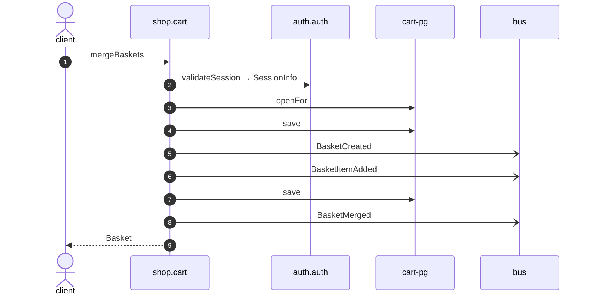

# Merge baskets

*Generated from the portolan catalog. Do not edit by hand.*

- **Id:** `flow.cart-merge-baskets`
- **Owner:** [shop](../shop/README.md)
- **Trigger:** `http` · POST /v1/baskets/{basketId}/merge
- **Root confidence:** high
- **Source:** [`examples/shop/cart/src/infrastructure/transport/http/basket/handlers.ts`](https://github.com/shortlink-org/portolan/blob/main/examples/shop/cart/src/infrastructure/transport/http/basket/handlers.ts)

 Source-backed cross-protocol continuations are included.

## Participants

| Participant | Kind | Context | Entity |
| --- | --- | --- | --- |
| `client` | actor | — | — |
| `shop.cart` | service | [shop](../shop/README.md) | — |
| `auth.auth` | service | [auth](../auth/README.md) | — |
| `cart-pg` | store | [shop](../shop/README.md) | [shop.cart.pg](../shop/cart/stores/pg.md) |
| `bus` | broker | — | — |

## Sequence

## Steps

1. **client** → **shop.cart** — mergeBaskets
   `cart.v1/mergeBaskets` · status: declared · [`examples/shop/cart/src/infrastructure/transport/http/basket/handlers.ts:54`](https://github.com/shortlink-org/portolan/blob/main/examples/shop/cart/src/infrastructure/transport/http/basket/handlers.ts#L54)

2. **shop.cart** → **auth.auth** — validateSession → SessionInfo
   `auth.v1/validateSession` · status: declared · [`examples/shop/cart/src/application/basket/usecases/merge_baskets/usecase.ts:28`](https://github.com/shortlink-org/portolan/blob/main/examples/shop/cart/src/application/basket/usecases/merge_baskets/usecase.ts#L28)

3. **shop.cart** → **cart-pg** — openFor
   status: declared · [`examples/shop/cart/src/application/basket/usecases/merge_baskets/usecase.ts:35`](https://github.com/shortlink-org/portolan/blob/main/examples/shop/cart/src/application/basket/usecases/merge_baskets/usecase.ts#L35)

4. **shop.cart** → **cart-pg** — save
   status: declared · [`examples/shop/cart/src/application/basket/usecases/merge_baskets/usecase.ts:46`](https://github.com/shortlink-org/portolan/blob/main/examples/shop/cart/src/application/basket/usecases/merge_baskets/usecase.ts#L46)

5. **shop.cart** → **bus** — BasketCreated
   [`shop.cart.basket.BasketCreated`](../shop/cart/aggregates/basket.md#event-shop-cart-basket-basketcreated) · status: declared · [`examples/shop/cart/src/application/basket/usecases/merge_baskets/usecase.ts:46`](https://github.com/shortlink-org/portolan/blob/main/examples/shop/cart/src/application/basket/usecases/merge_baskets/usecase.ts#L46)

6. **shop.cart** → **bus** — BasketItemAdded
   [`shop.cart.basket.BasketItemAdded`](../shop/cart/aggregates/basket.md#event-shop-cart-basket-basketitemadded) · status: declared · [`examples/shop/cart/src/application/basket/usecases/merge_baskets/usecase.ts:46`](https://github.com/shortlink-org/portolan/blob/main/examples/shop/cart/src/application/basket/usecases/merge_baskets/usecase.ts#L46)

7. **shop.cart** → **cart-pg** — save
   status: declared · [`examples/shop/cart/src/application/basket/usecases/merge_baskets/usecase.ts:47`](https://github.com/shortlink-org/portolan/blob/main/examples/shop/cart/src/application/basket/usecases/merge_baskets/usecase.ts#L47)

8. **shop.cart** → **bus** — BasketMerged
   [`shop.cart.basket.BasketMerged`](../shop/cart/aggregates/basket.md#event-shop-cart-basket-basketmerged) · status: declared · [`examples/shop/cart/src/application/basket/usecases/merge_baskets/usecase.ts:47`](https://github.com/shortlink-org/portolan/blob/main/examples/shop/cart/src/application/basket/usecases/merge_baskets/usecase.ts#L47)

9. **shop.cart** → **client** — Basket
   status: declared · Synthesized from the proven synchronous HTTP handler return.
