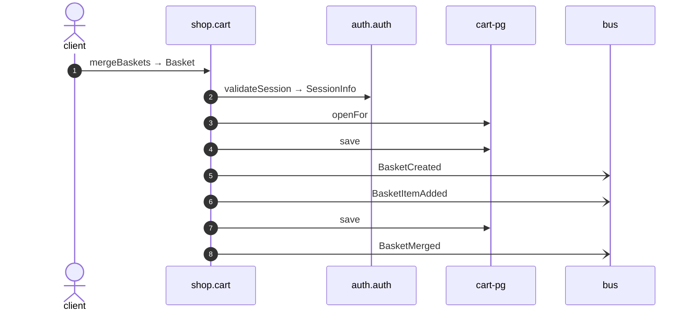

# Merge baskets

*Generated from the portolan catalog. Do not edit by hand.*

- **Id:** `flow.cart-merge-baskets`
- **Owner:** [shop](../shop/README.md)
- **Source:** [`examples/shop/cart/src/infrastructure/transport/http/basket/handlers.ts`](https://github.com/shortlink-org/portolan/blob/main/examples/shop/cart/src/infrastructure/transport/http/basket/handlers.ts)

## Participants

| Participant | Kind | Context |
| --- | --- | --- |
| `client` | actor | — |
| `shop.cart` | service | [shop](../shop/README.md) |
| `auth.auth` | service | [auth](../auth/README.md) |
| `cart-pg` | store | [shop](../shop/README.md) |
| `bus` | broker | — |

## Sequence

## Steps

1. **client** → **shop.cart** — mergeBaskets → Basket
   [`examples/shop/cart/src/infrastructure/transport/http/basket/handlers.ts:54`](https://github.com/shortlink-org/portolan/blob/main/examples/shop/cart/src/infrastructure/transport/http/basket/handlers.ts#L54) · Seen running in telemetry/traces.jsonl (1 trace).

2. **shop.cart** → **auth.auth** — validateSession → SessionInfo
   `auth.v1/validateSession` · [`examples/shop/cart/src/application/basket/usecases/merge_baskets/usecase.ts:28`](https://github.com/shortlink-org/portolan/blob/main/examples/shop/cart/src/application/basket/usecases/merge_baskets/usecase.ts#L28) · Seen running in telemetry/traces.jsonl (1 trace).

3. **shop.cart** → **cart-pg** — openFor
   status: declared · [`examples/shop/cart/src/application/basket/usecases/merge_baskets/usecase.ts:35`](https://github.com/shortlink-org/portolan/blob/main/examples/shop/cart/src/application/basket/usecases/merge_baskets/usecase.ts#L35)

4. **shop.cart** → **cart-pg** — save
   status: declared · [`examples/shop/cart/src/application/basket/usecases/merge_baskets/usecase.ts:46`](https://github.com/shortlink-org/portolan/blob/main/examples/shop/cart/src/application/basket/usecases/merge_baskets/usecase.ts#L46)

5. **shop.cart** → **bus** — BasketCreated
   [`shop.cart.basket.BasketCreated`](../shop/cart/aggregates/basket.md#event-shop-cart-basket-basketcreated) · [`examples/shop/cart/src/application/basket/usecases/merge_baskets/usecase.ts:46`](https://github.com/shortlink-org/portolan/blob/main/examples/shop/cart/src/application/basket/usecases/merge_baskets/usecase.ts#L46) · Seen running in telemetry/traces.jsonl (1 trace).

6. **shop.cart** → **bus** — BasketItemAdded
   [`shop.cart.basket.BasketItemAdded`](../shop/cart/aggregates/basket.md#event-shop-cart-basket-basketitemadded) · [`examples/shop/cart/src/application/basket/usecases/merge_baskets/usecase.ts:46`](https://github.com/shortlink-org/portolan/blob/main/examples/shop/cart/src/application/basket/usecases/merge_baskets/usecase.ts#L46) · Seen running in telemetry/traces.jsonl (1 trace).

7. **shop.cart** → **cart-pg** — save
   status: declared · [`examples/shop/cart/src/application/basket/usecases/merge_baskets/usecase.ts:47`](https://github.com/shortlink-org/portolan/blob/main/examples/shop/cart/src/application/basket/usecases/merge_baskets/usecase.ts#L47)

8. **shop.cart** → **bus** — BasketMerged
   [`shop.cart.basket.BasketMerged`](../shop/cart/aggregates/basket.md#event-shop-cart-basket-basketmerged) · [`examples/shop/cart/src/application/basket/usecases/merge_baskets/usecase.ts:47`](https://github.com/shortlink-org/portolan/blob/main/examples/shop/cart/src/application/basket/usecases/merge_baskets/usecase.ts#L47) · Seen running in telemetry/traces.jsonl (1 trace).

## Recordings

Traces this flow was seen running in, kept as examples: which steps ran, how long each took, and the names the spans carried.

- **Recording:** [`examples/shop/cart/telemetry/traces.jsonl`](https://github.com/shortlink-org/portolan/blob/main/examples/shop/cart/telemetry/traces.jsonl)
- **Trace:** `2f1e3fbc117e7892a3d2dc7365ff06c7`
- **Recorded:** 2026-09-04T18:33:36.633Z
- **Duration:** 14.668 ms

| Step | Span | Duration | Attributes |
| --- | --- | --- | --- |
| [s1](cart-merge-baskets.md#step-s1) | `POST /v1/baskets/:basketId/merge` | 14.668 ms | `http.request.method=POST` `http.response.status_code=200` `http.route=/v1/baskets/:basketId/merge` `server.address=localhost` `server.port=8081` |
| [s2](cart-merge-baskets.md#step-s2) | `GET` | 4.518 ms | `http.request.method=GET` `http.response.status_code=200` `server.address=localhost` `server.port=8080` |
| [s6](cart-merge-baskets.md#step-s6) | `publish cart.BasketItemAdded` | 0.326 ms | `event.name=cart.BasketItemAdded` `messaging.destination.name=shop.cart.basket` `messaging.operation.type=publish` `messaging.system=outbox` |
| [s5](cart-merge-baskets.md#step-s5) | `publish cart.BasketCreated` | 0.281 ms | `event.name=cart.BasketCreated` `messaging.destination.name=shop.cart.basket` `messaging.operation.type=publish` `messaging.system=outbox` |
| [s8](cart-merge-baskets.md#step-s8) | `publish cart.BasketMerged` | 0.281 ms | `event.name=cart.BasketMerged` `messaging.destination.name=shop.cart.basket` `messaging.operation.type=publish` `messaging.system=outbox` |
