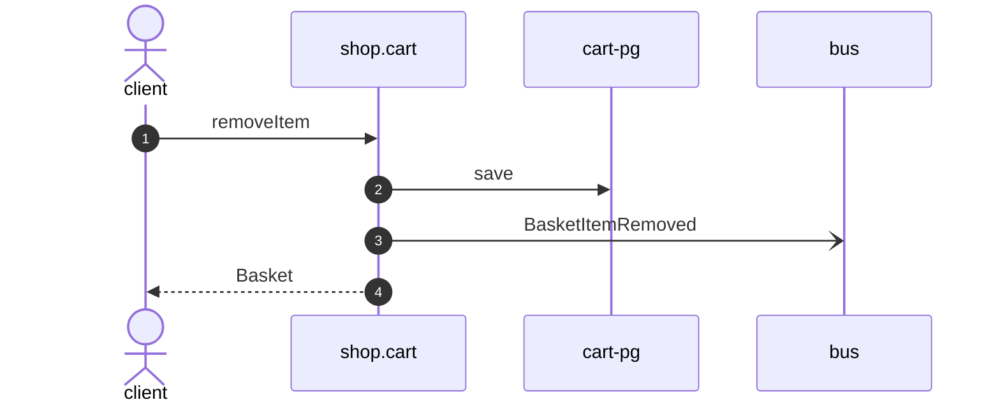

# Remove item

*Generated from the portolan catalog. Do not edit by hand.*

- **Id:** `flow.cart-remove-item`
- **Owner:** [shop](../shop/README.md)
- **Trigger:** `http` · DELETE /v1/baskets/{basketId}/items/{sku}
- **Root confidence:** high
- **Source:** [`examples/shop/cart/src/infrastructure/transport/http/basket/handlers.ts`](https://github.com/shortlink-org/portolan/blob/main/examples/shop/cart/src/infrastructure/transport/http/basket/handlers.ts)

 Source-backed cross-protocol continuations are included.

## Participants

| Participant | Kind | Context | Entity |
| --- | --- | --- | --- |
| `client` | actor | — | — |
| `shop.cart` | service | [shop](../shop/README.md) | — |
| `cart-pg` | store | [shop](../shop/README.md) | [shop.cart.pg](../shop/cart/stores/pg.md) |
| `bus` | broker | — | — |

## Sequence

## Steps

1. **client** → **shop.cart** — removeItem
   `cart.v1/removeItem` · status: declared · [`examples/shop/cart/src/infrastructure/transport/http/basket/handlers.ts:49`](https://github.com/shortlink-org/portolan/blob/main/examples/shop/cart/src/infrastructure/transport/http/basket/handlers.ts#L49)

2. **shop.cart** → **cart-pg** — save
   status: declared · [`examples/shop/cart/src/application/basket/usecases/remove_item/usecase.ts:22`](https://github.com/shortlink-org/portolan/blob/main/examples/shop/cart/src/application/basket/usecases/remove_item/usecase.ts#L22)

3. **shop.cart** → **bus** — BasketItemRemoved
   [`shop.cart.basket.BasketItemRemoved`](../shop/cart/aggregates/basket.md#event-shop-cart-basket-basketitemremoved) · status: declared · [`examples/shop/cart/src/application/basket/usecases/remove_item/usecase.ts:22`](https://github.com/shortlink-org/portolan/blob/main/examples/shop/cart/src/application/basket/usecases/remove_item/usecase.ts#L22)

4. **shop.cart** → **client** — Basket
   status: declared · Synthesized from the proven synchronous HTTP handler return.
