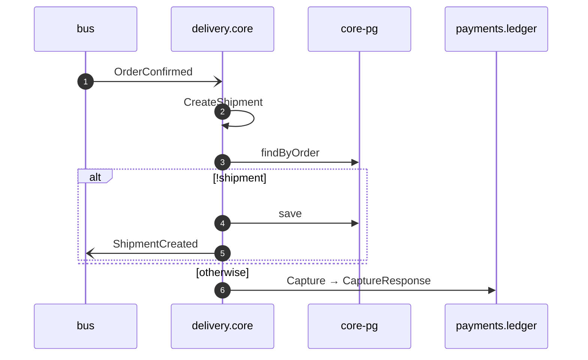

# Create shipment on order confirmed

*Generated from the portolan catalog. Do not edit by hand.*

- **Id:** `flow.core-create-shipment-on-order-confirmed`
- **Owner:** [delivery](../delivery/README.md)
- **Trigger:** `event` · OrderConfirmed
- **Root confidence:** high
- **Source:** [`examples/shop/delivery/core/src/application/policy/create-shipment-on-order-confirmed.ts`](https://github.com/shortlink-org/portolan/blob/main/examples/shop/delivery/core/src/application/policy/create-shipment-on-order-confirmed.ts)

A confirmed order becomes something to carry, and the money for it is asked to move (ADR core.0003).

## Participants

| Participant | Kind | Context | Entity |
| --- | --- | --- | --- |
| `bus` | broker | — | — |
| `delivery.core` | service | [delivery](../delivery/README.md) | — |
| `core-pg` | store | [delivery](../delivery/README.md) | [delivery.core.pg](../delivery/core/stores/pg.md) |
| `payments.ledger` | service | [payments](../payments/README.md) | — |

## Sequence

## Steps

1. **bus** → **delivery.core** — OrderConfirmed
   [`shop.oms.order.OrderConfirmed`](../shop/oms/aggregates/order.md#event-shop-oms-order-orderconfirmed) · status: declared · [`examples/shop/delivery/core/src/application/policy/create-shipment-on-order-confirmed.ts:18`](https://github.com/shortlink-org/portolan/blob/main/examples/shop/delivery/core/src/application/policy/create-shipment-on-order-confirmed.ts#L18)

2. **delivery.core** ↺ **delivery.core** — CreateShipment
   status: declared · [`examples/shop/delivery/core/src/application/policy/create-shipment-on-order-confirmed.ts:21`](https://github.com/shortlink-org/portolan/blob/main/examples/shop/delivery/core/src/application/policy/create-shipment-on-order-confirmed.ts#L21)

3. **delivery.core** → **core-pg** — findByOrder
   status: declared · [`examples/shop/delivery/core/src/application/shipment/usecases/create_shipment/usecase.ts:56`](https://github.com/shortlink-org/portolan/blob/main/examples/shop/delivery/core/src/application/shipment/usecases/create_shipment/usecase.ts#L56)

> **One of**
>
> *!shipment*
>
> 
> 4. **delivery.core** → **core-pg** — save
>    status: declared · [`examples/shop/delivery/core/src/application/shipment/usecases/create_shipment/usecase.ts:59`](https://github.com/shortlink-org/portolan/blob/main/examples/shop/delivery/core/src/application/shipment/usecases/create_shipment/usecase.ts#L59)
> 
> 5. **delivery.core** → **bus** — ShipmentCreated
>    [`delivery.core.shipment.ShipmentCreated`](../delivery/core/aggregates/shipment.md#event-delivery-core-shipment-shipmentcreated) · status: declared · [`examples/shop/delivery/core/src/application/shipment/usecases/create_shipment/usecase.ts:59`](https://github.com/shortlink-org/portolan/blob/main/examples/shop/delivery/core/src/application/shipment/usecases/create_shipment/usecase.ts#L59)
>
> *otherwise*

6. **delivery.core** → **payments.ledger** — Capture → CaptureResponse
   `payments.v1.PaymentService/Capture` · status: declared · [`examples/shop/delivery/core/src/application/shipment/usecases/create_shipment/usecase.ts:67`](https://github.com/shortlink-org/portolan/blob/main/examples/shop/delivery/core/src/application/shipment/usecases/create_shipment/usecase.ts#L67)
