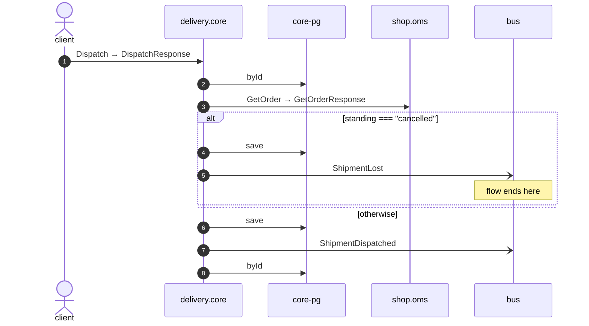

# Dispatch

*Generated from the portolan catalog · commit `8 sources` · at 2026-09-05T13:47:23+07:00. Do not edit by hand.*

- **Id:** `flow.core-dispatch`
- **Owner:** [delivery](../delivery/README.md)
- **Source:** [`examples/shop/delivery/core/src/infrastructure/transport/grpc/shipment/handlers.ts`](https://github.com/shortlink-org/portolan/blob/main/examples/shop/delivery/core/src/infrastructure/transport/grpc/shipment/handlers.ts)

One shipment, for whoever is asking about an order.

## Participants

| Participant | Kind | Context |
| --- | --- | --- |
| `client` | actor | — |
| `delivery.core` | service | [delivery](../delivery/README.md) |
| `core-pg` | store | [delivery](../delivery/README.md) |
| `shop.oms` | service | [shop](../shop/README.md) |
| `bus` | broker | — |

## Sequence

## Steps

1. **client** → **delivery.core** — Dispatch → DispatchResponse
   status: declared · [`examples/shop/delivery/core/src/infrastructure/transport/grpc/shipment/handlers.ts:21`](https://github.com/shortlink-org/portolan/blob/main/examples/shop/delivery/core/src/infrastructure/transport/grpc/shipment/handlers.ts#L21)

2. **delivery.core** → **core-pg** — byId
   status: declared · [`examples/shop/delivery/core/src/application/shipment/usecases/dispatch/usecase.ts:31`](https://github.com/shortlink-org/portolan/blob/main/examples/shop/delivery/core/src/application/shipment/usecases/dispatch/usecase.ts#L31)

3. **delivery.core** → **shop.oms** — GetOrder → GetOrderResponse
   `shop.v1.OrderService/GetOrder` · status: declared · [`examples/shop/delivery/core/src/application/shipment/usecases/dispatch/usecase.ts:32`](https://github.com/shortlink-org/portolan/blob/main/examples/shop/delivery/core/src/application/shipment/usecases/dispatch/usecase.ts#L32)

> **One of**
>
> *standing === "cancelled" — *ends the flow**
>
> 
> 4. **delivery.core** → **core-pg** — save
>    status: declared · [`examples/shop/delivery/core/src/application/shipment/usecases/dispatch/usecase.ts:36`](https://github.com/shortlink-org/portolan/blob/main/examples/shop/delivery/core/src/application/shipment/usecases/dispatch/usecase.ts#L36)
> 
> 5. **delivery.core** → **bus** — ShipmentLost
>    [`delivery.core.shipment.ShipmentLost`](../delivery/core/aggregates/shipment.md#event-delivery-core-shipment-shipmentlost) · status: declared · [`examples/shop/delivery/core/src/application/shipment/usecases/dispatch/usecase.ts:36`](https://github.com/shortlink-org/portolan/blob/main/examples/shop/delivery/core/src/application/shipment/usecases/dispatch/usecase.ts#L36)
>
> *otherwise*

6. **delivery.core** → **core-pg** — save
   status: declared · [`examples/shop/delivery/core/src/application/shipment/usecases/dispatch/usecase.ts:41`](https://github.com/shortlink-org/portolan/blob/main/examples/shop/delivery/core/src/application/shipment/usecases/dispatch/usecase.ts#L41)

7. **delivery.core** → **bus** — ShipmentDispatched
   [`delivery.core.shipment.ShipmentDispatched`](../delivery/core/aggregates/shipment.md#event-delivery-core-shipment-shipmentdispatched) · status: declared · [`examples/shop/delivery/core/src/application/shipment/usecases/dispatch/usecase.ts:41`](https://github.com/shortlink-org/portolan/blob/main/examples/shop/delivery/core/src/application/shipment/usecases/dispatch/usecase.ts#L41)

8. **delivery.core** → **core-pg** — byId
   status: declared · [`examples/shop/delivery/core/src/application/shipment/usecases/get_shipment/usecase.ts:24`](https://github.com/shortlink-org/portolan/blob/main/examples/shop/delivery/core/src/application/shipment/usecases/get_shipment/usecase.ts#L24)
