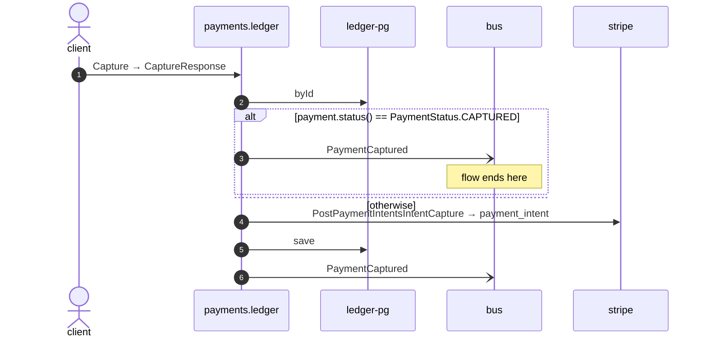

# Capture

*Generated from the portolan catalog. Do not edit by hand.*

- **Id:** `flow.ledger-capture`
- **Owner:** [payments](../payments/README.md)
- **Trigger:** `callback` · gRPC · Capture
- **Root confidence:** high
- **Source:** [`examples/payments/ledger/src/main/java/org/portolan/payments/ledger/infrastructure/transport/grpc/payment/PaymentGrpcService.java`](https://github.com/shortlink-org/portolan/blob/main/examples/payments/ledger/src/main/java/org/portolan/payments/ledger/infrastructure/transport/grpc/payment/PaymentGrpcService.java)

Moves the money the gateway was holding, writes the pair of postings for it, and says so on the bus.

## Participants

| Participant | Kind | Context | Entity |
| --- | --- | --- | --- |
| `client` | actor | — | — |
| `payments.ledger` | service | [payments](../payments/README.md) | — |
| `ledger-pg` | store | [payments](../payments/README.md) | [payments.ledger.pg](../payments/ledger/stores/pg.md) |
| `bus` | broker | — | — |
| `stripe` | external | — | — |

## Sequence

## Steps

1. **client** → **payments.ledger** — Capture → CaptureResponse
   status: declared · [`examples/payments/ledger/src/main/java/org/portolan/payments/ledger/infrastructure/transport/grpc/payment/PaymentGrpcService.java:53`](https://github.com/shortlink-org/portolan/blob/main/examples/payments/ledger/src/main/java/org/portolan/payments/ledger/infrastructure/transport/grpc/payment/PaymentGrpcService.java#L53)

2. **payments.ledger** → **ledger-pg** — byId
   status: declared · [`examples/payments/ledger/src/main/java/org/portolan/payments/ledger/application/payment/usecase/CapturePayment.java:41`](https://github.com/shortlink-org/portolan/blob/main/examples/payments/ledger/src/main/java/org/portolan/payments/ledger/application/payment/usecase/CapturePayment.java#L41)

> **One of**
>
> *payment.status() == PaymentStatus.CAPTURED — *ends the flow**
>
> 
> 3. **payments.ledger** → **bus** — PaymentCaptured
>    [`payments.ledger.payment.PaymentCaptured`](../payments/ledger/aggregates/payment.md#event-payments-ledger-payment-paymentcaptured) · status: declared · [`examples/payments/ledger/src/main/java/org/portolan/payments/ledger/application/payment/usecase/CapturePayment.java:44`](https://github.com/shortlink-org/portolan/blob/main/examples/payments/ledger/src/main/java/org/portolan/payments/ledger/application/payment/usecase/CapturePayment.java#L44)
>
> *otherwise*

4. **payments.ledger** → **stripe** — PostPaymentIntentsIntentCapture → payment_intent
   `stripe.v1/PostPaymentIntentsIntentCapture` · status: declared · [`examples/payments/ledger/src/main/java/org/portolan/payments/ledger/application/payment/usecase/CapturePayment.java:48`](https://github.com/shortlink-org/portolan/blob/main/examples/payments/ledger/src/main/java/org/portolan/payments/ledger/application/payment/usecase/CapturePayment.java#L48)

5. **payments.ledger** → **ledger-pg** — save
   status: declared · [`examples/payments/ledger/src/main/java/org/portolan/payments/ledger/application/payment/usecase/CapturePayment.java:49`](https://github.com/shortlink-org/portolan/blob/main/examples/payments/ledger/src/main/java/org/portolan/payments/ledger/application/payment/usecase/CapturePayment.java#L49)

6. **payments.ledger** → **bus** — PaymentCaptured
   [`payments.ledger.payment.PaymentCaptured`](../payments/ledger/aggregates/payment.md#event-payments-ledger-payment-paymentcaptured) · status: declared · [`examples/payments/ledger/src/main/java/org/portolan/payments/ledger/application/payment/usecase/CapturePayment.java:50`](https://github.com/shortlink-org/portolan/blob/main/examples/payments/ledger/src/main/java/org/portolan/payments/ledger/application/payment/usecase/CapturePayment.java#L50)
