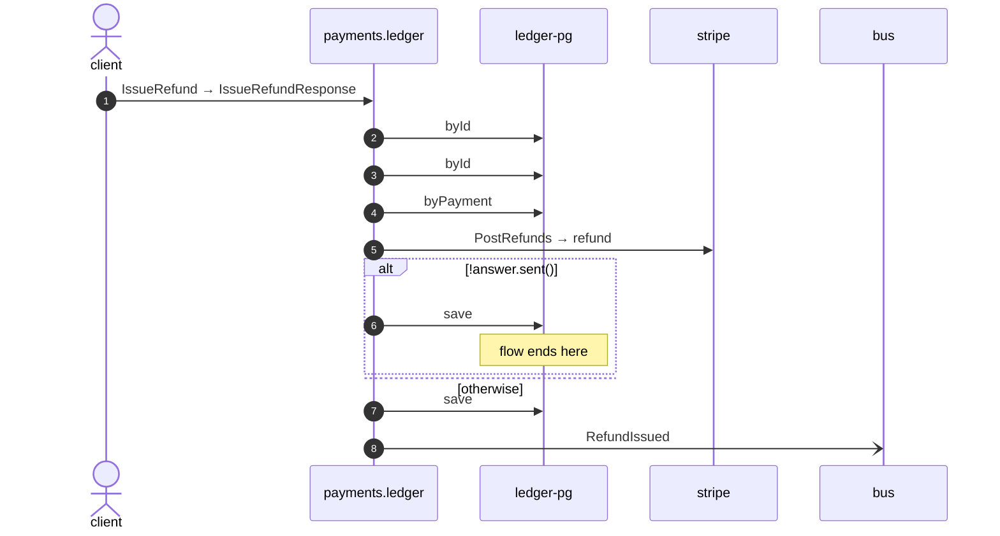

# Issue refund

*Generated from the portolan catalog · commit `6 sources` · at 2026-09-05T13:47:23+07:00. Do not edit by hand.*

- **Id:** `flow.ledger-issue-refund`
- **Owner:** [payments](../payments/README.md)
- **Source:** [`examples/payments/ledger/src/main/java/org/portolan/payments/ledger/infrastructure/transport/grpc/refund/RefundGrpcService.java`](https://github.com/shortlink-org/portolan/blob/main/examples/payments/ledger/src/main/java/org/portolan/payments/ledger/infrastructure/transport/grpc/refund/RefundGrpcService.java)

Sends money back against a captured payment, in full or in part.

## Participants

| Participant | Kind | Context |
| --- | --- | --- |
| `client` | actor | — |
| `payments.ledger` | service | [payments](../payments/README.md) |
| `ledger-pg` | store | [payments](../payments/README.md) |
| `stripe` | external | — |
| `bus` | broker | — |

## Sequence

## Steps

1. **client** → **payments.ledger** — IssueRefund → IssueRefundResponse
   status: declared · [`examples/payments/ledger/src/main/java/org/portolan/payments/ledger/infrastructure/transport/grpc/refund/RefundGrpcService.java:29`](https://github.com/shortlink-org/portolan/blob/main/examples/payments/ledger/src/main/java/org/portolan/payments/ledger/infrastructure/transport/grpc/refund/RefundGrpcService.java#L29)

2. **payments.ledger** → **ledger-pg** — byId
   status: declared · [`examples/payments/ledger/src/main/java/org/portolan/payments/ledger/application/refund/usecase/IssueRefund.java:47`](https://github.com/shortlink-org/portolan/blob/main/examples/payments/ledger/src/main/java/org/portolan/payments/ledger/application/refund/usecase/IssueRefund.java#L47)

3. **payments.ledger** → **ledger-pg** — byId
   status: declared · [`examples/payments/ledger/src/main/java/org/portolan/payments/ledger/application/refund/usecase/IssueRefund.java:52`](https://github.com/shortlink-org/portolan/blob/main/examples/payments/ledger/src/main/java/org/portolan/payments/ledger/application/refund/usecase/IssueRefund.java#L52)

4. **payments.ledger** → **ledger-pg** — byPayment
   status: declared · [`examples/payments/ledger/src/main/java/org/portolan/payments/ledger/application/refund/usecase/IssueRefund.java:56`](https://github.com/shortlink-org/portolan/blob/main/examples/payments/ledger/src/main/java/org/portolan/payments/ledger/application/refund/usecase/IssueRefund.java#L56)

5. **payments.ledger** → **stripe** — PostRefunds → refund
   `stripe.v1/PostRefunds` · status: declared · [`examples/payments/ledger/src/main/java/org/portolan/payments/ledger/application/refund/usecase/IssueRefund.java:62`](https://github.com/shortlink-org/portolan/blob/main/examples/payments/ledger/src/main/java/org/portolan/payments/ledger/application/refund/usecase/IssueRefund.java#L62)

> **One of**
>
> *!answer.sent() — *ends the flow**
>
> 
> 6. **payments.ledger** → **ledger-pg** — save
>    status: declared · [`examples/payments/ledger/src/main/java/org/portolan/payments/ledger/application/refund/usecase/IssueRefund.java:65`](https://github.com/shortlink-org/portolan/blob/main/examples/payments/ledger/src/main/java/org/portolan/payments/ledger/application/refund/usecase/IssueRefund.java#L65)
>
> *otherwise*

7. **payments.ledger** → **ledger-pg** — save
   status: declared · [`examples/payments/ledger/src/main/java/org/portolan/payments/ledger/application/refund/usecase/IssueRefund.java:69`](https://github.com/shortlink-org/portolan/blob/main/examples/payments/ledger/src/main/java/org/portolan/payments/ledger/application/refund/usecase/IssueRefund.java#L69)

8. **payments.ledger** → **bus** — RefundIssued
   [`payments.ledger.refund.RefundIssued`](../payments/ledger/aggregates/refund.md#event-payments-ledger-refund-refundissued) · status: declared · [`examples/payments/ledger/src/main/java/org/portolan/payments/ledger/application/refund/usecase/IssueRefund.java:70`](https://github.com/shortlink-org/portolan/blob/main/examples/payments/ledger/src/main/java/org/portolan/payments/ledger/application/refund/usecase/IssueRefund.java#L70)
