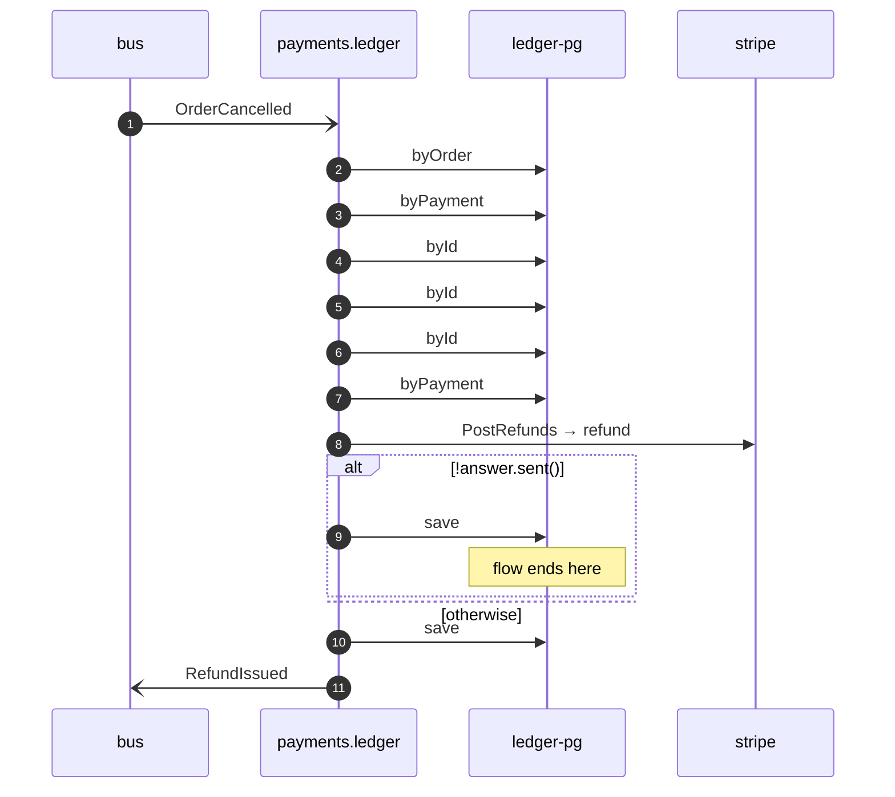

# Refund payment on order cancelled

*Generated from the portolan catalog. Do not edit by hand.*

- **Id:** `flow.ledger-refund-payment-on-order-cancelled`
- **Owner:** [payments](../payments/README.md)
- **Trigger:** `event` · OrderCancelled
- **Root confidence:** high
- **Source:** [`examples/payments/ledger/src/main/java/org/portolan/payments/ledger/application/policy/RefundPaymentOnOrderCancelled.java`](https://github.com/shortlink-org/portolan/blob/main/examples/payments/ledger/src/main/java/org/portolan/payments/ledger/application/policy/RefundPaymentOnOrderCancelled.java)

Sends captured money back once the order it was captured for is gone.

## Participants

| Participant | Kind | Context | Entity |
| --- | --- | --- | --- |
| `bus` | broker | — | — |
| `payments.ledger` | service | [payments](../payments/README.md) | — |
| `ledger-pg` | store | [payments](../payments/README.md) | [payments.ledger.pg](../payments/ledger/stores/pg.md) |
| `stripe` | external | — | — |

## Sequence

## Steps

1. **bus** → **payments.ledger** — OrderCancelled
   [`shop.oms.order.OrderCancelled`](../shop/oms/aggregates/order.md#event-shop-oms-order-ordercancelled) · status: declared · [`examples/payments/ledger/src/main/java/org/portolan/payments/ledger/application/policy/RefundPaymentOnOrderCancelled.java:22`](https://github.com/shortlink-org/portolan/blob/main/examples/payments/ledger/src/main/java/org/portolan/payments/ledger/application/policy/RefundPaymentOnOrderCancelled.java#L22)

2. **payments.ledger** → **ledger-pg** — byOrder
   status: declared · [`examples/payments/ledger/src/main/java/org/portolan/payments/ledger/application/refund/usecase/RefundCancelledOrder.java:38`](https://github.com/shortlink-org/portolan/blob/main/examples/payments/ledger/src/main/java/org/portolan/payments/ledger/application/refund/usecase/RefundCancelledOrder.java#L38)

3. **payments.ledger** → **ledger-pg** — byPayment
   status: declared · [`examples/payments/ledger/src/main/java/org/portolan/payments/ledger/application/refund/usecase/RefundCancelledOrder.java:44`](https://github.com/shortlink-org/portolan/blob/main/examples/payments/ledger/src/main/java/org/portolan/payments/ledger/application/refund/usecase/RefundCancelledOrder.java#L44)

4. **payments.ledger** → **ledger-pg** — byId
   status: declared · [`examples/payments/ledger/src/main/java/org/portolan/payments/ledger/application/refund/usecase/RefundCancelledOrder.java:45`](https://github.com/shortlink-org/portolan/blob/main/examples/payments/ledger/src/main/java/org/portolan/payments/ledger/application/refund/usecase/RefundCancelledOrder.java#L45)

5. **payments.ledger** → **ledger-pg** — byId
   status: declared · [`examples/payments/ledger/src/main/java/org/portolan/payments/ledger/application/refund/usecase/IssueRefund.java:47`](https://github.com/shortlink-org/portolan/blob/main/examples/payments/ledger/src/main/java/org/portolan/payments/ledger/application/refund/usecase/IssueRefund.java#L47)

6. **payments.ledger** → **ledger-pg** — byId
   status: declared · [`examples/payments/ledger/src/main/java/org/portolan/payments/ledger/application/refund/usecase/IssueRefund.java:52`](https://github.com/shortlink-org/portolan/blob/main/examples/payments/ledger/src/main/java/org/portolan/payments/ledger/application/refund/usecase/IssueRefund.java#L52)

7. **payments.ledger** → **ledger-pg** — byPayment
   status: declared · [`examples/payments/ledger/src/main/java/org/portolan/payments/ledger/application/refund/usecase/IssueRefund.java:56`](https://github.com/shortlink-org/portolan/blob/main/examples/payments/ledger/src/main/java/org/portolan/payments/ledger/application/refund/usecase/IssueRefund.java#L56)

8. **payments.ledger** → **stripe** — PostRefunds → refund
   `stripe.v1/PostRefunds` · status: declared · [`examples/payments/ledger/src/main/java/org/portolan/payments/ledger/application/refund/usecase/IssueRefund.java:62`](https://github.com/shortlink-org/portolan/blob/main/examples/payments/ledger/src/main/java/org/portolan/payments/ledger/application/refund/usecase/IssueRefund.java#L62)

> **One of**
>
> *!answer.sent() — *ends the flow**
>
> 
> 9. **payments.ledger** → **ledger-pg** — save
>    status: declared · [`examples/payments/ledger/src/main/java/org/portolan/payments/ledger/application/refund/usecase/IssueRefund.java:65`](https://github.com/shortlink-org/portolan/blob/main/examples/payments/ledger/src/main/java/org/portolan/payments/ledger/application/refund/usecase/IssueRefund.java#L65)
>
> *otherwise*

10. **payments.ledger** → **ledger-pg** — save
   status: declared · [`examples/payments/ledger/src/main/java/org/portolan/payments/ledger/application/refund/usecase/IssueRefund.java:69`](https://github.com/shortlink-org/portolan/blob/main/examples/payments/ledger/src/main/java/org/portolan/payments/ledger/application/refund/usecase/IssueRefund.java#L69)

11. **payments.ledger** → **bus** — RefundIssued
   [`payments.ledger.refund.RefundIssued`](../payments/ledger/aggregates/refund.md#event-payments-ledger-refund-refundissued) · status: declared · [`examples/payments/ledger/src/main/java/org/portolan/payments/ledger/application/refund/usecase/IssueRefund.java:70`](https://github.com/shortlink-org/portolan/blob/main/examples/payments/ledger/src/main/java/org/portolan/payments/ledger/application/refund/usecase/IssueRefund.java#L70)
